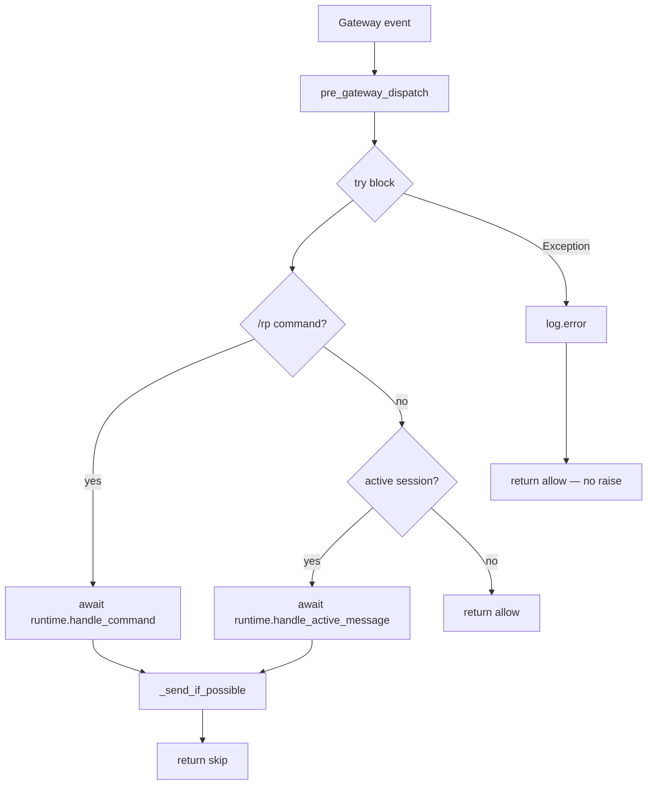

## 0. 术语约定

| 术语 | 定义 | 防冲突 |
|---|---|---|
| **migrate-once** | `TavernStore.migrate()` runs DDL exactly once per instance lifetime via `_migrated: bool` flag | `_migrated` not in codebase — new |
| **content_mode** | String enum `safe\|mature\|explicit\|dark\|custom` on a session, matching design doc §12.2 | No `content_mode` in plugin source — new |
| **estimate_tokens** | `estimate_tokens(text: str) -> int` approximates GPT-style token count (`max(1, len(text) // 4)`) | Not in codebase — new |
| **async runtime skeleton** | `TavernRuntime.handle_command` and `handle_active_message` become true `async def` coroutines; no LLM calls yet | `handle_command_sync` / `handle_active_message_sync` remain as thin sync wrappers |
| **schema v2** | Extended `migrate()` DDL: `presets`, `prompt_modules`, `model_profiles` tables + `sessions.content_mode` column | No conflict; purely additive |

---

## 1. 决策与约束

**需求摘要:** Harden the Phase 1–3 foundation before Prompt Compiler (Phase 4). No new user-visible commands. Purpose is internal correctness, Phase 4 readiness, and test reliability.

**明确不做:**
- Actual async LLM calls in `handle_active_message` (Phase 4 milestone)
- `/rp card import` command wiring (Phase 4)
- `save_preset` / `save_model_profile` DB methods (schema tables only, no insert helpers yet)
- tiktoken integration (stdlib `len // 4` only for now)
- Lorebook, memory, novel engine (later phases)

**复杂度档位:** 走服务端内部功能默认档位，无偏离。Pure Python stdlib, no external services.

**关键决策:**

1. **`_migrated` is per-instance, not global.** Each `pre_gateway_dispatch` call creates a fresh `TavernStore`; a global flag would skip migration on a new store pointing at a fresh DB. Per-instance + `IF NOT EXISTS` DDL is safe and correct.

2. **`CharacterCard` gains 6 fields needed by Phase 4 Prompt Compiler:** `system_prompt_override`, `post_history_instructions`, `tags`, `talkativeness`, `extensions`, `source_path`. Fields the Prompt Compiler does not need at Phase 4 (e.g. `created_at`) remain DB-only.

3. **`save_card` serialisation uses explicit field enumeration** (not `dataclasses.asdict`) because `raw` contains arbitrary nested dicts that must be preserved exactly; `asdict` performs deep copy and would drop non-standard types. Fields are listed explicitly with the card dataclass as input type annotated as `CharacterCard`.

4. **Exception guard catches `Exception`, not `BaseException`.** `KeyboardInterrupt` and `SystemExit` must propagate through the hook.

5. **Async compat in hook:** `pre_gateway_dispatch` is a sync function (Hermes hook contract). It calls async runtime methods via `asyncio.get_event_loop().run_until_complete()` when no loop is running, or `loop.create_task()` when a loop is already running. This is a temporary shim; Phase 4 will audit whether the hook can become async-native.

6. **`sessions.content_mode` added via `ALTER TABLE ADD COLUMN`** guarded by a `PRAGMA table_info(sessions)` check (SQLite < 3.37 has no `ADD COLUMN IF NOT EXISTS`). Migration is idempotent.

---

## 2. 名词与编排

### 2.1 名词层

**现状:**

- `CharacterCard` (`plugins/hermes_tavern/importers/cards.py:13`): 10 fields — `id, name, description, personality, scenario, first_mes, mes_example, alternate_greetings, creator_notes, raw`. Missing Phase 4 fields.
- `TavernStore` (`plugins/hermes_tavern/db.py:25`): no `_migrated` flag; `migrate()` re-runs CREATE TABLE DDL at the start of every public method call.
- `TavernStore.save_card` (`db.py:185`): accepts `Any`, manually copies 9 named fields — will silently drop any new fields added to `CharacterCard`.
- Schema: only `cards`, `sessions`, `messages` tables; no `presets`, `prompt_modules`, `model_profiles`; `sessions` has no `content_mode`.
- No `utils.py` in `plugins/hermes_tavern/`.

**变化:**

| Object | Action | Motivation |
|---|---|---|
| `CharacterCard` | Add 6 fields (see below) | Phase 4 Prompt Compiler needs them |
| `parse_character_card` | Populate 6 new fields from card data dict | Data completeness |
| `TavernStore.__init__` | Add `self._migrated: bool = False` | migrate-once guard |
| `TavernStore.migrate()` | Guard + extend DDL with new tables + `content_mode` column | Schema v2, idempotency |
| `TavernStore.save_card` | Accept `CharacterCard` (typed), include all fields | Avoid silent field drift |
| New: `utils.py` | `estimate_tokens(text: str) -> int` | Phase 4 context budget |
| New schema | `presets`, `prompt_modules`, `model_profiles` tables | Phase 4 preset/model storage |
| `sessions` | `content_mode TEXT NOT NULL DEFAULT 'safe'` column | Phase 4 routing/boundaries |

**New `CharacterCard` fields:**

```python
# plugins/hermes_tavern/importers/cards.py — added to CharacterCard dataclass
system_prompt_override: str = ""        # data.system_prompt / data.system
post_history_instructions: str = ""    # data.post_history_instructions
tags: list[str] = field(default_factory=list)
talkativeness: float | None = None     # data.talkativeness (0.0–1.0 or null)
extensions: dict[str, Any] = field(default_factory=dict)  # data.extensions
source_path: str = ""                   # caller-supplied; not in card JSON
```

**Interface examples:**

```python
# parse_character_card — V2 card with new fields
# Input:
{
  "spec": "chara_card_v2",
  "data": {
    "name": "Alice",
    "system_prompt": "You are Alice.",
    "post_history_instructions": "Stay in character.",
    "tags": ["fantasy", "elf"],
    "talkativeness": 0.7,
    "extensions": {"world": "Faerun"}
  }
}
# Output:
CharacterCard(
    name="Alice",
    system_prompt_override="You are Alice.",
    post_history_instructions="Stay in character.",
    tags=["fantasy", "elf"],
    talkativeness=0.7,
    extensions={"world": "Faerun"},
    source_path="",   # not in JSON; default
    # ... other fields as before
)
# source: plugins/hermes_tavern/importers/cards.py  parse_character_card()

# estimate_tokens
estimate_tokens("Hello world")   # → 2   (11 chars // 4 = 2)
estimate_tokens("")               # → 1   (floor: max(1, 0))
estimate_tokens("a" * 400)       # → 100
# source: plugins/hermes_tavern/utils.py  estimate_tokens()

# TavernStore.migrate() — idempotency
store = TavernStore(tmp / "t.sqlite3")
store.migrate()   # runs DDL; _migrated = True
store.migrate()   # no-op
# source: plugins/hermes_tavern/db.py  TavernStore.migrate()
```

---

### 2.2 编排層



**现状:**
- `pre_gateway_dispatch` (`gateway_hook.py:49`): sync, no exception guard; any `TavernStore` or `TavernRuntime` error propagates to Hermes core.
- `TavernRuntime.handle_command` (`runtime.py:25`): declared `async def` but immediately calls `handle_command_sync`; not a true coroutine.
- `TavernRuntime.handle_active_message_sync` (`runtime.py:52`): sync only; no async counterpart.
- `TavernStore.migrate()` (`db.py:46`): runs full `executescript` on every call.

**变化:**
- `pre_gateway_dispatch`: wrap body in `try/except Exception as exc`; on error log at ERROR level, return `{"action": "allow"}`.
- `TavernRuntime.handle_command`: becomes a true `async def` (future `await` points inside for Phase 4); remove delegation to `handle_command_sync` (or keep sync version as leaf for commands that stay sync).
- New: `TavernRuntime.handle_active_message(event)` — `async def` coroutine; current `handle_active_message_sync` delegates to it via the async compat helper.
- `TavernStore.migrate()`: add guard `if self._migrated: return`; set `self._migrated = True` after DDL; extend DDL for schema v2.

**流程级约束:**
- `pre_gateway_dispatch` **must never raise** to Hermes core — exception guard is the single defence line.
- `migrate()` idempotency: second call on same instance must not re-execute any DDL (verified by test intercepting `executescript` calls).
- Async compat in sync hook: use `asyncio.get_event_loop().run_until_complete(coro)` when no loop running; `loop.create_task(coro)` when loop is running (fire-and-forget acceptable for placeholder; Phase 4 will revisit).
- `ALTER TABLE sessions ADD COLUMN content_mode` is guarded by `PRAGMA table_info(sessions)` check to remain idempotent on SQLite < 3.37.

---

### 2.3 挂載点清单

1. `TavernStore.migrate()` DDL — `presets`, `prompt_modules`, `model_profiles` tables and `sessions.content_mode` appended here. Delete → Phase 4 has no schema to write preset/model/content-mode data into.
2. `CharacterCard` fields `system_prompt_override`, `post_history_instructions`, `tags`, `talkativeness`, `extensions`, `source_path` — delete → Phase 4 Prompt Compiler loses card system prompt, PHI, and tag-based routing.
3. `plugins/hermes_tavern/utils.py:estimate_tokens` — delete → Phase 4 context budget manager has no token counting entry point.
4. `pre_gateway_dispatch` exception guard — delete → any DB/runtime error propagates uncaught into Hermes core dispatch.

---

### 2.4 推进策略

| Step | Paradigm cut | Exit signal |
|---|---|---|
| 1 | **Schema layer** — add `_migrated` flag; extend `migrate()` DDL with new tables + `content_mode` column (with `PRAGMA` guard) | `migrate()` called twice leaves DB unchanged on second call; `presets`, `prompt_modules`, `model_profiles` tables exist; `sessions.content_mode` column present |
| 2 | **Data contracts** — extend `CharacterCard` with 6 fields; update `parse_character_card`; update `TavernStore.save_card` type + serialisation | Parse test with all 6 new fields passes; round-trip `save_card → get_card` contains `system_prompt_override` |
| 3 | **Orchestration** — add exception guard to hook; make `handle_active_message` a true `async def`; update hook async compat | Hook test with raising store returns `{"action": "allow"}`; `inspect.iscoroutinefunction(runtime.handle_active_message)` is `True` |
| 4 | **Utilities** — add `utils.py` with `estimate_tokens` | `from plugins.hermes_tavern.utils import estimate_tokens; estimate_tokens("hi")` returns integer ≥ 1 |
| 5 | **Test coverage** — adapter enum-key test; golden fixture files `tests/fixtures/cards/st_v2.json` + `tests/fixtures/cards/direct.json`; fixture-based parse tests | All `test_hermes_tavern_*.py` pass; `tests/fixtures/cards/` contains both files |

---

### 2.5 结構健康度与微重构

**文件级评估:**
- `db.py` (234 lines): adding `_migrated` flag + ~50 lines of DDL and column guard → ~290 lines. Still single-responsibility CRUD. Healthy.
- `importers/cards.py` (69 lines): adding 6 fields + parse lines → ~90 lines. Clean.
- `runtime.py` (98 lines): async changes are ~10 lines delta. Fine.
- `gateway_hook.py` (73 lines): adding try/except → ~85 lines. Fine.

**目录级评估:**
- `plugins/hermes_tavern/` has 7 source files + `importers/` subdir. Adding `utils.py` is one flat file. Directory remains un-crowded.

**结论: 本次不做微重构。** No file is fat or multi-responsibility; `utils.py` is a clean additive entry.

**超出范围的观察:**
- `TavernStore.save_card` uses `Any` as card type — a typing improvement to `CharacterCard` is part of this feature (Step 2), but a broader refactor of `TavernStore` to use typed methods throughout would benefit from a dedicated `cs-refactor` pass after Phase 3.5 merges.
- `TavernRuntime` will grow significantly during Phase 4. Consider splitting into `runtime/dispatch.py` + `runtime/commands.py` at that point, not now.

---

## 3. 验收契约

**正常路径:**

1. `TavernStore(tmp_path / "t.sqlite3").migrate()` called twice → `executescript` (or DDL) is invoked exactly once (verify by monkeypatching or DDL counter).
2. `parse_character_card({"spec": "chara_card_v2", "data": {"name": "X", "system_prompt": "P", "post_history_instructions": "Q", "tags": ["t"], "talkativeness": 0.5, "extensions": {"k": 1}}})` → `card.system_prompt_override == "P"`, `card.post_history_instructions == "Q"`, `card.tags == ["t"]`, `card.talkativeness == 0.5`, `card.extensions == {"k": 1}`.
3. `parse_character_card` on `tests/fixtures/cards/st_v2.json` → no exception; `card.name` non-empty.
4. `parse_character_card` on `tests/fixtures/cards/direct.json` → no exception; `card.name` non-empty.
5. `estimate_tokens("hello world")` → integer ≥ 1.
6. `estimate_tokens("")` → `1` (floor applied).
7. After `TavernStore(tmp).migrate()`: tables `presets`, `prompt_modules`, `model_profiles` exist in DB.
8. After `TavernStore(tmp).migrate()`: `PRAGMA table_info(sessions)` includes column `content_mode`.
9. `inspect.iscoroutinefunction(TavernRuntime().handle_command)` → `True`.
10. `inspect.iscoroutinefunction(TavernRuntime().handle_active_message)` → `True`.
11. `_get_adapter` with `event.source.platform` as an enum (`.value == "telegram"`) and `adapters = {"telegram": adapter}` → returns `adapter`.

**边界路径:**

12. `save_card(parse_character_card({"name": "B", "system_prompt": "S"}))` → `get_card("B")` → `json.loads(row["data_json"])["system_prompt_override"] == "S"`.
13. `TavernStore.migrate()` on a DB that already has Phase 1–3 schema (no `content_mode`) → adds column without error.

**错误路径:**

14. `pre_gateway_dispatch(event=event, store=FakeStore())` where `FakeStore.get_active_session` raises `RuntimeError("db down")` → returns `{"action": "allow"}`; no exception propagated.

**明确不做 (反向核对):**

- `handle_active_message` body does **not** call any LLM API (placeholder `PLACEHOLDER_REPLY` stays).
- `TavernStore` has **no** `save_preset` or `save_model_profile` methods.
- `utils.py` does **not** import `tiktoken`.
- No `/rp card import` handling in `TavernRuntime.handle_command_sync`.

---

## 4. 与项目级架构文档的关系

After this feature lands, update `.codestable/architecture/ARCHITECTURE.md` §4 "Hermes Tavern Plugin Architecture":

- DB schema: note schema v2 (presets/prompt_modules/model_profiles tables + sessions.content_mode).
- Add `utils.py` to the module listing with note "token estimator, stdlib only".
- Note that `handle_command` and `handle_active_message` are async entry points (sync wrappers remain for gateway hook compat until Phase 4).

The compound decision `2026-05-18-decision-hermes-plugin-language.md` is respected: all changes are Python-only.
