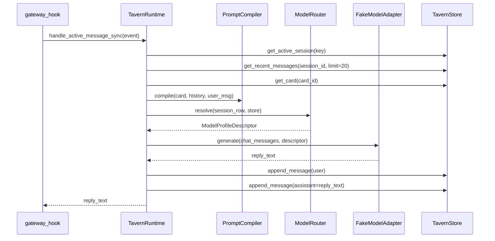

# Phase 4 — Prompt Compiler v1 + Model Routing Skeleton

## 0. Decisions & Constraints

**In scope**
- `PromptModule` / `CompiledContext` dataclasses (`prompt.py`, new file)
- `PromptCompiler` — assembles card system prompt + enabled preset modules + history turns + user message
- `ChatRenderer` — list of `{"role": str, "content": str}` dicts
- `StoryStringRenderer` — stub returning concatenated text
- `FakeModelAdapter` — returns a fixed string; no network
- `ModelProfileDescriptor` — pure value object with no secrets (`model_router.py`, new file)
- `ModelRouter` — resolves a descriptor from DB profile or hardcoded defaults; calls `resolve_runtime_provider` conceptually but **never** in tests
- `TavernRuntime.handle_active_message_sync` — uses compiler + fake adapter instead of bare `PLACEHOLDER_REPLY` constant
- `/rp debug prompt` command — compile context for active session, return debug text

**Not in scope**
- Real LLM calls
- Persisting api_key / access_token anywhere
- tiktoken or any tokeniser package import
- Saving presets or model profiles via CLI (schema tables already exist from Phase 3.5)
- `/rp set-model` or `/rp preset` commands

**Complexity tier**: default (single plugin, no new external dependencies, no concurrency changes)

**Not doing**: the `resolve_runtime_provider` call path is represented by a stub/protocol in `model_router.py` — no real import of `hermes_cli.runtime_provider` so tests stay fully offline.

---

## 1. Where This Lives

All new code adds to `plugins/hermes_tavern/`. Two new files:

| File | Role |
|---|---|
| `plugins/hermes_tavern/prompt.py` | `PromptModule`, `CompiledContext`, `PromptCompiler` |
| `plugins/hermes_tavern/model_router.py` | `ModelProfileDescriptor`, `ModelRouter` |

Existing files updated:
- `runtime.py` — `handle_active_message_sync` uses compiler + adapter; new `_debug_prompt` handler
- `commands.py` — add `debug` as recognised subcommand token (already passes unknown names to runtime)

No existing files are overfat (largest is `db.py` at ~290 lines, all persistence — healthy). No directory reorganisation needed.

**Section 2.5 — Structure health**: Not doing micro-refactor. Files are focused and within healthy size. Target directory (`plugins/hermes_tavern/`) is not crowded.

---

## 2. Noun Layer — Current → Change

### 2.1 Existing types (current)

- `CharacterCard` — `importers/cards.py`; fields include `system_prompt_override`, `description`, `personality`, `scenario`, `first_mes`, `mes_example`, `post_history_instructions`
- `RPCommand` — `commands.py`; `name`, `args`, `raw`
- `TavernStore.get_active_session(session_key)` → `dict | None`; rows come with `id`, `card_id`, `card_name`
- `estimate_tokens(text) -> int` — `utils.py`

### 2.2 New types (change)

```python
# prompt.py

@dataclass(frozen=True)
class PromptModule:
    name: str
    role: str          # "system" | "user" | "assistant"
    content: str
    position: str      # "before_char" | "after_char" | "in_chat"
    insertion_order: int = 0
    enabled: bool = True

@dataclass
class CompiledContext:
    modules: list[PromptModule]   # ordered, all enabled
    history: list[dict]           # [{"role": ..., "content": ...}] from DB
    user_message: str
    card_name: str
    token_budget: int             # estimate_tokens sum across modules+history+user
```

```python
# model_router.py

@dataclass(frozen=True)
class ModelProfileDescriptor:
    provider: str      # e.g. "anthropic", "openrouter", "hermes_global"
    model_id: str      # e.g. "claude-opus-4-6"
    mode: str          # "chat" | "completion"
    context_window: int
    source: str        # "db_profile" | "default_priority_1" | "default_priority_2" | ...
    # NO api_key / access_token fields — ever
```

**Input → output examples**

`PromptCompiler.compile(card, history_rows, user_message, preset_modules=[])`:
- Input: `card.system_prompt_override = "You are Aria."`, `history_rows = [{"role":"user","content":"Hi"}]`, `user_message = "Hello"`
- Output: `CompiledContext(modules=[PromptModule(name="char_system", role="system", content="You are Aria.", ...)], history=[{"role":"user","content":"Hi"}], user_message="Hello", card_name=card.name, token_budget=N)`

`ModelRouter.resolve(session_row=None, store=None)`:
- Input: no active profile → returns `ModelProfileDescriptor(provider="anthropic", model_id="claude-opus-4-6", mode="chat", context_window=200000, source="default_priority_2")`
- Input: session has `model_profile_id` in DB → looks up row, returns descriptor with `source="db_profile"`

`ChatRenderer.render(ctx)`:
- Input: `CompiledContext` with 1 system module + 2 history turns + user_message
- Output: `[{"role":"system","content":"..."}, {"role":"user","content":"Hi"}, {"role":"assistant","content":"..."}, {"role":"user","content":"Hello"}]`

`StoryStringRenderer.render(ctx)`:
- Output: single string joining all content with `\n\n`; prefixes each with `[ROLE]` label

`FakeModelAdapter.generate(messages, profile)`:
- Input: any list of message dicts + any descriptor
- Output: `"[Hermes Tavern fake adapter response]"` — deterministic, no I/O

---

## 3. Orchestration Layer — Current → Change

### Current
```
handle_active_message_sync
  → get_active_session
  → append_message (user)
  → append_message (PLACEHOLDER_REPLY)
  → return PLACEHOLDER_REPLY
```

### Change



**`/rp debug prompt`** command flow (new):
```
handle_command_sync("debug", args=["prompt"], event)
  → get_active_session
  → get_recent_messages(limit=5)
  → get_card
  → PromptCompiler.compile(...)
  → ChatRenderer.render(ctx)
  → format debug text (module count, token_budget, first 200 chars of each message)
  → return debug text
```

`handle_active_message_sync` no longer references `PLACEHOLDER_REPLY` directly — it delegates to `FakeModelAdapter`. `PLACEHOLDER_REPLY` constant can be removed or kept as fallback for no-session path (keep for clarity).

### 3.1 Mounting points

| Point | Delete it and… |
|---|---|
| `prompt.py` export `PromptCompiler` | active-message path produces no structured context; debug prompt impossible |
| `model_router.py` export `ModelRouter` | runtime cannot resolve profile; adapter has no target |
| `FakeModelAdapter` in `adapters.py` | runtime has nothing to call; tests hang on real HTTP |
| `TavernStore.get_recent_messages` | compiler has no history input; context is card-only |
| `/rp debug prompt` handler | developer has no prompt inspection tool |

### 3.2 Progression strategy (paradigm slices)

1. **Noun layer + compiler** — write `prompt.py` (`PromptModule`, `CompiledContext`, `PromptCompiler`); write `adapters.py` (`FakeModelAdapter`); write `model_router.py` (`ModelProfileDescriptor`, `ModelRouter`). Exit: `py_compile` green on all three new files.

2. **Storage extension** — add `TavernStore.get_recent_messages(session_id, limit) -> list[dict]`. Exit: calling it on a fresh DB returns `[]`.

3. **Renderers** — write `renderers.py` (`ChatRenderer`, `StoryStringRenderer`). Exit: `ChatRenderer.render(compiled_ctx)` returns list with expected role ordering.

4. **Runtime wiring** — update `handle_active_message_sync` to call compiler → router → fake adapter; add `_debug_prompt` and wire `/rp debug prompt` subcommand. Exit: `/rp debug prompt` with an active session returns a non-empty string containing "modules:" and "tokens:".

5. **Tests** — add `tests/plugins/test_hermes_tavern_compiler.py`, `test_hermes_tavern_model_router.py`, `test_hermes_tavern_renderers.py`; update `test_hermes_tavern_runtime.py` for new active-message behaviour. Exit: all new test files pass `py_compile`; `python -m pytest` (if available) passes.

---

## 4. Acceptance Contract

| Scenario | Expected result |
|---|---|
| `PromptCompiler.compile` with card having non-empty `system_prompt_override` | `ctx.modules[0].content == card.system_prompt_override` |
| `PromptCompiler.compile` with empty `system_prompt_override`, non-empty `description` | falls back to `description` as system content |
| `PromptCompiler.compile` with both empty | no system module emitted |
| `ChatRenderer.render` on context with 1 system module + 2 history turns + user_message | list length == 4, `[0]["role"] == "system"`, last `["role"] == "user"` |
| `StoryStringRenderer.render` returns single `str` | type is `str`, non-empty when context has any content |
| `FakeModelAdapter.generate` | always returns `"[Hermes Tavern fake adapter response]"`, no I/O |
| `ModelRouter.resolve(session_row=None, store=None)` | returns `ModelProfileDescriptor(provider="anthropic", model_id="claude-opus-4-6", source starting with "default")` |
| `ModelProfileDescriptor` has no `api_key`/`access_token` field | `hasattr(descriptor, "api_key")` is `False` |
| `/rp debug prompt` with active session + card | returns string containing "modules:" and "tokens:" |
| `/rp debug prompt` with no active session | returns "No active Hermes Tavern session." |
| `handle_active_message_sync` with active session | returns string from `FakeModelAdapter` (not bare `PLACEHOLDER_REPLY`) |
| `TavernStore.get_recent_messages(session_id, limit=5)` on empty DB | returns `[]` |

**Explicit not-doing checks**
- No `import tiktoken` anywhere in the plugin
- No `api_key` / `access_token` field on any new dataclass
- No real HTTP request in any new code path
- `resolve_runtime_provider` not imported in tests — `ModelRouter` is tested with a stub/fake
