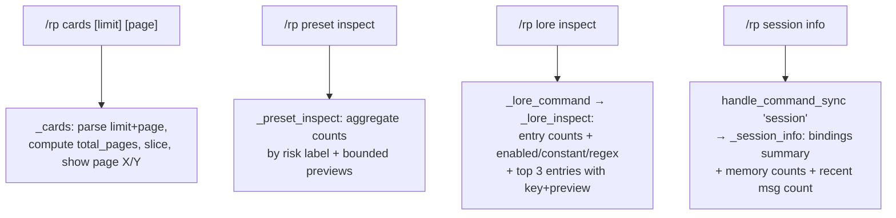

# Phase 17: Mobile Inspect Parity & Paginated Card Browsing

## 0. Scope

**Does:** adds four targeted UX improvements to the Hermes Tavern `/rp` command surface:
1. `/rp cards [limit] [page]` — paginated card list
2. `/rp preset inspect <preset>` — improved mobile-safe aggregate view (already exists, needs restructure)
3. `/rp lore inspect <lorebook>` — new command
4. `/rp session info` — new command

**Does not:**
- Telegram inline keyboards or gateway buttons
- Real provider/network calls
- Asset download or file delivery
- Changes to import, compiler, provider bridge, or memory subsystems

**Complexity:** default档位 (small targeted additions to an existing command dispatcher).

## 1. Decisions & Constraints

- **All changes in `runtime.py`** (command dispatcher). No `db.py` changes needed — all required data access methods already exist.
- **`commands.py` unchanged** — RPCommand parser is format-complete.
- **No microrefactor** — `runtime.py` at 1113 lines is intentionally monolithic per the Tavern command-dispatcher pattern (one class, one file). Adding ~80 lines of targeted methods is well within pattern. No split planned.
- **No raw JSON ever output to user** — enforced by design; all paths format structured text only.
- **No secret-like fields exposed** — `api_key`, `access_token` fields never appear in session or preset DB rows; credential constraint from attention.md is met by architecture.
- **TDD** — failing tests written first, then implementation.

## 2. Noun Layer

### 2.1 Current → Change

**Current:**
- `RPCommand(name, args, raw)` — unchanged.
- Lorebook entry row: `{id, lorebook_id, title, content, keys_json, enabled, constant, regex, ...}` — all fields available via `store.list_lorebook_entries(lorebook_id)`.
- Session row: `{id, status, card_id, card_name, title, content_mode, preset_id, lorebook_id, adapter_mode, live_confirmed}` — returned by `store.get_active_session(session_key)`.
- Preset module row: `{id, preset_id, name, content, enabled, raw_json}` — returned by `store.list_prompt_modules(preset_id)`.

**Change:** no new DB columns, no new types. Phase 17 only adds presentation logic over existing rows.

### 2.2 Orchestration Layer

**Current flow** (handle_command_sync):
```
/rp cards → _cards(command)        # parses one optional limit arg
/rp preset inspect → _preset_inspect(command)  # exists, dumps per-module lines
/rp lore → _lore_command()         # routes: import|list|use|test|debug (no inspect)
/rp session[s] → _sessions()       # lists sessions for scope; no "info" subcommand
```

**Changed flow:**


**Detailed behavior specs:**

`/rp cards [limit] [page]`:
- Input: `args[0]` = limit (optional, default 10, clamp 1..25); `args[1]` = page (optional, default 1, clamp ≥1)
- Compute: `total = len(store.list_cards())`, `total_pages = max(1, ceil(total/limit))`, `page = min(page, total_pages)`, slice = `cards[(page-1)*limit : page*limit]`
- Output:
  ```
  Hermes Tavern cards (page 2/4, 5 shown):
    [abc12345] Name — tag1, tag2
      preview text…
      start: /rp start Name
      inspect: /rp card inspect Name
  prev: /rp cards 10 1  ← only when page > 1
  next: /rp cards 10 3  ← only when page < total_pages
  ```
- Backward compatible: `/rp cards` and `/rp cards 5` still work identically (page defaults to 1).

`/rp preset inspect <preset>` (improved):
- Input: preset ref (id prefix or name)
- Fetch: `store.get_preset(ref)` → `store.list_prompt_modules(preset_id)`
- Aggregate: risk label counts via `_module_risk_counts_db(modules)` (new helper — existing `_module_risk_counts` takes PromptModule objects, not dicts); enabled safe/adult counts; disabled risky count
- Output:
  ```
  Preset: <name> (<id[:8]>)
  source: <source>
  modules: N total
    safe: X enabled, adult_fiction: Y enabled, risky: Z disabled
  module previews:
    - <name>: <risk> (<enabled|disabled>) — <60-char preview>
    … (up to 5 modules shown)
  use: /rp preset use <preset>
  ```

`/rp lore inspect <lorebook>` (new):
- Input: lorebook ref (id prefix or name)
- Fetch: `store.get_lorebook(ref)` → `store.list_lorebook_entries(lorebook_id)`
- Compute: total, enabled count, constant count, regex count
- Output (top 3 entries by insertion_order/priority):
  ```
  Lorebook: <name> (<id[:8]>)
  source: <source>
  entries: N total, E enabled, C constant, R regex
  top entries:
    - <title>: keys=[k1, k2] — <60-char content preview>
    - …
  use: /rp lore use <lorebook>
  test: /rp lore test <message>
  ```

`/rp session info` (new):
- Input: active session required
- Fetch: `store.get_active_session(session_key)`, `store.list_session_memory_facts(session_key)`, `store.get_session_summary(session_key)`, `store.get_recent_messages(session["id"], limit=5)`
- Output:
  ```
  Session: [<id[:8]>] <title or 'untitled'> (<status>)
  card: <card_name or 'none'>
  preset: <preset_id[:8] or 'none'>
  lorebook: <lorebook_id[:8] or 'none'>
  content_mode: <mode>
  adapter: <adapter_mode> (<live|not live>)
  memory: <N facts>, summary: <yes|none>
  recent messages: <count (of last 5 fetched)>
  hints: /rp history | /rp debug prompt | /rp status
  ```

### 2.3 Mount Points

| Mount | Effect if removed |
|---|---|
| `handle_command_sync`: `name == "session"` branch | `/rp session info` routes to unknown-command error |
| `_lore_command`: `subcommand == "inspect"` branch | `/rp lore inspect` routes to usage error |
| `/rp help` text additions for lore inspect + session info | Commands invisible in help |
| `_cards`: page arg parsing + pagination footer | Card browsing reverts to single-page |

### 2.4 Implementation Strategy (by paradigm)

**Step 1 — Tests (red phase)**
Write failing tests in `tests/plugins/test_hermes_tavern_mobile_browsers.py`:
- `test_cards_pagination_page2`, `test_cards_page_clamp`, `test_cards_backward_compatible`
- `test_preset_inspect_aggregate_counts`, `test_preset_inspect_no_raw_json`
- `test_lore_inspect_basic`, `test_lore_inspect_not_found`
- `test_session_info_active`, `test_session_info_no_session`

Exit signal: `pytest tests/plugins/test_hermes_tavern_mobile_browsers.py` shows N failures (expected).

**Step 2 — Cards pagination**
Modify `_cards()`: add `page` parsing from `command.args[1]`, compute slice, emit `page X/Y` header + next/prev footer.

Exit signal: card pagination tests pass; existing card tests still pass.

**Step 3 — Preset inspect improvement**
Add module-level helper `_module_risk_counts_db(modules: list[dict]) -> dict` for DB row dicts (separate from existing `_module_risk_counts` which takes PromptModule objects). Rewrite `_preset_inspect()` to use aggregate counts + bounded previews (5 max, 60 chars).

Exit signal: preset inspect tests pass; existing preset tests still pass.

**Step 4 — Lore inspect**
Add `_lore_inspect()` method. Add `subcommand == "inspect"` branch in `_lore_command()`. Update help text.

Exit signal: lore inspect tests pass; existing lore tests still pass.

**Step 5 — Session info**
Add `_session_info()` method. Add `name == "session"` branch in `handle_command_sync`. Update help text.

Exit signal: session info tests pass; all 185+ tests pass.

### 2.5 Structural Health

**Files being modified:**
- `runtime.py` — 1113 lines, single TavernRuntime class with command dispatcher. Pattern is intentional (all `/rp` dispatch in one place). Adding ~80 lines of targeted methods stays within pattern. **Decision: no microrefactor.**

**Target directory for new test additions:**
- `tests/plugins/test_hermes_tavern_mobile_browsers.py` — existing file, already covers Phase 16 mobile commands. Phase 17 additions fit naturally. **Decision: extend existing file, no new file.**

**No structural observations outside scope.**

## 3. Acceptance Contract

| Scenario | Input | Expected output |
|---|---|---|
| Cards page 1 default | `/rp cards` | Same as Phase 16 output; no pagination footer if only 1 page |
| Cards page 2 | `/rp cards 5 2` with 8 cards | `page 2/2`, cards 6-8 shown, prev hint, no next hint |
| Cards page clamp | `/rp cards 5 99` with 8 cards | `page 2/2` (clamped), cards 6-8 shown |
| Cards bad limit | `/rp cards abc` | Usage error |
| Preset inspect aggregate | `/rp preset inspect <id>` | Shows `safe: X enabled, risky: Z disabled`, no raw JSON |
| Preset inspect use hint | `/rp preset inspect <id>` | Output contains `/rp preset use <name>` |
| Preset inspect missing | `/rp preset inspect noexist` | `Preset not found: noexist` |
| Lore inspect basic | `/rp lore inspect <id>` | Shows id/name/source, entry counts, top 3 entries, use+test hints |
| Lore inspect not found | `/rp lore inspect noexist` | `Lorebook not found: noexist` |
| Lore inspect in help | `/rp help` | Output contains `/rp lore inspect <lorebook>` |
| Session info active | `/rp session info` (active session) | Shows id/title/status, bindings, content_mode, adapter, memory counts, recent msg count |
| Session info no session | `/rp session info` (no active session) | `No active Hermes Tavern session.` |
| Session info in help | `/rp help` | Output contains `/rp session info` |
| No raw JSON exposed | all inspect/info commands | Output never contains `{` + `"` raw JSON blob |
| Existing 185 tests | full suite | All pass |
