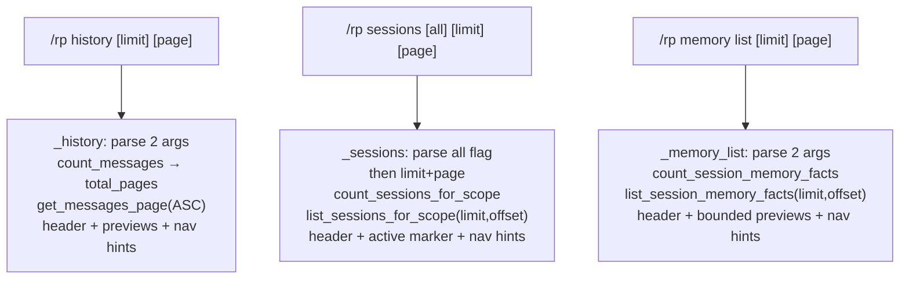

# Phase 18: Mobile-Safe Paginated History, Sessions, and Memory Browsing

## 0. Scope

**Does:**
1. `/rp history [limit] [page]` — paginated transcript view; page 1 = oldest (chronological)
2. `/rp sessions [all] [limit] [page]` — paginated session list with `all` flag preserved
3. `/rp memory list [limit] [page]` — paginated fact list with bounded previews

**Does not:**
- Telegram inline keyboards or gateway navigation buttons
- Real provider/network calls
- DB schema changes (read-only helpers only)
- Changes to import, compiler, provider bridge, or active-session dispatch

**Complexity:** default 档位. Three parallel extensions to an existing command dispatcher, each following the same pagination recipe.

## 1. Decisions & Constraints

- **All runtime changes in `runtime.py`**. New DB helpers added to `db.py` as read-only methods (no schema migration).
- **Chronological pages for history**: page 1 = oldest messages. Requires adding `count_messages` + `get_messages_page` (ASC offset-based) to db.py; current `get_recent_messages` (DESC tail) remains for the actual generation pipeline.
- **Most-recent-first pages for sessions**: page 1 = most recently updated sessions — consistent with current `list_sessions_for_scope` ordering. `count_sessions_for_scope` added; existing method gains optional `limit`/`offset` kwargs (default values preserve current behavior).
- **Importance-order pages for memory**: same ordering as current `list_session_memory_facts` (importance DESC, created_at ASC). `count_session_memory_facts` added; existing method gains optional `limit`/`offset` kwargs.
- **No raw JSON output**, no credential fields — enforced by existing architecture.
- **`_mobile_preview` reused** for all fact/message content previews.
- **TDD**: failing tests written first, implementation second.
- **Backward compatibility**: existing call sites for `get_recent_messages`, `list_sessions_for_scope`, and `list_session_memory_facts` pass no limit/offset → get current behavior unchanged.

## 2. Noun Layer

### 2.1 Current → Change

**Current:**
- `RPCommand(name, args, raw)` — `args` is `list[str]`; unchanged.
- `store.get_recent_messages(session_id, limit)` → `list[dict]`; DESC-then-ASC tail query.
- `store.list_sessions_for_scope(scope_key, *, include_all)` → `list[dict]`; hardcoded `LIMIT 50`.
- `store.list_session_memory_facts(session_key)` → `list[dict]`; returns all facts ordered importance DESC, created_at ASC.
- No count helpers for any of these.

**Change (db.py — read-only additions):**

```python
# New helpers
store.count_messages(session_id: str) -> int
store.get_messages_page(session_id: str, limit: int, offset: int) -> list[dict]
# ↑ ASC chronological; offset = (page-1)*limit

store.count_sessions_for_scope(scope_key: str, *, include_all: bool) -> int
# existing method gains optional kwargs (defaults preserve current behavior):
store.list_sessions_for_scope(scope_key, *, include_all, limit=50, offset=0) -> list[dict]

store.count_session_memory_facts(session_key: str) -> int
# existing method gains optional kwargs:
store.list_session_memory_facts(session_key, *, limit=None, offset=0) -> list[dict]
# limit=None → return all (current behavior)
```

### 2.2 Orchestration Layer

**Current dispatch (relevant paths):**
```
/rp history [limit]        → _history(command, event)  # one arg, tail query
/rp sessions [all]         → _sessions(command, event) # all flag only
/rp memory list            → _memory_list(event)       # no args, dumps all
```

**Changed dispatch:**


**Detailed behavior specs:**

`/rp history [limit] [page]`:
- `args[0]`: limit, default 10, clamp 1..50; bad value → `"Usage: /rp history [limit] [page]"`
- `args[1]`: page, default 1, clamp ≥1; clamped to total_pages if over
- `total = store.count_messages(session_id)`; `total_pages = max(1, ceil(total/limit))`
- `offset = (page-1)*limit`; messages = `store.get_messages_page(session_id, limit, offset)`
- Header: `Hermes Tavern session history (page X/Y, N shown, M total):`
- Each row: `  [shortid] role: preview` (preview via `_mobile_preview(content, 80)`)
- Nav hints (only when applicable):
  - `prev: /rp history <limit> <page-1>` when page > 1
  - `next: /rp history <limit> <page+1>` when page < total_pages

`/rp sessions [all] [limit] [page]`:
- `args[0]` may be `"all"` (case-insensitive); if so, include_all=True, shift args
- After optional `all`: `args[0]`=limit (default 10, clamp 1..25), `args[1]`=page (default 1)
- Bad numeric args → `"Usage: /rp sessions [all] [limit] [page]"`
- `total = store.count_sessions_for_scope(scope_key, include_all=include_all)`
- `total_pages = max(1, ceil(total/limit))`; page clamped to total_pages
- Header: `Hermes Tavern sessions (all, page X/Y, N shown, M total):` or without `all, `
- Rows: existing format `  [shortid] (status)[*] card_name[ — title]`; active marker `*` preserved
- Nav hints:
  - `prev: /rp sessions [all] <limit> <page-1>` when page > 1
  - `next: /rp sessions [all] <limit> <page+1>` when page < total_pages
  - `all` literal included in hint iff include_all=True

`/rp memory list [limit] [page]`:
- Sub-command routing: `_memory_command` dispatches on `args[0]=="list"` → `_memory_list(command, event)` (signature change: add `command` param)
- `args[1]`: limit, default 10, clamp 1..25; bad value → `"Usage: /rp memory list [limit] [page]"`
- `args[2]`: page, default 1, clamp ≥1..total_pages
- No active session → `"No active Hermes Tavern session."` (unchanged)
- `total = store.count_session_memory_facts(session_key)`; `total_pages = max(1, ceil(total/limit))`
- `facts = store.list_session_memory_facts(session_key, limit=limit, offset=offset)`
- Header: `Hermes Tavern session memory:\nsummary: set|none\nfacts (page X/Y, N shown, M total):`
- Each row: `  - (importance) preview` (preview via `_mobile_preview(content, 80)`)
- Nav hints:
  - `prev: /rp memory list <limit> <page-1>` when page > 1
  - `next: /rp memory list <limit> <page+1>` when page < total_pages

### 2.3 Mount Points

| Mount | Description | Delete to remove feature |
|---|---|---|
| `_history` in `runtime.py` | adds page arg parsing + pagination logic | yes |
| `_sessions` in `runtime.py` | adds limit/page arg parsing + pagination logic | yes |
| `_memory_list` in `runtime.py` | adds command arg passthrough + pagination logic | yes |
| `count_*` / `get_messages_page` / `list_*(..., limit, offset)` in `db.py` | read-only pagination primitives | yes (remove callers first) |
| Help text strings in `handle_command_sync` | updated usage strings | yes |

### 2.4 Execution Strategy (Paradigm Slices)

1. **DB layer** — add `count_messages`, `get_messages_page`, `count_sessions_for_scope`; extend `list_sessions_for_scope` and `list_session_memory_facts` with optional `limit`/`offset`. Exit: `py_compile db.py` green, unit-level assertions in tests.
2. **`_history` pagination** — refactor arg parse, call new helpers, emit paginated output. Exit: history tests green.
3. **`_sessions` pagination** — refactor arg parse, call new helpers. Exit: sessions tests green.
4. **`_memory_list` pagination** — pass `command` through dispatcher, refactor arg parse, call new helpers. Exit: memory tests green.
5. **Help text** — update usage strings for all three commands. Exit: help-text tests green.
6. **Full suite** — `venv/bin/python -m pytest tests/plugins/test_hermes_tavern_*.py -q -o 'addopts='` all green.

### 2.5 Structure Health & Micro-refactor Assessment

**File-level:**
- `runtime.py` at 1221 lines. Per Phase 17 decision, intentional monolith pattern for the command dispatcher. Phase 18 adds ~120 lines. Still within acceptable range. **No file split.**
- `db.py` grows by ~60 lines (count helpers + optional kwargs). Same monolith pattern; no split.

**Directory-level:**
- All new tests appended to `tests/plugins/test_hermes_tavern_mobile_browsers.py` (Phases 16/17 home). No new test files needed.

**Convention check:** No relevant compound convention found for "pagination helper placement". Both count methods and extended kwargs follow the existing `db.py` single-class pattern.

**Conclusion: no micro-refactor.** All additions are targeted extensions inside existing files and the existing pattern.

## 3. Acceptance Contract

### A — `/rp history [limit] [page]`

| Input | Expected |
|---|---|
| `/rp history` (10 msgs total) | page 1/1, all 10 shown, no nav hints |
| `/rp history` (25 msgs total) | page 1/3 (10 shown, 25 total), next hint |
| `/rp history 5 2` (25 total) | page 2/5, msgs 6-10 shown, prev + next hints |
| `/rp history 10 99` (25 total) | clamped to page 3/3, msgs 21-25 shown, prev hint, no next hint |
| `/rp history bad` | `Usage: /rp history [limit] [page]` |
| no active session | `No active Hermes Tavern session.` |
| each row preview | ≤80 chars, single-line, no raw JSON |
| page X/Y header | contains "page X/Y", "N shown", "M total" |
| chronological order | page 1 = oldest messages |

### B — `/rp sessions [all] [limit] [page]`

| Input | Expected |
|---|---|
| `/rp sessions` (3 sessions) | page 1/1, 3 shown, no nav hints |
| `/rp sessions all` (8 sessions) | page 1/1 (default limit=10 ≥ 8), all shown |
| `/rp sessions 3 2` (8 sessions) | page 2/3, 3 shown, prev + next hints (no `all`) |
| `/rp sessions all 3 2` (8 sessions) | page 2/3, prev `/rp sessions all 3 1`, next `/rp sessions all 3 3` |
| `/rp sessions bad` | `Usage: /rp sessions [all] [limit] [page]` |
| `/rp sessions all bad` | `Usage: /rp sessions [all] [limit] [page]` |
| active session | `*` marker on active session |
| header with all | `Hermes Tavern sessions (all, page X/Y, N shown, M total):` |
| header without all | `Hermes Tavern sessions (page X/Y, N shown, M total):` |

### C — `/rp memory list [limit] [page]`

| Input | Expected |
|---|---|
| `/rp memory list` (5 facts) | page 1/1, all 5 shown, no nav hints |
| `/rp memory list 2 2` (5 facts) | page 2/3, 2 shown, prev + next hints |
| `/rp memory list 2 99` (5 facts) | clamped to page 3/3, 1 shown, prev hint, no next |
| `/rp memory list bad` | `Usage: /rp memory list [limit] [page]` |
| no active session | `No active Hermes Tavern session.` |
| summary shown | `summary: set` or `summary: none` in header block |
| fact preview | ≤80 chars, single-line |
| facts header line | `facts (page X/Y, N shown, M total):` |

### Explicit Not-Does (reverse checks)

- No Telegram inline keyboards in any output
- No raw JSON in any output
- No DB schema changes (no new tables/columns)
- Existing `/rp history 5` (no page arg) still works as page 1
- Existing `/rp sessions all` (no numeric args) still works as page 1, limit 10
- Existing `/rp memory list` (no args) still works as page 1, limit 10
