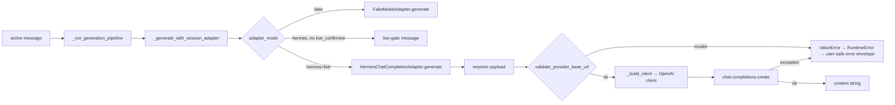

# Phase 19 — Live Provider Hardening + E2E Generation

## 0. Decisions & Constraints

**Not doing:**
- Real network calls in tests — all provider calls are injectable fakes.
- Breaking any existing `/rp` command signatures.
- Persisting api_key / access_token in DB (enforced from Phase 5 onward; no change).
- Timeout wrapping via threading — bounded error message is sufficient for this phase.
- Changing default `adapter_mode=fake`.
- Schema migrations (no new DB columns needed).

**Complexity:** default track. Two files extended (`provider_bridge.py`, `adapters.py`), one command added to `runtime.py`, tests added to existing test files + new E2E test file.

**Ambiguous decisions resolved (mobile/gateway-safe defaults):**
- `base_url` error message never includes the rejected URL value — attacker-controlled URL must not appear in user-facing output.
- Exception `str(exc)` is never forwarded to user — fixed envelope message only.
- `/rp model test` never performs real generation even in hermes+live mode — it only resolves + validates.

---

## 1. Where this fits

Phase 19 extends three existing files and adds one new test module:

| File | Role |
|---|---|
| `plugins/hermes_tavern/provider_bridge.py` | Add `validate_provider_base_url()` |
| `plugins/hermes_tavern/adapters.py` | Call validator in `_build_client()`; harden error envelope |
| `plugins/hermes_tavern/runtime.py` | Harden error envelope in `_generate_with_session_adapter()`; add `/rp model test` |
| `tests/plugins/test_hermes_tavern_provider_bridge.py` | Add base_url validation tests |
| `tests/plugins/test_hermes_tavern_adapters.py` | Add secret-safe error envelope test |
| `tests/plugins/test_hermes_tavern_runtime.py` | Add `/rp model test` + error-non-crash tests |
| `tests/plugins/test_hermes_tavern_e2e.py` | **New** — full pipeline test |

---

## 2. Noun layer

### 2.1 Names: current → change

**Current:**
- `HermesChatCompletionAdapter._build_client(payload)` — constructs `OpenAI(api_key=..., base_url=...)` from resolver payload with no URL validation.
- `_generate_with_session_adapter()` in `runtime.py` catches `Exception as exc` and returns `f"[Hermes Tavern live provider error: {type(exc).__name__}: {exc}]"` — `str(exc)` can include URL, response body, headers.
- No `/rp model test` command exists.
- No E2E test covering full pipeline.

**Change:**

```python
# provider_bridge.py — new function
def validate_provider_base_url(base_url: str) -> None:
    """Raise ValueError with user-safe message if base_url is not allowed.
    Never includes the rejected URL in the error message.
    """

# provider_bridge.py — new constant
SAFE_URL_SCHEMES: frozenset[str]      # {"https"}
BLOCKED_PRIVATE_PREFIXES: tuple[str]  # ("127.", "10.", "192.168.", ...)
```

```python
# adapters.py — _build_client() now calls validator before constructing client
def _build_client(self, payload: dict[str, Any]) -> Any:
    base_url = payload.get("base_url")
    if base_url:
        validate_provider_base_url(base_url)   # raises ValueError → caller catches
    ...
```

```python
# runtime.py — hardened error envelope
# BEFORE: return f"[Hermes Tavern live provider error: {type(exc).__name__}: {exc}]"
# AFTER:  return "[Hermes Tavern: provider error — check /rp model status]"

# runtime.py — new /rp model test sub-command
def _model_test(self, event: Any) -> str:
    """Dry-run: resolve provider config + validate, no real generation."""
```

No new DB columns. No new value objects.

### 2.2 Orchestration layer: current → change

**Current pipeline (active message, hermes+live mode):**

```
handle_active_message_sync
  → _run_generation_pipeline
      → _compile prompt
      → _router.resolve → descriptor
      → _chat_renderer.render → messages
      → _generate_with_session_adapter
          → HermesChatCompletionAdapter.generate
              → resolver() → payload (unchecked base_url)
              → _build_client(payload)        ← no URL check
              → client.chat.completions.create
          except Exception: leak exc detail   ← unsafe
```

**After Phase 19:**

```
handle_active_message_sync
  → _run_generation_pipeline
      → ... (unchanged)
      → _generate_with_session_adapter
          → HermesChatCompletionAdapter.generate
              → resolver() → payload
              → _build_client(payload)
                  validate_provider_base_url(base_url)   ← NEW
                  → ValueError → RuntimeError: user-safe  ← surfaced up
              → client.chat.completions.create
          except Exception: "[Hermes Tavern: provider error — check /rp model status]"  ← FIXED

/rp model test → _model_test():
  → resolve descriptor (no generation)
  → validate base_url if present
  → return safe status summary
```

**Main flow diagram:**



### 2.3 Mount points

| Mount point | Delete → feature disappears? |
|---|---|
| `validate_provider_base_url` called in `_build_client` | Yes — removing the call re-opens base_url injection |
| error envelope `except Exception` in `_generate_with_session_adapter` | Yes — removing it restores exc-leaking message |
| `/rp model test` branch in `_model_command` | Yes — command removed from user-facing surface |
| `/rp model test` in help text | Yes — command no longer discoverable |

### 2.4 Advance strategy (paradigm slices)

1. **Safety skeleton** — add `validate_provider_base_url` to `provider_bridge.py`, wire into `_build_client`, harden error envelope in runtime. Exit signal: `py_compile` clean + new provider_bridge/adapter tests pass.

2. **`/rp model test` command** — add `_model_test()` to `TavernRuntime`, wire into `_model_command`, update help string. Exit signal: `/rp model test` tests pass (no real generation).

3. **E2E pipeline test** — write `tests/plugins/test_hermes_tavern_e2e.py` covering full session+card+preset+lore+memory → compile → render → injected fake adapter → persisted reply. Exit signal: test passes without network.

4. **Full test run** — `python -m pytest tests/plugins/test_hermes_tavern_*.py -q -o 'addopts='`. Exit signal: all green.

### 2.5 Structural health

**Files being changed:**
- `provider_bridge.py` (79 lines): healthy. Adding ~30 lines. Fine.
- `adapters.py` (125 lines): healthy. Adding ~5 lines to `_build_client`. Fine.
- `runtime.py` (1285 lines): fat but not this phase's problem. Adding ~40 lines for `_model_test()` and changing 1 line for error envelope. **Not doing extraction this phase** — a dedicate refactor pass is the right move later. Observation: `runtime.py` would benefit from splitting commands into a `_commands/` subpackage; filing for `cs-refactor` after Phase 20.

**New file:** `tests/plugins/test_hermes_tavern_e2e.py` — belongs in `tests/plugins/`, same pattern as other test files. No structural concern.

**Convention check:** compound decisions contain no directory-layout conventions for this plugin. Proceeding with existing `tests/plugins/` pattern.

**Not doing micro-refactor this phase.** runtime.py fatness is flagged above as post-Phase-20 candidate.

---

## 3. Acceptance contract

| # | Trigger | Expected observable result |
|---|---|---|
| A1 | `validate_provider_base_url("http://evil.com/v1")` | raises `ValueError`; message does not contain the URL |
| A2 | `validate_provider_base_url("file:///etc/passwd")` | raises `ValueError` |
| A3 | `validate_provider_base_url("https://127.0.0.1/v1")` | raises `ValueError` |
| A4 | `validate_provider_base_url("https://192.168.1.1/v1")` | raises `ValueError` |
| A5 | `validate_provider_base_url("https://api.apiyi.com/v1")` | returns without raising |
| A6 | `validate_provider_base_url("https://api.openai.com/v1")` | returns without raising |
| A7 | Live adapter gets invalid base_url → `generate()` → response string | response is `"[Hermes Tavern: provider error — check /rp model status]"` or similar bounded message; no URL in response |
| A8 | Live adapter raises arbitrary `RuntimeError("secret detail")` → `_generate_with_session_adapter` | response does not contain `"secret detail"` |
| A9 | `/rp model test` (session + hermes + live) | returns readiness status; no real generation; no api_key in output |
| A10 | `/rp model test` (no active session) | returns "No active Hermes Tavern session." |
| A11 | E2E: session + card + preset + lore + memory → fake adapter → `handle_active_message_sync` | returns `FAKE_ADAPTER_REPLY`; both user and assistant messages persisted in DB |
| A12 | gateway hook: live adapter throws exception during `handle_active_message_sync` | hook returns `{"action": "allow"}`; no crash |
| A13 | `api_key` / `access_token` never appears in any `/rp model test` or error envelope output | confirmed by string search in test assertions |

**Explicitly not tested (boundary):**
- Real network calls.
- Real OpenAI SDK behavior beyond the injected fake client.
- DB schema migrations (none in this phase).
