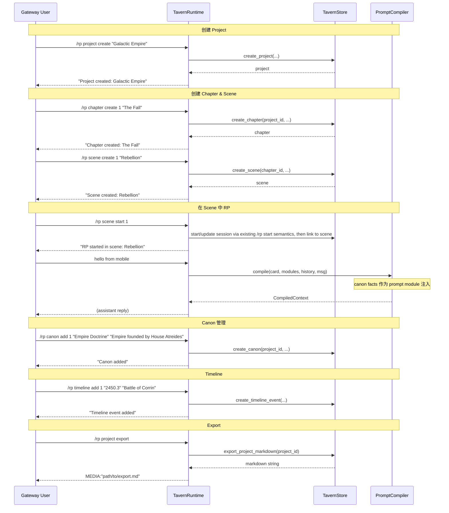

# Phase 121: Novel Project Layer

## 0. 术语约定

| 术语 | 定义 | 防冲突结论 |
|------|------|-----------|
| **Project** | 一个长篇小说工程容器，包含 metadata（标题、摘要、状态）及子对象。 | 不与 Hermes "project"（代码仓库）冲突——这是 Tavern 内部的文学工程概念。源码中不使用裸 `project` 变量名，统一用 `novel_project` 或 `tavern_project`。 |
| **Chapter** | Project 下的一个章节，有标题、序号、状态（draft/complete）。 | 不与代码中的"章节"模式冲突。 |
| **Scene** | Chapter 下的一个场景，有标题、内容摘要、关联的角色和 lore。 | 不与 3D/图形场景概念冲突。 |
| **Canon Fact** | 世界设定中已确立的不可变事实，供 prompt 注入用。 | 区别于 session_memory_facts（后者是剧情进展记忆）。 |
| **Timeline Event** | 虚构世界中的时间点事件，有日期/时间描述、关联章节。 | 不与系统 timestamp 冲突。 |
| **Canon Group** | Canon facts 的逻辑分组（角色档案、地点、规则、历史等）。 | 不与 lorebook group 冲突。 |

Grep 结论：`project`, `chapter`, `scene`, `canon`, `timeline` 在 `src/hermes_tavern/` 中不存在（仅 `project` 出现在 pyproject.toml 语境中，与本文无关）。全新概念，无冲突。

---

## 1. 决策与约束

### 需求摘要

- **做什么**：在现有 session-based RP 之上，增加 project → chapter → scene 三层结构，支持 canon fact 管理和 timeline 追踪，并提供 Markdown 导出能力。
- **为谁**：想要用 Tavern 写长篇小说的用户（多章节、多场景、需要保持世界观一致性）。
- **成功标准**：用户能创建 project，在其下创建 chapter 和 scene；scene 可关联到 active RP session；canon facts 可通过 prompt module 注入；timeline 可查询；能导出为结构化 Markdown。
- **明确不做**：
  - 不替代或修改现有 session-based RP 的 session CRUD
  - 不做协作/多用户 novel 编辑
  - 不做云端同步
  - 不做版本历史/Git-like 回溯
  - 不做 novel 导入（首版只做导出）
  - 不做自动分章/自动拆分
  - Timeline 不做图形渲染（纯文本列表）

### 复杂度档位

走默认档位，无偏离。本 feature 是纯本地 SQLite 扩展 + 文本导出，无并发、无实时协作、无外部 SDK。

### 关键决策

1. **投影到现有 TavernStore SQLite，不另开文件**。Project/chapter/scene/canon/timeline 全部新增表，与现有 cards/sessions/messages 同库。理由：避免跨库事务、简化备份、利用已有连接池。

2. **Scene 可关联到现有 session**。一个 scene 通过 `session_id` FK 指向 sessions 表。一个 session 此时就是"这个 scene 的聊天历史"。不引入新的 scene-message 关系表。

3. **Canon facts 作为新类型的 prompt module**。canon 注入走现有 PromptModule 体系（位置=system，插入顺序在 card 之后、preset 之前），不重复造注入机制。

4. **Timeline 是平铺 event 列表**，不建模时间线分支。支持按 project 查询和按时间描述排序。

5. **Markdown 导出是 controller-side 拼接**，不走模板引擎。简单可靠，后续可演进。

### 前置依赖

无。Phase 4 Prompt Compiler 和 Phase 20 Macro Engine 已就绪，canon 注入可直接复用 `PromptModule` 体系。

---

## 2. 名词与编排

### 2.1 名词层

#### 现状

现有 DB schema（`src/hermes_tavern/db.py`）管理：
- `cards`, `sessions`, `messages`, `presets`, `prompt_modules`
- `lorebooks`, `lorebook_entries`, `personas`
- `session_memory_facts`, `session_summaries`

`PromptCompiler.compile()` ∈ `src/hermes_tavern/prompt.py` 接收 `preset_modules` 列表组装 prompt。

#### 变化

**新增表（5 张）**：

```sql
-- Project 容器
CREATE TABLE IF NOT EXISTS novel_projects (
    id INTEGER PRIMARY KEY AUTOINCREMENT,
    title TEXT NOT NULL,
    summary TEXT NOT NULL DEFAULT '',
    status TEXT NOT NULL DEFAULT 'draft',  -- draft | in_progress | complete | archived
    created_at TEXT NOT NULL DEFAULT (datetime('now')),
    updated_at TEXT NOT NULL DEFAULT (datetime('now'))
);

-- Chapter
CREATE TABLE IF NOT EXISTS novel_chapters (
    id INTEGER PRIMARY KEY AUTOINCREMENT,
    project_id INTEGER NOT NULL REFERENCES novel_projects(id),
    title TEXT NOT NULL,
    chapter_number INTEGER NOT NULL DEFAULT 1,
    summary TEXT NOT NULL DEFAULT '',
    status TEXT NOT NULL DEFAULT 'draft',  -- draft | complete
    created_at TEXT NOT NULL DEFAULT (datetime('now')),
    updated_at TEXT NOT NULL DEFAULT (datetime('now'))
);

-- Scene（关联 session）
CREATE TABLE IF NOT EXISTS novel_scenes (
    id INTEGER PRIMARY KEY AUTOINCREMENT,
    chapter_id INTEGER NOT NULL REFERENCES novel_chapters(id),
    session_id TEXT REFERENCES sessions(id),  -- nullable: scene 可以不关联 session
    title TEXT NOT NULL,
    summary TEXT NOT NULL DEFAULT '',
    scene_number INTEGER NOT NULL DEFAULT 1,
    status TEXT NOT NULL DEFAULT 'draft',  -- draft | complete
    created_at TEXT NOT NULL DEFAULT (datetime('now')),
    updated_at TEXT NOT NULL DEFAULT (datetime('now'))
);

-- Canon Fact（世界设定）
CREATE TABLE IF NOT EXISTS novel_canon (
    id INTEGER PRIMARY KEY AUTOINCREMENT,
    project_id INTEGER NOT NULL REFERENCES novel_projects(id),
    title TEXT NOT NULL,
    content TEXT NOT NULL,
    canon_group TEXT NOT NULL DEFAULT 'general',
    importance INTEGER NOT NULL DEFAULT 0,  -- 0-10, higher = more important
    created_at TEXT NOT NULL DEFAULT (datetime('now')),
    updated_at TEXT NOT NULL DEFAULT (datetime('now'))
);

-- Timeline Event
CREATE TABLE IF NOT EXISTS novel_timeline (
    id INTEGER PRIMARY KEY AUTOINCREMENT,
    project_id INTEGER NOT NULL REFERENCES novel_projects(id),
    event_date TEXT NOT NULL,          -- 虚构时间描述："星历 2450.3"、"第三纪元年春"
    title TEXT NOT NULL,
    description TEXT NOT NULL DEFAULT '',
    chapter_id INTEGER REFERENCES novel_chapters(id),
    sort_key TEXT NOT NULL DEFAULT '', -- 排序用规范化键："2450.3", "0003.01.spring"
    created_at TEXT NOT NULL DEFAULT (datetime('now'))
);
```

**接口示例**（新增到 `TavernStore`）：

```python
# 来源：src/hermes_tavern/db.py → TavernStore 新增方法

# Project CRUD
def create_project(self, title: str, summary: str = "") -> dict[str, Any]
    """→ {"id": 1, "title": "...", "status": "draft", ...}"""

def list_projects(self) -> list[dict[str, Any]]
    """→ [{id, title, summary, status, chapter_count, ...}]"""

def get_project(self, project_id: int) -> dict[str, Any] | None

# Chapter CRUD
def create_chapter(self, project_id: int, title: str) -> dict[str, Any]
def list_chapters(self, project_id: int) -> list[dict[str, Any]]
def get_chapter(self, chapter_id: int) -> dict[str, Any] | None

# Scene CRUD
def create_scene(self, chapter_id: int, title: str, session_id: str | None = None) -> dict[str, Any]
def list_scenes(self, chapter_id: int) -> list[dict[str, Any]]
def get_scene(self, scene_id: int) -> dict[str, Any] | None
def link_scene_session(self, scene_id: int, session_id: str) -> None

# Canon CRUD
def create_canon(self, project_id: int, title: str, content: str, group: str = "general") -> dict[str, Any]
def list_canon(self, project_id: int, group: str | None = None) -> list[dict[str, Any]]
def get_canon_for_prompt(self, project_id: int, limit: int = 10) -> list[dict[str, Any]]
    """→ 按 importance DESC + created_at 返回 top N canon facts 转 prompt module"""

# Timeline
def create_timeline_event(self, project_id: int, event_date: str, title: str, description: str = "", sort_key: str = "") -> dict[str, Any]
def list_timeline(self, project_id: int) -> list[dict[str, Any]]
    """→ 按 sort_key ASC 排序"""

# Export
def export_project_markdown(self, project_id: int) -> str
    """→ 拼接 Markdown 字符串：标题、摘要、章节→场景→session 对话、canon、timeline"""
```

### 2.2 编排层

#### 主流程图



#### 现状

当前 `handle_command_sync` ∈ `src/hermes_tavern/runtime.py` 是 table-driven dispatch，通过 `COMMAND_TABLE` 路由到各 handler。session-based RP 独立运行，无 project 层级概念。

#### 变化

1. **在 `COMMAND_TABLE` 中新增 5 个 command family**：`project`, `chapter`, `scene`, `canon`, `timeline`，每个对应一个 `runtime_novel.py` handler。

2. **新增 `src/hermes_tavern/runtime_novel.py`**：
   - `project_create/list/info/set/export`
   - `chapter_create/list`
   - `scene_create/list/start`
   - `canon_add/list/group`
   - `timeline_add/list`

3. **Canon 注入到 prompt**：在 `_session_prompt_modules` (`runtime.py`) 中，当 session 关联的 scene/chapter/project 存在时，调用 `store.get_canon_for_prompt(project_id)` 获取 canon facts，包装为 `PromptModule(role="system", content=..., position="after_card", insertion_order=...)` 注入到 `preset_modules` 之前。

4. **Scene 启动时自动关联 session**：`/rp scene start` 复用现有 `/rp start` 生命周期语义启动/更新当前 RP session，设置 `card_id`（从当前 card 或参数），并将 `scene.session_id` 更新为该 session 的 id。

5. **Markdown 导出**：`export_project_markdown` 在 `TavernStore` 中拼接：
   ```
   # {project.title}
   ## Summary
   {project.summary}
   
   ## Canon
   {按 group 分组的 canon facts}
   
   ## Timeline
   {按 sort_key 排序的 timeline events}
   
   ## Chapters
   ### Chapter N: {title}
   #### Scene M: {title}
   {session messages as dialogue}
   ```
   将内容写入 `get_hermes_home() / "plugins" / "hermes-tavern" / "exports" / "project_{id}.md"`，返回 `MEDIA:"<path>"` 格式。

#### 流程级约束

- **幂等性**：`create_project` 允许同名 project（用 id 区分，不做 title unique constraint）。project/export 每次重新生成文件。
- **错误语义**：project/chapter/scene 不存在时返回明确错误消息（"Project not found: X"）；canon 注入失败（DB 错误）时跳过 canon 部分继续生成（不阻塞 RP）。
- **并发**：无特殊要求（单用户 gateway 场景）。
- **扩展点**：`get_canon_for_prompt` 的 limit 和排序策略可在后续扩展为可配置；export 格式可后续支持 JSON/ZIP。

### 2.3 挂载点清单

| 挂载位置 | 动作 |
|---------|------|
| `src/hermes_tavern/runtime.py` → `COMMAND_TABLE` | 新增 5 个 command family 路由条目 |
| `src/hermes_tavern/db.py` → `TavernStore` | 新增 5 张表 + CRUD 方法 |
| `src/hermes_tavern/runtime.py` → `_session_prompt_modules()` | 新增 canon injection 调用点 |
| `src/hermes_tavern/plugin.yaml` | 无需变更（entrypoint 不变） |

本 feature 挂载点 4 条，在正常区间内。

### 2.4 推进策略

```
1. DB schema：在 TavernStore 中创建 5 张表 + CRUD 方法
   退出信号：import TavernStore → 创建/查询 project/chapter/scene/canon/timeline 正常

2. Command surface：新增 runtime_novel.py + 5 个 command family
   退出信号：/rp project create/list, /rp chapter, /rp scene, /rp canon, /rp timeline 返回正确响应

3. Canon prompt injection：_session_prompt_modules 中注入 canon facts
   退出信号：active session with project → debug prompt 输出包含 canon 模块

4. Scene-session linking：/rp scene start 创建 session 并关联 scene
   退出信号：/rp scene start → /rp session info 显示关联的 project/chapter/scene

5. Markdown export：export_project_markdown 完成拼接
   退出信号：/rp project export 返回 MEDIA 标记 → 导出文件可读

6. 测试覆盖：单元测试 + 集成测试覆盖所有 CRUD 和注入/导出路径
   退出信号：pytest 全绿 + targeted tests 覆盖关键场景
```

### 2.5 结构健康度与微重构

#### 评估

- **文件级 — `src/hermes_tavern/db.py` (88 defs)**：当前 db.py 已偏大（88 个方法定义），本次新增约 15-20 个方法 → 改动密度高、职责混杂（novel 层与现有 card/session/memory CRUD 混写）。
- **文件级 — `src/hermes_tavern/runtime.py` (108 defs)**：已偏大，本次需要在 `COMMAND_TABLE` 加 5 条路由 + 在 `_session_prompt_modules` 加一处注入调用 → 改动密度低（2 处分散的点改动），暂可容忍。
- **目录级 — `src/hermes_tavern/`**：当前 36 个 .py 文件，本次新增 1 个 `runtime_novel.py`。目录已有按 runtime 子模块拆分的既有模式（`runtime_turns.py`, `runtime_lore.py`, `runtime_memory.py` 等），继续这个模式属于一致性操作，不算摊平。

#### 结论：微重构（拆文件）— 仅 db.py

将 novel 相关的 DB 操作从 db.py 抽到独立文件 `src/hermes_tavern/db_novel.py`。

#### 方案

- **搬什么**：所有 novel project/chapter/scene/canon/timeline 相关的方法和建表逻辑
- **搬到哪**：`src/hermes_tavern/db_novel.py`，`TavernStore` 的 novel 方法作为 mixin 或通过 `from db_novel import NovelDBMixin` 注入
- **行为不变怎么验证**：现有全量 pytest 通过（718 个测试）+ 编译校验 + git diff 确认除 import 路径外无功能性变更
- **步骤序列**：
  1. 创建 `db_novel.py`，移动/新增 novel 相关方法
  2. 更新 `db.py` 中的 `TavernStore` class，继承或组合 `NovelDBMixin`
  3. 运行全量 pytest 确认无回归
  4. 继续 feature 主体步骤

#### 建议沉淀的 convention

- **稳定模式**：是。同 `runtime_turns.py` / `runtime_lore.py` 等 pattern —— DB 子模块按 domain 拆分。
- **规则一句话**：`TavernStore` 的 domain-specific CRUD 方法应放在 `db_{domain}.py` 文件中，`db.py` 只保留基础连接/迁移/session 核心方法。
- **适用范围**：本仓库 `src/hermes_tavern/` 全部
  → 建议 implement 跑通后走 `cs-decide` 归档为 `category: convention`

---

## 3. 验收契约

### 关键场景清单

**正常路径**：
1. `/rp project create "My Novel"` → 返回 "Hermes Tavern project created: [1] My Novel"
2. `/rp project list` → 列出所有 project（含 chapter_count）
3. `/rp chapter create [1] "Chapter 1"` → 在当前 project 下创建 chapter（或显式 project-id）
4. `/rp scene create 1 "Opening"` → 在 chapter 1 下创建 scene
5. `/rp scene start 1` → 创建新 session，state 显示 "Scene: Opening"
6. `/rp canon add 1 "World" "The sky is purple" --group world` → 添加 canon fact
7. `/rp canon list` → 列出当前 project 的 canon facts
8. `/rp timeline add 1 "Year 1" "The Beginning"` → 添加 timeline event
9. `/rp timeline list` → 列出当前 project 的 timeline
10. `/rp project export` → 返回 MEDIA 格式的 Markdown 导出路径

**边界**：
11. 未选择 project 时执行 `/rp chapter create` → "No active novel project. Use /rp project set <id> or pass project-id."
12. canon fact 的 group 为空时 → default 为 "general"
13. 空 canon → get_canon_for_prompt 返回空列表，不影响 prompt 构建
14. scene 不关联 session 时 → scene list 显示 "no session linked"

**错误路径**：
15. `/rp chapter create` 但 project_id 不存在 → "Project not found"
16. `/rp scene start nonexistent` → "Scene not found"
17. `/rp project export` 但 project 无内容 → 生成含标题和空的 sections 的 Markdown

### 明确不做的反向核对项

- 代码中**不应出现**对云端同步 API 的调用
- 代码中**不应出现**多用户/协作相关的表或逻辑
- 代码中**不应出现**novel import 功能（仅 export）
- 代码中**不应出现**图形渲染（timeline 纯文本）
- 现有的 session CRUD（`/rp start`, `/rp end`, `/rp switch`）**行为不变**

---

## 4. 与项目级架构文档的关系

### 名词 ← architecture

- `novel_projects`, `novel_chapters`, `novel_scenes`, `novel_canon`, `novel_timeline` → 更新 `ARCHITECTURE.md` DB schema 节，添加 novel 表

### 动词骨架 ← architecture

- Canon injection flow → 更新 `ARCHITECTURE.md` Prompt pipeline 节，标注 canon 模块注入点

### 流程级约束 ← architecture

- 无新的跨 feature 稳定约束（本 feature 限定在 novel 子域）

### 关联已有架构 doc

- `design/codestable/architecture/ARCHITECTURE.md` — 更新 DB schema 和 prompt pipeline 两处
- `design/HERMES_TAVERN_DESIGN.md` — Phase 9 标记为 "implemented"（acceptance 后）
