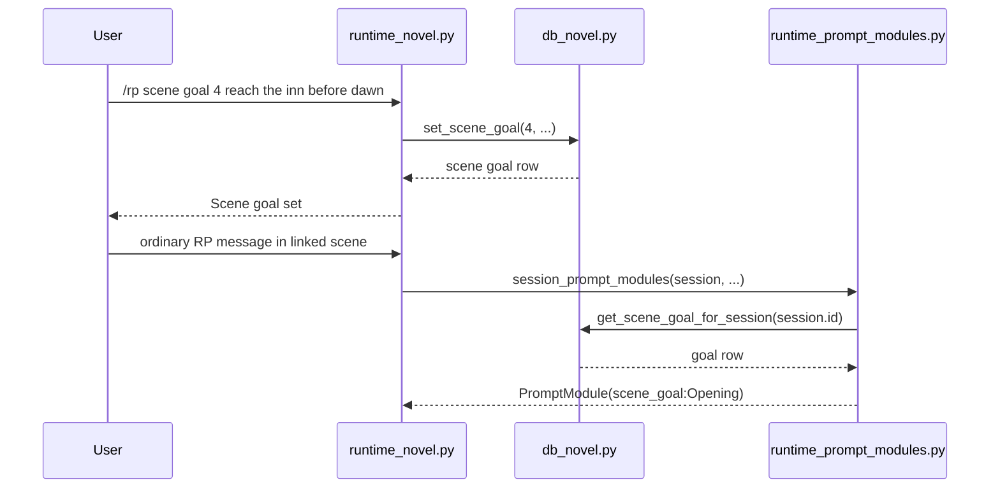

# Phase 122: Scene Goals v1

## 0. 术语约定

| 术语 | 定义 | 防冲突结论 |
|------|------|-----------|
| **Scene Goal** | 用户为一个 novel scene 写下的当前叙事目标，例如“让主角在不暴露身份的情况下拿到钥匙”。 | 不等于 outline，不自动拆章，不自动生成剧情。 |
| **Active Linked Scene** | `novel_scenes.session_id` 指向当前 active RP session 的 scene。 | 复用 Phase 121 scene-session linkage。 |
| **Scene Goal Module** | 从 active linked scene goal 派生的 `PromptModule`。 | 不等于 canon fact；goal 是当前场景方向，canon 是已确立事实。 |

Grep 结论：Phase 121 已有 `scene` command family、`novel_scenes` 和 canon prompt injection；源码尚无 `scene_goal` / `novel_scene_goals` 概念。

## 1. 决策与约束

### 需求摘要

- **做什么**：允许用户为 scene 设置、查看、清除目标，并在该 scene 关联的 active session 中把目标注入 prompt。
- **为谁**：长篇小说 / RP 用户，需要给单个场景一个可见、可编辑的写作方向。
- **成功标准**：
  - `/rp scene goal <scene-id> <text>` 持久化目标。
  - `/rp scene goal <scene-id>` 显示目标。
  - `/rp scene goal clear <scene-id>` 清除目标。
  - active linked scene 的 `/rp debug prompt` 显示 `system/scene_goal:<scene title>`。
- **明确不做**：
  - 不做 outline editing。
  - 不做自动写作、rewrite、expand、compress。
  - 不做 canon check/conflict。
  - 不做 relationship state 或 character state。
  - 不做 novel import、cloud sync、collaboration、timeline graphics。
  - 不绕过 provider safety systems，不涉及 minors/underage content。

### 复杂度档位

默认档位。此 feature 是本地 SQLite metadata + existing prompt-module assembly，无网络调用、无新 provider path、无并发协议。

### 关键决策

1. **新增一张 `novel_scene_goals` 表，而不是改写 session/message 语义**。Scene goal 是 scene metadata，生命周期跟 scene 绑定，用 `scene_id UNIQUE` 保持每个 scene 一个当前目标。

2. **命令挂在现有 `scene` family 下**。新增 `/rp scene goal ...`，不新增顶层 `/rp goal`，避免扩大 command namespace。

3. **Prompt 注入复用 `PromptModule`**。active session 若 linked scene 有非空 goal，则生成 `PromptModule(name="scene_goal:<scene title>", role="system", position="before_user", insertion_order=70)`，在 author note 前作为场景方向出现。

4. **DB 错误不阻塞 RP**。scene goal lookup 遇到 `sqlite3.Error` 时跳过 module，和 Phase 121 canon injection 的错误语义一致。

5. **导出是附带可见性，不是新格式**。Markdown export 可在 scene heading 下写 `Goal: ...`；不引入 ZIP/JSON archive 或 import。

### 前置依赖

Phase 121 novel project layer accepted: scene-session linking, `db_novel.py`, `runtime_novel.py`, and prompt-module injection hooks already exist.

## 2. 名词与编排

### 2.1 名词层

#### 现状

- `src/hermes_tavern/db_novel.py` owns `novel_projects`, `novel_chapters`, `novel_scenes`, `novel_canon`, and `novel_timeline`.
- `src/hermes_tavern/runtime_novel.py` owns `/rp scene create/list/start`.
- `src/hermes_tavern/runtime_prompt_modules.py` injects project canon for sessions linked through scene → chapter → project.

#### 变化

新增 table:

```sql
CREATE TABLE IF NOT EXISTS novel_scene_goals (
    id INTEGER PRIMARY KEY AUTOINCREMENT,
    scene_id INTEGER NOT NULL UNIQUE REFERENCES novel_scenes(id) ON DELETE CASCADE,
    goal_text TEXT NOT NULL DEFAULT '',
    created_at TEXT NOT NULL DEFAULT (datetime('now')),
    updated_at TEXT NOT NULL DEFAULT (datetime('now'))
);
```

新增 store methods:

```python
def set_scene_goal(self, scene_id: int, goal_text: str) -> dict[str, Any]
def get_scene_goal(self, scene_id: int) -> dict[str, Any] | None
def clear_scene_goal(self, scene_id: int) -> bool
def get_scene_goal_for_session(self, session_id: str) -> dict[str, Any] | None
```

Command behavior:

```text
/rp scene goal <scene-id> <goal text>   # set/update
/rp scene goal <scene-id>               # inspect
/rp scene goal clear <scene-id>         # clear
```

Prompt module example:

```python
PromptModule(
    name="scene_goal:Opening",
    role="system",
    content="Scene goal: reach the inn before dawn.",
    position="before_user",
    insertion_order=70,
    enabled=True,
)
```

### 2.2 编排层



Flow constraints:

- **Idempotency**: setting a goal for the same scene replaces the previous goal.
- **Empty text**: set command without goal text returns usage; clearing uses explicit `clear`.
- **Missing scene**: store raises `ValueError("Scene not found")`; runtime returns a bounded user message.
- **Prompt failure**: sqlite errors during goal lookup skip the module and continue prompt assembly.
- **Scope isolation**: only the session linked through `novel_scenes.session_id` receives the scene goal module.

### 2.3 挂载点清单

| 挂载位置 | 动作 |
|---------|------|
| `src/hermes_tavern/db_novel.py` | Add table migration and scene-goal CRUD/query helpers. |
| `src/hermes_tavern/runtime_novel.py` | Add `scene goal` subcommand under existing scene family. |
| `src/hermes_tavern/runtime_prompt_modules.py` | Add scene-goal module assembly near canon/persona/note modules. |
| `src/hermes_tavern/commands.py` | Extend `/rp scene ...` help line. |
| `tests/test_hermes_tavern_novel_db.py` | Add persistence and session lookup coverage. |
| `tests/test_hermes_tavern_novel_runtime.py` | Add command and debug-prompt coverage. |

### 2.4 推进策略

1. **DB persistence**: add `novel_scene_goals` migration and CRUD helpers.
2. **Command surface**: add `/rp scene goal` set/inspect/clear and help text.
3. **Prompt injection**: inject active linked scene goal as a `PromptModule`; skip on DB errors.
4. **Export/docs polish**: include goal in Markdown export and README command surface.
5. **Verification**: targeted DB/runtime tests, full pytest, reverse-scope scans.

### 2.5 结构健康度与微重构

- **`db_novel.py`** is already the correct domain file from Phase 121. Adding one table and four methods is cohesive; no new DB module needed.
- **`runtime_novel.py`** is the correct command-family owner. Adding one `scene` subcommand is smaller than creating another runtime module.
- **`runtime_prompt_modules.py`** already owns canon/persona/note/memory/lore module assembly. A small `session_scene_goal_modules()` helper matches existing shape.
- **Tests** should extend existing novel DB/runtime test files rather than creating a new suite.

Conclusion: no pre-feature micro-refactor. If implementation finds `runtime_novel.py` needs substantial parser branching beyond `scene goal`, stop and ask before splitting.

## 3. 验收契约

Normal scenarios:

1. `/rp scene goal 1 Reach the bridge before dawn` → returns a set/update confirmation and persists the text.
2. `/rp scene goal 1` → shows the current goal for scene 1.
3. `/rp scene goal clear 1` → clears the goal; inspect reports no goal set.
4. Active session linked to scene 1 with a goal → `/rp debug prompt` includes `system/scene_goal:<scene title>` and the goal text.
5. Session not linked to that scene → `/rp debug prompt` does not include the goal.
6. `/rp project export` includes the scene goal under that scene when present.

Boundary/error scenarios:

7. `/rp scene goal` or `/rp scene goal not-a-number` → usage message.
8. `/rp scene goal 999 text` → no novel scene found.
9. Empty goal text is rejected; explicit clear is required.
10. sqlite lookup error during prompt assembly skips scene goal and keeps prompt debug usable.

Reverse-scope checks:

- No `project import`, `novel import`, cloud sync, collaboration, timeline graphics, canon check, relationship state, or character state paths.
- No provider calls or credential persistence.
- No protected core files changed.

## 4. 与项目级架构文档的关系

Acceptance should update:

- `design/codestable/architecture/ARCHITECTURE.md`: add `novel_scene_goals` to DB schema and mention scene-goal prompt module in the prompt pipeline.
- `design/HERMES_TAVERN_DESIGN.md`: move “scene goals” from deferred writing commands into the implemented Phase 122 subset.

No new long-term architecture constraint is introduced beyond the existing plugin-only and novel-domain DB split conventions.
