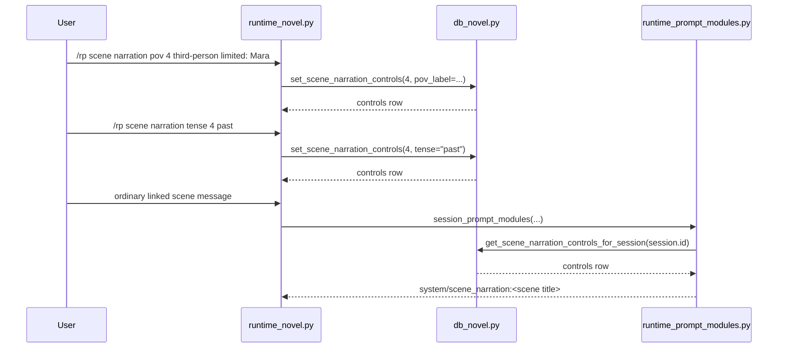

# Phase 123: Scene Narration Controls v1

## 0. Terms

| Term | Meaning | Conflict guard |
|---|---|---|
| Scene Narration Controls | User-authored scene metadata for POV label and tense. | Not `/rp voice`; no TTS/audio behavior. |
| POV Label | Freeform narration point-of-view text, e.g. `third-person limited: Mara`. | Not character state; it creates no character entity. |
| Tense | A small enum: `past` or `present`. | Not provider/model style routing. |
| Scene Narration Module | PromptModule derived from an active linked scene's controls. | Not a writing/autowriting command. |

Existing source has `/rp voice [on|off]`, so the user-facing command uses `scene narration` instead of `voice`.

## 1. Decisions And Constraints

### Need

Users writing long-form scenes need stable POV and tense guidance attached to a scene, not buried in chat history.

### Success

- A scene can persist POV and tense controls.
- Controls can be inspected and cleared.
- A linked active scene can expose controls to prompt assembly as one small system module.
- Markdown project export can show controls under the scene heading.

### Explicit Non-Goals

- No write continue/rewrite/expand/compress.
- No outline editing.
- No character state or relationship state.
- No canon check/conflict.
- No project archive ZIP/import.
- No cloud sync, collaboration, provider credential work, or protected core-file edits.
- No minors/underage content path and no provider safety bypass.

### Complexity

Default local SQLite/plugin slice. No network, no provider calls, no new Hermes core integration.

## 2. Names And Flow

### 2.1 Noun Layer

Current:
- `src/hermes_tavern/db_novel.py` owns novel project/chapter/scene/scene-goal/canon/timeline persistence.
- `novel_scenes.session_id` links scenes to active RP sessions.
- `runtime_prompt_modules.py` already injects canon and scene-goal modules for linked sessions.

Change:

```sql
CREATE TABLE IF NOT EXISTS novel_scene_narration_controls (
    id INTEGER PRIMARY KEY AUTOINCREMENT,
    scene_id INTEGER NOT NULL UNIQUE REFERENCES novel_scenes(id) ON DELETE CASCADE,
    pov_label TEXT NOT NULL DEFAULT '',
    tense TEXT NOT NULL DEFAULT '',
    created_at TEXT NOT NULL DEFAULT (datetime('now')),
    updated_at TEXT NOT NULL DEFAULT (datetime('now'))
);
```

Store contract:

```python
def set_scene_narration_controls(
    self,
    scene_id: int,
    *,
    pov_label: str | None = None,
    tense: str | None = None,
) -> dict[str, Any]

def get_scene_narration_controls(self, scene_id: int) -> dict[str, Any] | None
def clear_scene_narration_controls(self, scene_id: int) -> bool
def get_scene_narration_controls_for_session(self, session_id: str) -> dict[str, Any] | None
```

Rules:
- Missing scene raises `ValueError("Scene not found")`.
- `tense`, when present, must be `past` or `present`; invalid values raise `ValueError("Invalid tense")`.
- `None` means leave the current field unchanged; blank strings clear that field.
- Empty controls may be represented by no row after explicit clear.

### 2.2 Orchestration Layer



Planned command surface, after S2:

```text
/rp scene narration <scene-id>
/rp scene narration clear <scene-id>
/rp scene narration pov <scene-id> <label>
/rp scene narration tense <scene-id> <past|present>
```

Prompt module:
- Name: `scene_narration:<scene title>`
- Role: `system`
- Position: `before_user`
- Insertion order: `65`, before scene goal and author note.
- Content only includes non-empty fields.

### 2.3 Mount Points

| Mount | Purpose |
|---|---|
| `src/hermes_tavern/db_novel.py` | Add table, index, CRUD, linked-session lookup. |
| `tests/test_hermes_tavern_novel_db.py` | Focused persistence and validation tests. |
| `src/hermes_tavern/runtime_novel.py` | Later command surface only. |
| `src/hermes_tavern/runtime_prompt_modules.py` | Later prompt-module injection only. |
| `src/hermes_tavern/commands.py` and README/docs tests | Later help/docs visibility only. |

### 2.4 Slicing

1. DB persistence and focused tests only.
2. Command surface for inspect/set/clear.
3. Prompt module for linked active scenes.
4. Markdown export and README command visibility.
5. Final verification and architecture/design writeback.

### 2.5 Structure Health

No micro-refactor first. `db_novel.py` is the established novel-domain persistence owner, and this adds one cohesive table plus four helpers. `runtime_novel.py` remains the right command owner for later slices. If command parsing grows beyond the four simple forms above, stop and redesign before splitting files.

## 3. Acceptance Criteria

1. Migration creates `novel_scene_narration_controls`.
2. Store can set, update, get, clear, and linked-session lookup controls.
3. Missing scene returns `ValueError("Scene not found")`.
4. Invalid tense returns `ValueError("Invalid tense")`.
5. Commands inspect/set/clear POV and tense with bounded usage errors.
6. Linked active session debug prompt includes `system/scene_narration:<scene title>` when controls exist.
7. Unlinked sessions and blank controls do not inject narration modules.
8. SQLite lookup errors during prompt assembly skip only this module.
9. Markdown export shows narration controls under the scene heading and before goal/messages.
10. Reverse-scope scan confirms no generation commands, archive import/export ZIP, character/relationship state, provider credential, cloud/collab, minors, or protected core-file changes.

## 4. Architecture Writeback

Acceptance should update:
- `design/codestable/architecture/ARCHITECTURE.md`: schema, command surface, prompt pipeline.
- `design/HERMES_TAVERN_DESIGN.md`: move POV/tense controls out of the deferred list and document narration controls as scene metadata.
