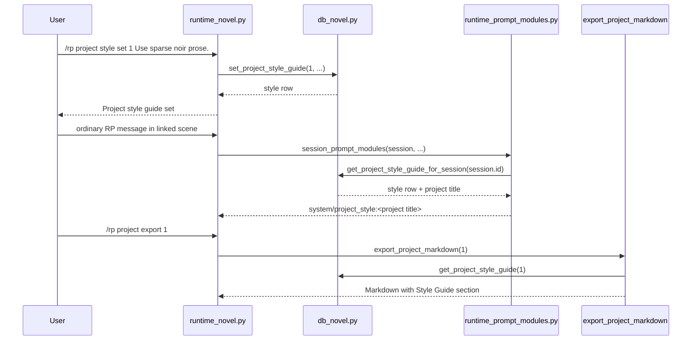

# Phase 124: Project Style Guide v1

## 0. Terms

| Term | Meaning | Conflict guard |
|---|---|---|
| Project Style Guide | User-authored prose guidance for a whole novel project, such as voice, pacing, diction, formatting preferences, or genre conventions. | Not a preset importer, not a jailbreak helper, not provider routing. |
| Active Project | The per-gateway-scope project selected by `/rp project set <id>` or created in the same scope. | Reuses Phase 121 `_novel_active_projects`; no account/backend state. |
| Linked Project Session | An active RP session linked through `novel_scenes.session_id` to a scene, chapter, and project. | Reuses Phase 121 scene-session linkage. |
| Project Style Module | PromptModule derived from a linked project's style guide. | Not scene narration, not author note, not canon. |

Existing source has no `style_guide` or project style command. The root design lists `style_guide` as deferred project metadata and "Project style guide" as a prompt assembly layer.

## 1. Decisions And Constraints

### Need

Long-form fiction users need stable project-level style guidance that survives across scenes and sessions. Today Phase 123 can guide scene POV and tense, but there is no project-level control for prose voice or house style.

### Success

- A project can persist one current style guide.
- Users can inspect, set/update, and clear it from `/rp project style ...`.
- A linked active scene session includes the style guide in `/rp debug prompt`.
- Project Markdown export shows the style guide near the project summary.
- Empty or absent style guides do not inject prompt modules.

### Explicit Non-Goals

- No outline editing.
- No write continue/rewrite/expand/compress commands.
- No character state or relationship state.
- No canon check/conflict.
- No project archive ZIP/import or novel import.
- No cloud sync, collaboration, backend accounts, provider credential persistence, protected core-file edits, or provider safety bypass.
- No minors/underage content path.

### Complexity

Default local SQLite/plugin slice. No network calls, no provider calls, no new model profile routing, and no Hermes core changes.

### Key Decisions

1. **Use a side table instead of altering `novel_projects`**. Store style guide text in `novel_project_style_guides(project_id UNIQUE, style_text, timestamps)`. This matches Phase 122/123 side-table precedent and avoids fragile SQLite column migration logic.

2. **Command stays under `project`**. Use `/rp project style ...`, not a new top-level `/rp style`, because style guide is project metadata.

3. **Prompt injection reuses PromptModule**. For a linked scene session, emit one system module named `project_style:<project title>`, with `position="before_char"` and `insertion_order=-30`. This places it before canon and preset modules within the current dynamic module ordering without changing PromptCompiler semantics.

4. **Current char system remains first**. The original vision lists project style before character card, but current PromptCompiler always emits `char_system` first. Phase 124 should not reorder the compiler; it adds the best available dynamic project-style module before canon/preset/persona modules.

5. **DB errors skip only this module**. SQLite failures during style-guide lookup must not block normal RP generation or other prompt modules.

## 2. Names And Flow

### 2.1 Noun Layer

Current:
- `src/hermes_tavern/db_novel.py` owns novel project/chapter/scene/scene-goal/scene-narration/canon/timeline persistence.
- `src/hermes_tavern/runtime_novel.py` owns `/rp project`, `/rp chapter`, `/rp scene`, `/rp canon`, and `/rp timeline`.
- `src/hermes_tavern/runtime_prompt_modules.py` injects canon, scene narration, and scene goal modules for linked novel sessions.
- `export_project_markdown()` emits Summary, Chapters, Canon, and Timeline.

Change:

```sql
CREATE TABLE IF NOT EXISTS novel_project_style_guides (
    id INTEGER PRIMARY KEY AUTOINCREMENT,
    project_id INTEGER NOT NULL UNIQUE REFERENCES novel_projects(id) ON DELETE CASCADE,
    style_text TEXT NOT NULL DEFAULT '',
    created_at TEXT NOT NULL DEFAULT (datetime('now')),
    updated_at TEXT NOT NULL DEFAULT (datetime('now'))
);

CREATE INDEX IF NOT EXISTS idx_novel_project_style_guides_project
    ON novel_project_style_guides(project_id);
```

Store contract:

```python
def set_project_style_guide(self, project_id: int, style_text: str) -> dict[str, Any]
def get_project_style_guide(self, project_id: int) -> dict[str, Any] | None
def clear_project_style_guide(self, project_id: int) -> bool
def get_project_style_guide_for_session(self, session_id: str) -> dict[str, Any] | None
```

Rules:
- Missing project raises `ValueError("Project not found")`.
- Setting trims only for empty-check purposes; stored text preserves user wording except surrounding command parsing.
- Blank style text is rejected at runtime command level; clearing uses explicit `clear`.
- Clear is idempotent and returns whether a row was removed.

Command behavior:

```text
/rp project style [project-id]              # inspect, defaults to active project
/rp project style set [project-id] <text>   # set/update, defaults to active project
/rp project style clear [project-id]        # clear, defaults to active project
```

Prompt module example:

```python
PromptModule(
    name="project_style:Skyline",
    role="system",
    content="Project style guide:\nUse close third-person prose with restrained sensory detail.",
    position="before_char",
    insertion_order=-30,
    enabled=True,
)
```

### 2.2 Orchestration Layer



Flow constraints:
- **Scope defaulting**: inspect/set/clear may use the active project only when no explicit project id is supplied.
- **Missing active project**: return a bounded "No active novel project" message, consistent with chapter/canon/timeline behavior.
- **Missing project**: return `No novel project found: <id>`.
- **Prompt failure**: `sqlite3.Error` during lookup skips only the project style module.
- **Prompt scoping**: only sessions linked to scenes under the styled project receive the module.
- **Export scoping**: only the exported project's style guide appears in that Markdown file.

### 2.3 Mount Points

| Mount | Purpose |
|---|---|
| `src/hermes_tavern/db_novel.py` | Add table/index, CRUD helpers, linked-session lookup, and Markdown export section. |
| `src/hermes_tavern/runtime_novel.py` | Add `/rp project style` inspect/set/clear routing under existing project command family. |
| `src/hermes_tavern/runtime_prompt_modules.py` | Add linked-session project style guide PromptModule assembly. |
| `src/hermes_tavern/commands.py` | Add project style help lines. |
| `README.md` | Add project style command visibility. |
| `tests/test_hermes_tavern_novel_db.py` | Add persistence, validation, linked-session lookup, and export coverage. |
| `tests/test_hermes_tavern_novel_runtime.py` | Add command and debug-prompt coverage. |
| `tests/test_hermes_tavern_commands.py` and `tests/test_hermes_tavern_readme_docs.py` | Add help/docs surface assertions if existing patterns require it. |

### 2.4 Slicing

1. **DB persistence**: add `novel_project_style_guides`, CRUD helpers, linked-session lookup, and focused DB tests.
2. **Command surface**: add `/rp project style` inspect/set/clear with active-project fallback and bounded errors.
3. **Prompt module**: inject linked-session project style module before canon/preset dynamic modules; skip on sqlite errors.
4. **Export and docs**: include a `## Style Guide` section in project Markdown only when non-empty; update command docs.
5. **Final verification and writeback**: run targeted/full verification and update architecture/root design/acceptance docs.

### 2.5 Structure Health

No pre-feature micro-refactor.

- `db_novel.py` is the established owner for novel-domain persistence and already holds scene-goal/narration side tables.
- `runtime_novel.py` is the correct command owner because project style is project metadata.
- `runtime_prompt_modules.py` is already the module assembly boundary for canon, scene narration, and scene goals.
- The target files are cohesive for this slice. If implementation requires changing PromptCompiler module ordering or adding a new prompt position enum, stop and redesign before expanding scope.

## 3. Acceptance Criteria

Normal scenarios:

1. `/rp project style set 1 Use spare noir prose.` persists the style guide and returns a bounded confirmation.
2. `/rp project style 1` shows the current style guide with mobile-safe preview.
3. `/rp project style clear 1` clears it; inspect reports no style guide set.
4. With active project set, `/rp project style set <text>`, `/rp project style`, and `/rp project style clear` work without explicit project id.
5. A linked active session under the project shows `system/project_style:<project title>` in `/rp debug prompt`.
6. The project style module content begins with `Project style guide:` and includes the stored text.
7. The project style module appears before canon and preset modules in debug-prompt order where those modules are present.
8. `/rp project export 1` includes `## Style Guide` after `## Summary` and before `## Chapters` when style text exists.

Boundary/error scenarios:

9. `/rp project style`, `/rp project style set <text>`, or `/rp project style clear` without an active project and without explicit id returns a bounded active-project guidance message.
10. `/rp project style not-a-number`, malformed `set`, and blank style text return usage.
11. Missing project id returns `No novel project found: <id>`.
12. Unlinked sessions and projects without style guides do not inject project style modules.
13. SQLite lookup errors during prompt assembly skip only project style and keep debug prompt usable.
14. Markdown export omits `## Style Guide` when no non-empty style guide exists.

Reverse-scope checks:

15. No protected core files changed: `run_agent.py`, `cli.py`, `gateway/run.py`.
16. No cloud sync, collaboration, backend account, provider credential persistence, provider safety bypass, minors/underage path, novel import, ZIP/archive import, relationship state, character state, outline editing, or write/rewrite/expand/compress commands.
17. No provider calls or model routing changes.

## 4. Risks

- **Prompt ordering drift**: Current PromptCompiler always emits `char_system` before dynamic modules. Phase 124 must document and test dynamic ordering rather than changing compiler order.
- **Command parsing ambiguity**: Optional project id plus freeform text can be ambiguous. Use explicit `set` and `clear` subcommands and reuse active project only when the first post-`set` token is not an integer.
- **Prompt bloat**: Style guide text can be long. First slice should use a bounded debug/preview display; prompt budgeting remains out of scope unless existing token tests fail.
- **Export noise**: Export should omit the Style Guide section when absent to avoid changing empty-project output unnecessarily.

## 5. Architecture Writeback

Acceptance should update:

- `design/codestable/architecture/ARCHITECTURE.md`: add `novel_project_style_guides` to schema, add project-style command help, and mention project-style prompt module in the Phase 124 capability summary.
- `design/HERMES_TAVERN_DESIGN.md`: move `style guide` from deferred novel-engine metadata into current scope and document command/export semantics.

No new long-term architecture constraint is introduced.
