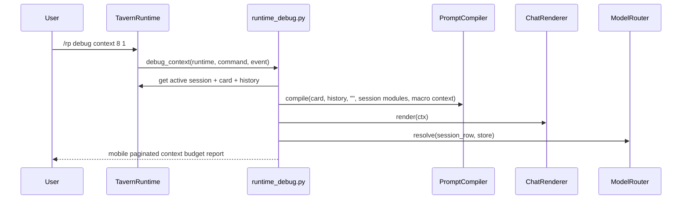

# Phase 126: Context Budget Report v1

> Planning note: drafted by the 2026-06-04 unattended Codex architect pass.
> No implementation is approved or included in this planning-only commit.

## 0. Terms

| Term | Meaning | Conflict guard |
|---|---|---|
| Context Budget Report | A read-only mobile report for estimated prompt/context token composition. | Not a context budget manager that trims, summarizes, or rewrites prompt content. |
| Context Row | One displayed item from compiled modules, recent history, rendered messages, or the pending user-message slot. | Not persisted and not a DB entity. |
| Omitted Layer | A known context source that is absent, such as no preset, no lorebook, no persona, no memory summary, or no note. | Not a full excluded-lore or vector retrieval explanation. |
| Token Estimate | Existing `estimate_tokens()` heuristic totals from compiled context. | Not model-provider token accounting. |

## 1. Decisions And Constraints

### Need

The root design asks for `/rp debug context` and prompt debuggability that explains context window, estimated tokens, included modules, omitted or excluded items, and recent history range. Current `/rp debug prompt` shows rows and one aggregate token estimate, but it does not provide a dedicated context-budget view.

### Success

- `/rp debug context [limit] [page]` works for an active session with a card.
- The report shows renderer, model descriptor summary, context window when known, estimated total tokens, module/history/rendered-message counts, and per-row token estimates.
- The report lists simple omitted-layer reasons for absent configured sources.
- Pagination matches `/rp debug prompt` style.
- The command is read-only and does not append messages, call providers, alter prompt order, or mutate DB state.

### Explicit Non-Goals

- No prompt trimming, summarization, compression, or automatic budget enforcement.
- No vectorization, retrieval-memory redesign, or provider-specific tokenizer.
- No model profile/provider routing change and no live provider call.
- No prompt-manager mutation such as `/rp prompt move`.
- No regex postprocessor or output rewrite hook.
- No write/rewrite/expand/compress command, outline editing, character state, relationship state, archive import/export, cloud/collab, backend accounts, credential persistence, minors/underage path, or provider safety bypass.
- No edits to `run_agent.py`, `cli.py`, or `gateway/run.py`.

### Complexity

Default local plugin slice. It reuses existing compiler, renderer, model router metadata, token estimator, and runtime debug patterns. No schema migration.

### Key Decisions

1. Implement report logic in `runtime_debug.py`, beside `debug_prompt()`.
2. Route `debug context` through the existing `/rp debug` command family.
3. Use the current `PromptCompiler.compile()` output as the source of truth; do not change compiler behavior.
4. Use `ModelRouter.resolve()` only for metadata already used by generation; do not call providers.
5. Treat omitted-layer reporting as a shallow v1 summary based on current session bindings and known optional state.

## 2. Names And Flow

### 2.1 Noun Layer

Current:
- `runtime_debug.debug_prompt()` builds a compiled prompt and reports modules, history, rendered messages, and aggregate `tokens`.
- `PromptCompiler` returns `CompiledContext(modules, history, user_message, card_name, token_budget)`.
- `ChatRenderer` renders compiled context to provider messages.
- `commands.py` advertises `/rp debug prompt [limit] [page]` and `/rp debug swipes`.

Change:
- Add `debug_context(runtime, command, event)` in `runtime_debug.py`.
- Add an internal report row shape with label, role/layer, name, estimated tokens, and preview.
- Add `/rp debug context [limit] [page]` help and dispatch.
- Keep report rows ephemeral and derived only from current session state.

Example output shape:

```text
Hermes Tavern context budget
card: Alice
renderer: chat
model: anthropic/claude-opus-4-6
context_window: 200000
estimated_tokens: 42
modules: 4
history turns: 3
rendered messages: 7
omitted: lorebook none; persona none
showing rows 1-8 of 12 (page 1/2)
---
  [module 0] system/char_system tokens=8: Scholar
  [history 0] assistant tokens=3: Hello there.
next: /rp debug context 8 2
```

### 2.2 Orchestration Layer



Flow constraints:
- No active session returns `No active Hermes Tavern session.`
- Active session without a card returns `No character card bound to this session.`
- Invalid pagination returns `Usage: /rp debug context [limit] [page]`.
- Provider exceptions are impossible because no provider call is made.
- DB lookup failures for optional prompt modules keep existing skip semantics.

### 2.3 Mount Points

| Mount | Purpose |
|---|---|
| `src/hermes_tavern/runtime_debug.py` | Add context report builder and `debug_context()`. |
| `src/hermes_tavern/runtime.py` | Dispatch `debug context`. |
| `src/hermes_tavern/commands.py` | Add help line. |
| `README.md` | Add command visibility if docs tests require it. |
| `tests/test_hermes_tavern_runtime.py` | Add command behavior, pagination, read-only, and no-card coverage. |
| `tests/test_hermes_tavern_readme_docs.py` / `tests/test_hermes_tavern_commands.py` | Add command docs/help assertions if existing patterns require it. |

### 2.4 Slicing

1. S1: Add `/rp debug context` report, dispatch, help, and focused runtime tests.
2. S2: Docs/readme command visibility and docs tests.
3. S3: Acceptance/writeback only, updating architecture/root design after implementation verification.

### 2.5 Structure Health

No pre-feature micro-refactor.

`runtime_debug.py` is the current debug-command owner and is cohesive for this report. `runtime.py` only needs one dispatch branch. `commands.py` only needs one help line. If implementation needs to change `PromptCompiler`, add prompt-budget enforcement, or introduce provider-specific tokenization, stop and redesign because that exceeds this feature.

## 3. Acceptance Criteria

1. `/rp debug context` with no active session returns the existing no-active-session message.
2. `/rp debug context` with an active card-backed session returns header, card, renderer, model, estimated tokens, module count, history count, rendered-message count, and omitted-layer summary.
3. `/rp debug context 2 1` and `/rp debug context 2 2` paginate rows with `next` and `prev` hints.
4. Invalid pagination returns `Usage: /rp debug context [limit] [page]`.
5. Active session without a card returns `No character card bound to this session.`
6. Report rows include per-row token estimates and mobile-safe previews.
7. Running the command does not append user or assistant messages and does not mutate session bindings.
8. The command does not call a live provider and does not persist credentials or provider debug data.
9. `/rp help` and README/docs surfaces include `/rp debug context [limit] [page]`.
10. Reverse-scope scan confirms no protected core edits and no prohibited feature-family implementation.

## 4. Architecture Writeback

Acceptance should update:
- `design/codestable/architecture/ARCHITECTURE.md`: add `/rp debug context [limit] [page]` to command surface and note read-only context budget report behavior.
- `design/HERMES_TAVERN_DESIGN.md`: mark `/rp debug context` report v1 as current while keeping actual context trimming/summarization/vectorization deferred.
