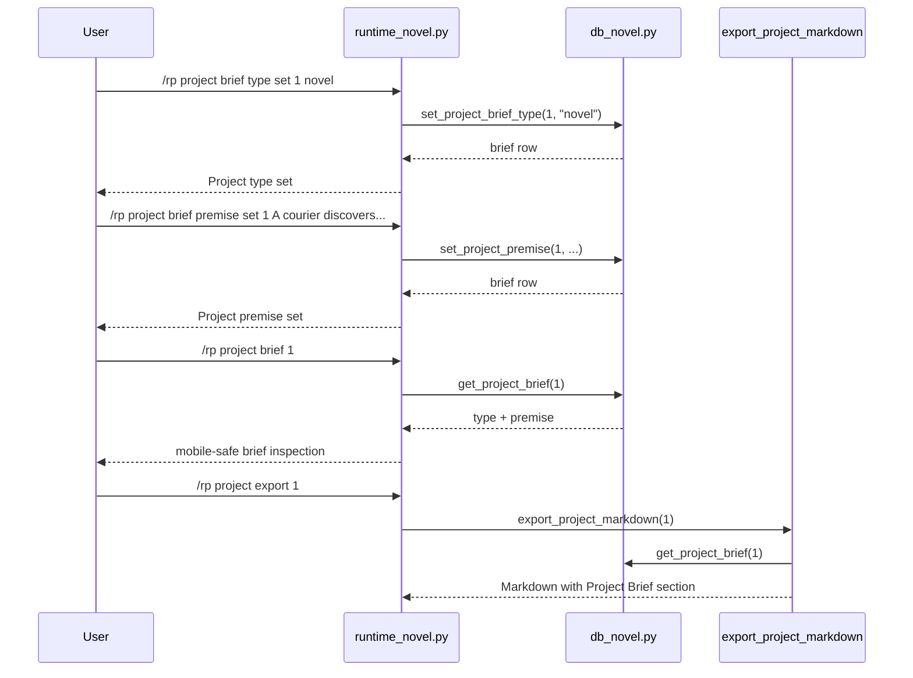

# Phase 127: Project Brief v1

## 0. Terms

| Term | Meaning | Conflict guard |
|---|---|---|
| Project Brief | A small project-scoped metadata record containing type and premise. | Not a prompt module, not a preset, not a provider/model setting. |
| Project Type | A non-safety organizational label: `novel`, `serial`, `rp`, `worldbuilding`, or `other`. | Not `content_mode`; does not change adult-fiction/safe filtering or routing. |
| Project Premise | User-authored prose describing the core story idea. | Not an outline editor, not generated text, not prompt injection. |
| Active Project | The per-gateway-scope project selected by `/rp project set <id>`. | Reuses Phase 121 active-project scope; no account/backend state. |

Startup inspection found no active feature checklist: existing feature checklist root statuses are accepted/implemented/done/complete, Phase 126 is accepted, and Phase 127 is unused.

## 1. Decisions And Constraints

### Need

The current novel project layer has project title, summary, status, chapters, scenes, canon, timeline, scene goals, narration controls, style guide, and context debugging. The root design still marks project metadata such as `type` and `premise` as deferred. Users need a lightweight way to record what kind of project they are writing and the premise that should appear in project inspection/export, without changing prompts or generation.

### Success

- A project can persist one brief row with optional project type and premise.
- Users can inspect the brief and set/clear type or premise from `/rp project brief ...`.
- `/rp project info <id>` shows brief fields when present.
- Project Markdown export includes a `## Project Brief` section only when brief content exists.
- No active RP prompt, `/rp debug prompt`, context budget report, provider selection, content mode, or generation behavior changes.

### Explicit Non-Goals

- No outline editing or outline storage in this phase.
- No prompt injection for project type or premise.
- No `content_mode`, `canon_policy`, default card/preset/lorebook binding, character state, relationship state, locations, organizations, plot threads, style samples, memory automation, vectorization, summarization, or context trimming.
- No write/rewrite/expand/compress commands.
- No project archive ZIP/import, cloud sync, collaboration, backend accounts, credential persistence, provider safety bypass, minors/underage path, or protected core-file edits.
- No edits to `run_agent.py`, `cli.py`, or `gateway/run.py`.

### Complexity

Default local SQLite/plugin slice. No network calls, no provider calls, no schema changes outside Tavern plugin tables, and no Hermes core changes.

### Key Decisions

1. **Use a side table**. Store the brief in `novel_project_briefs(project_id UNIQUE, project_type, premise_text, timestamps)` instead of altering `novel_projects`. This follows the Phase 122-124 side-table pattern and avoids fragile SQLite column migrations.

2. **Keep type non-operational**. `project_type` is an allowlisted label for organization and export. It must not affect content mode, model routing, safety handling, prompt modules, or provider choice.

3. **Keep premise descriptive**. `premise_text` is displayed in info/export only. Prompt inclusion is deliberately out of scope so the first slice remains read/write metadata, not prompt mutation.

4. **Commands stay under `project brief`**. This keeps the project command family cohesive and avoids adding a new top-level `/rp premise` or `/rp type` surface.

5. **S1 boundary is persistence/export only**. S1 may touch `src/hermes_tavern/db_novel.py` and `tests/test_hermes_tavern_novel_db.py` only. Runtime commands, help, README, architecture writeback, and root-design writeback are later slices.

## 2. Names And Flow

### 2.1 Noun Layer

Current:
- `src/hermes_tavern/db_novel.py` owns novel project/chapter/scene/canon/timeline/style/goal/narration persistence and Markdown export.
- `src/hermes_tavern/runtime_novel.py` owns `/rp project`, `/rp chapter`, `/rp scene`, `/rp canon`, and `/rp timeline`.
- `src/hermes_tavern/commands.py` owns `/rp help` command visibility.
- `runtime_prompt_modules.py` injects project style, canon, scene narration, scene goal, notes, memory, and lore modules.

Change:

```sql
CREATE TABLE IF NOT EXISTS novel_project_briefs (
    id INTEGER PRIMARY KEY AUTOINCREMENT,
    project_id INTEGER NOT NULL UNIQUE REFERENCES novel_projects(id) ON DELETE CASCADE,
    project_type TEXT NOT NULL DEFAULT '',
    premise_text TEXT NOT NULL DEFAULT '',
    created_at TEXT NOT NULL DEFAULT (datetime('now')),
    updated_at TEXT NOT NULL DEFAULT (datetime('now'))
);

CREATE INDEX IF NOT EXISTS idx_novel_project_briefs_project
    ON novel_project_briefs(project_id);
```

Store contract:

```python
def get_project_brief(self, project_id: int) -> dict[str, Any] | None
def set_project_brief_type(self, project_id: int, project_type: str) -> dict[str, Any]
def clear_project_brief_type(self, project_id: int) -> bool
def set_project_premise(self, project_id: int, premise_text: str) -> dict[str, Any]
def clear_project_premise(self, project_id: int) -> bool
```

Rules:
- Missing project raises `ValueError("Project not found")`.
- Valid project types: `novel`, `serial`, `rp`, `worldbuilding`, `other`.
- Invalid project type raises `ValueError("Invalid project type")`.
- Blank premise text is rejected by runtime command parsing; clearing uses explicit `clear`.
- Clearing the last non-empty field may delete the row or leave an empty row, but public getters must return no visible brief content.
- Existing `summary` remains unchanged; premise is separate user-authored story metadata.

Command behavior:

```text
/rp project brief [project-id]
/rp project brief inspect [project-id]
/rp project brief type set <project-id> <novel|serial|rp|worldbuilding|other>
/rp project brief type clear <project-id>
/rp project brief premise set <project-id> <text>
/rp project brief premise clear <project-id>
```

### 2.2 Orchestration



Flow constraints:
- Inspect may default to active project when no id is supplied.
- Mutating commands require an explicit project id to avoid ambiguity with freeform premise text.
- Missing active project returns the existing bounded active-project guidance message.
- Missing project returns `No novel project found: <id>`.
- Invalid type returns `Invalid project type. Use novel, serial, rp, worldbuilding, or other.`
- Prompt assembly does not call `get_project_brief()`.

### 2.3 Mount Points

| Mount | Purpose |
|---|---|
| `src/hermes_tavern/db_novel.py` | S1: add table/index, store helpers, project info query support if needed, and Markdown export section. |
| `tests/test_hermes_tavern_novel_db.py` | S1: migration, CRUD, clear, missing-project, invalid-type, export visibility, and empty-export omission coverage. |
| `src/hermes_tavern/runtime_novel.py` | S2: add `/rp project brief ...` routing and bounded command messages. |
| `src/hermes_tavern/commands.py` | S2: add project brief help lines. |
| `README.md` | S2: add Core commands visibility if docs tests require it. |
| `tests/test_hermes_tavern_novel_runtime.py` | S2: command behavior, active inspect fallback, bad args, missing project, and no prompt-injection regression coverage. |
| `tests/test_hermes_tavern_commands.py` and `tests/test_hermes_tavern_readme_docs.py` | S2: help/docs command-surface assertions. |
| `design/codestable/architecture/ARCHITECTURE.md` and `design/HERMES_TAVERN_DESIGN.md` | S3: writeback only after implementation verification. |

Non-mounts:
- `runtime_prompt_modules.py`, `prompt.py`, `model_router.py`, provider adapters, credentials, and protected core files stay untouched. If implementation needs them, stop and redesign.

### 2.4 Slicing

1. **S1: Persistence/export only**
   - Add `novel_project_briefs`, store helpers, type validation, and export visibility.
   - Likely touched files: `src/hermes_tavern/db_novel.py`, `tests/test_hermes_tavern_novel_db.py`.
   - Exit signal: focused DB tests prove migration, set/update/get/clear, missing-project, invalid-type, export inclusion, and empty export omission.
   - Boundary: no command routing, help, README, prompt module, provider, content mode, or architecture/root-design edits.

2. **S2: Command surface and docs**
   - Add `/rp project brief ...` runtime routing, command-table help, README Core commands visibility, and runtime/help/docs tests.
   - Likely touched files: `src/hermes_tavern/runtime_novel.py`, `src/hermes_tavern/commands.py`, `README.md`, command/runtime/docs tests.
   - Exit signal: users can inspect/set/clear project type and premise with bounded errors, and help/docs tests pass.

3. **S3: Verification and writeback**
   - Run focused/full relevant tests and update CodeStable architecture/root design after implementation.
   - Likely touched files: `design/codestable/architecture/ARCHITECTURE.md`, `design/HERMES_TAVERN_DESIGN.md`, Phase 127 acceptance/checklist status files.
   - Exit signal: architecture/root design mark `type` and `premise` current while keeping outline, content mode, defaults, and other metadata deferred.

### 2.5 Structure Health

No pre-feature micro-refactor.

- `db_novel.py` is large but is still the established cohesive owner for novel-domain persistence and export. S1 adds one side table and a small helper cluster consistent with style/goal/narration patterns.
- `runtime_novel.py` is large but remains the correct command owner because the new surface is project metadata.
- The target tests are already organized around novel DB and novel runtime behavior.
- If future metadata expands beyond this small brief, a later phase should consider extracting project-metadata helpers. This phase should not do that refactor.

## 3. Acceptance Criteria

Normal scenarios:

1. Migration creates `novel_project_briefs` and `idx_novel_project_briefs_project`.
2. `set_project_brief_type(project_id, "novel")` persists type and `get_project_brief(project_id)` returns it.
3. `set_project_premise(project_id, text)` persists the full premise text and preserves existing type.
4. Clearing type preserves premise; clearing premise preserves type; clearing both leaves no visible brief content.
5. `/rp project brief type set 1 novel` returns a bounded confirmation.
6. `/rp project brief premise set 1 A courier discovers the city is alive.` returns a mobile-safe confirmation and persists the full text.
7. `/rp project brief 1` and `/rp project brief inspect 1` show type and premise with mobile-safe previews.
8. `/rp project brief` defaults to the active project for inspection only.
9. `/rp project info 1` shows project brief fields when present.
10. `/rp project export 1` includes `## Project Brief` after `## Summary` and before `## Style Guide`/`## Chapters` when type or premise is non-empty.
11. Export omits `## Project Brief` when no brief content exists.

Boundary/error scenarios:

12. Mutating commands without project id return usage.
13. Missing active project on `/rp project brief` returns the bounded active-project guidance message.
14. Missing project id returns `No novel project found: <id>`.
15. Invalid type returns the bounded invalid-type message.
16. Blank premise text returns usage.
17. `/rp debug prompt` and `/rp debug context` output do not include `project_brief`, `project_type`, or premise content.

Reverse-scope checks:

18. No protected core files changed: `run_agent.py`, `cli.py`, `gateway/run.py`.
19. No prompt assembly, prompt compiler, provider routing, model profile, credential, content-mode, lore matching, memory, context budget, generation, or gateway dispatch behavior changes.
20. No outline editing/storage, canon policy, default card/preset/lorebook binding, character state, relationship state, cloud/collab, backend account, minors/underage path, provider safety bypass, project import, or archive ZIP workflow is introduced.

## 4. Architecture Writeback

Acceptance should update:

- `design/codestable/architecture/ARCHITECTURE.md`: add `novel_project_briefs` to schema, add `/rp project brief ...` to command surface, and note Phase 127 Project Brief v1 as local metadata/export behavior with no prompt/generation impact.
- `design/HERMES_TAVERN_DESIGN.md`: move `type` and `premise` from deferred project metadata into current scope; keep `outline`, `canon_policy`, `content_mode`, default card/preset/lorebook bindings, future sub-objects, and prompt/generation effects deferred.
