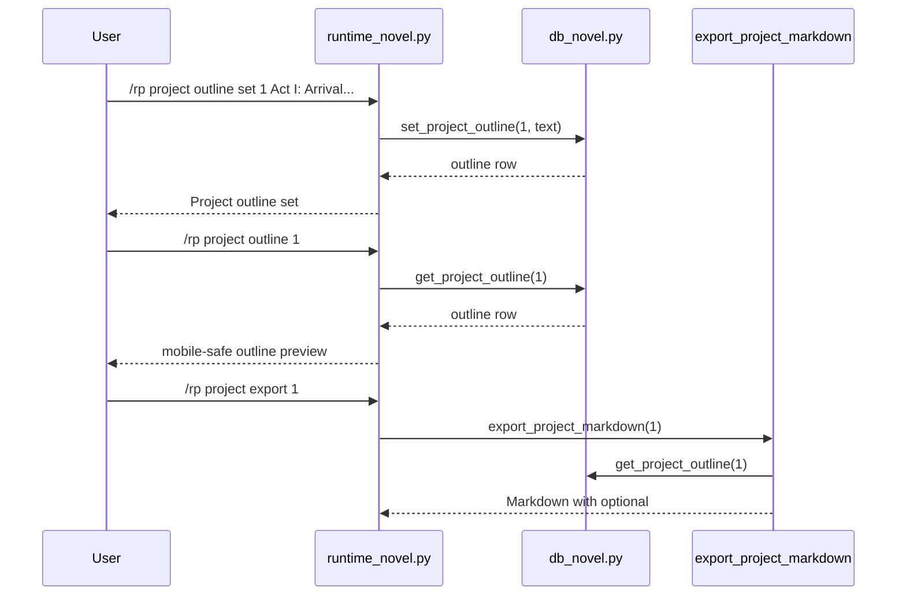

# Phase 128: Project Outline v1

## 0. Terms

| Term | Meaning | Conflict guard |
|---|---|---|
| Project Outline | User-authored project-scoped prose describing planned structure, beats, arcs, or chapter notes. | Not generated text and not a provider task. |
| Outline Text | One plain text field for the current project outline. | Not a structured beat/arc database in v1. |
| Active Project | The per-gateway-scope project selected by `/rp project set <id>`. | Reuses Phase 121 active-project scope. |
| Outline Export | Optional `## Outline` section in project Markdown export. | Not ZIP/archive export and not project import. |

Startup inspection found no active feature checklist: Phase 121-127 checklists are accepted/completed and no `planned`, `pending`, or `in_progress` checklist remains.

## 1. Decisions And Constraints

### Need

The root design previously deferred `outline` after Phase 127 made project type and
premise current. Long-form users need a simple local place to keep project outline
text visible in project inspection and export without changing prompt or generation
behavior.

### Success

- A project can persist one outline text record.
- Users can inspect, set, update, and clear the outline from `/rp project outline ...`.
- `/rp project info <id>` shows an outline preview when present.
- Project Markdown export includes `## Outline` only when outline text exists.
- `/rp debug prompt`, `/rp debug context`, prompt assembly, providers, content mode, and generation remain unchanged.

### Explicit Non-Goals

- No structured outline item/beat/arc/revision-note model.
- No outline generation, continuation, rewrite, expand, or compress command.
- No prompt injection for outline text.
- No project archive ZIP/import or Markdown import.
- No character state, relationship state, canon check/conflict, locations, organizations, plot threads, default bindings, cloud sync, collaboration, backend accounts, credential persistence, minors/underage path, provider safety bypass, or protected core-file edits.
- No edits to `run_agent.py`, `cli.py`, or `gateway/run.py`.

### Complexity

Default local plugin slice. This follows existing `novel_project_style_guides` and `novel_project_briefs` side-table patterns in `db_novel.py` and `runtime_novel.py`. No network, no provider calls, no credentials, and no Hermes core integration.

### Key Decisions

1. Use a side table `novel_project_outlines(project_id UNIQUE, outline_text, timestamps)` instead of altering `novel_projects`.
2. Keep the outline informational in v1. It is visible in info/export only and is not a prompt module.
3. Commands live under `project outline` to keep project metadata grouped with style and brief.
4. Empty outline text is not visible; clear deletes or makes the public getter return no visible outline.
5. S1 is persistence/export only. Runtime commands, help, README, architecture, and root-design writeback are later slices.

## 2. Names And Flow

### 2.1 Noun Layer

Current:
- `src/hermes_tavern/db_novel.py` owns novel project/chapter/scene/canon/timeline/style/brief persistence and Markdown export.
- `src/hermes_tavern/runtime_novel.py` owns `/rp project`, including project style and brief command handlers.
- `runtime_prompt_modules.py` injects project style, canon, scene narration, scene goal, notes, memory, and lore modules. Project Brief is explicitly excluded from prompt assembly.

Change:

```sql
CREATE TABLE IF NOT EXISTS novel_project_outlines (
    id INTEGER PRIMARY KEY AUTOINCREMENT,
    project_id INTEGER NOT NULL UNIQUE REFERENCES novel_projects(id) ON DELETE CASCADE,
    outline_text TEXT NOT NULL DEFAULT '',
    created_at TEXT NOT NULL DEFAULT (datetime('now')),
    updated_at TEXT NOT NULL DEFAULT (datetime('now'))
);

CREATE INDEX IF NOT EXISTS idx_novel_project_outlines_project
    ON novel_project_outlines(project_id);
```

Store contract:

```python
def get_project_outline(self, project_id: int) -> dict[str, Any] | None
def set_project_outline(self, project_id: int, outline_text: str) -> dict[str, Any]
def clear_project_outline(self, project_id: int) -> bool
```

Rules:
- Missing project raises `ValueError("Project not found")`.
- `get_project_outline()` returns `None` when no row exists or outline text is blank.
- Runtime rejects blank set text; clearing uses explicit `clear`.
- Export uses the stored text as plain Markdown content.

Command behavior:

```text
/rp project outline [project-id]
/rp project outline inspect [project-id]
/rp project outline set [project-id] <text>
/rp project outline clear [project-id]
```

### 2.2 Orchestration Layer



Flow constraints:
- Inspect may default to active project when no id is supplied.
- Set may use explicit project id or active-project fallback, matching project style guide behavior.
- Missing active project returns `No active novel project. Use /rp project set <id> or pass project-id.`
- Missing project returns `No novel project found: <id>`.
- Outline lookup is not called by prompt assembly.

### 2.3 Mount Points

| Mount | Purpose |
|---|---|
| `src/hermes_tavern/db_novel.py` | S1: add table/index, store helpers, and Markdown export section. |
| `tests/test_hermes_tavern_novel_db.py` | S1: migration, set/update/get/clear, missing-project, export inclusion/omission/order tests. |
| `src/hermes_tavern/runtime_novel.py` | S2: add `/rp project outline ...` routing, info preview, and bounded messages. |
| `src/hermes_tavern/commands.py` | S2: add project outline help lines. |
| `README.md` | S2: add Core commands visibility if docs tests require it. |
| `tests/test_hermes_tavern_novel_runtime.py` | S2: command behavior, active fallback, missing project, bad args, no prompt leak. |
| `tests/test_hermes_tavern_commands.py` and `tests/test_hermes_tavern_readme_docs.py` | S2: help/docs assertions. |
| `design/codestable/architecture/ARCHITECTURE.md` and `design/HERMES_TAVERN_DESIGN.md` | S3: writeback only after verification. |

Non-mounts:
- `runtime_prompt_modules.py`, `prompt.py`, `model_router.py`, provider adapters, credentials, `run_agent.py`, `cli.py`, and `gateway/run.py` stay untouched. If implementation needs them, stop and redesign.

### 2.4 Slicing

1. S1: Persistence/export only.
2. S2: Runtime command surface, project-info visibility, help/docs tests, and no prompt-leak regression.
3. S3: Acceptance/writeback after focused, plugin, full, YAML, whitespace, protected-core, and reverse-scope verification.

### 2.5 Structure Health

No pre-feature micro-refactor.

`db_novel.py` already owns project metadata side tables and export. Adding one side table and three helpers is cohesive. `runtime_novel.py` already owns project style and brief command parsing, so outline belongs there. Tests should extend existing novel DB/runtime suites. If implementation discovers that outline needs ordered beats, revision history, generation, or prompt injection, stop because that exceeds this phase.

## 3. Acceptance Criteria

1. Migration creates `novel_project_outlines` and `idx_novel_project_outlines_project`.
2. `set_project_outline()` creates and updates one row per project.
3. `get_project_outline()` returns the row when non-empty and `None` when missing or visibly empty.
4. `clear_project_outline()` returns `False` when no outline exists and `True` when it clears existing outline text.
5. Missing project operations raise `ValueError("Project not found")`.
6. Project Markdown export includes `## Outline` when outline text exists and omits it when empty.
7. Outline export appears after `## Project Brief` when present and before `## Style Guide` / `## Chapters`.
8. `/rp project outline` inspect/set/clear commands return bounded normal, usage, missing-active-project, and missing-project messages.
9. `/rp project info <id>` shows an outline preview only when outline exists.
10. `/rp help` and README command surfaces include project outline commands.
11. `/rp debug prompt` and `/rp debug context` do not include outline text.
12. Reverse-scope scan confirms no protected core edits and no prohibited feature-family implementation.

## 4. Architecture Writeback

Acceptance should update:
- `design/codestable/architecture/ARCHITECTURE.md`: add Project Outline v1 to Phase 128 summary, command surface, DB schema, and project metadata description.
- `design/HERMES_TAVERN_DESIGN.md`: move `outline` from deferred project metadata into current local metadata; document `novel_project_outlines`; add `/rp project outline ...`; keep canon_policy, content_mode, default bindings, structured beats, character/relationship state, archive import/export, provider/generation behavior, minors/underage paths, and provider safety bypass deferred.
