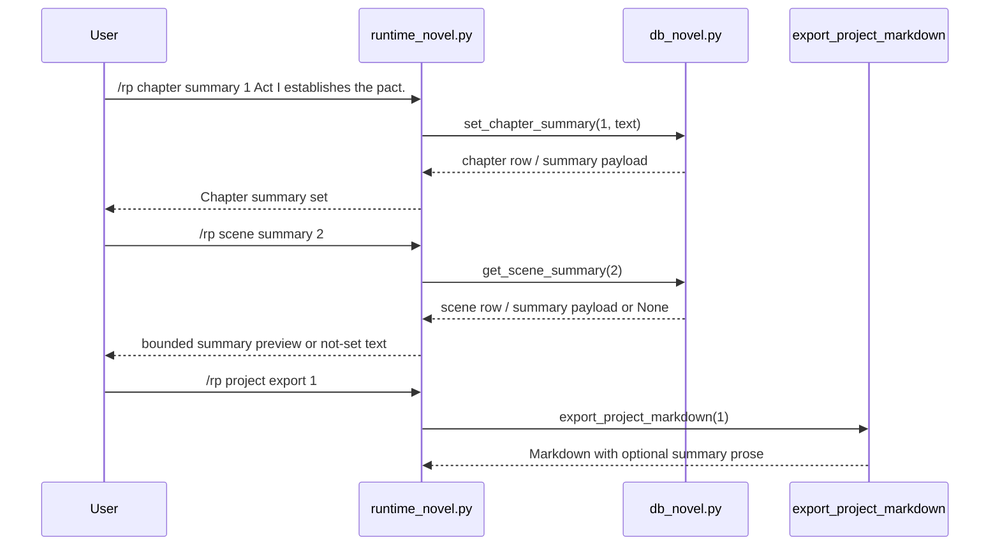

# Phase 129: Chapter And Scene Summary Metadata v1

## 0. Terms

| Term | Meaning | Conflict guard |
|---|---|---|
| Chapter Summary | User-authored local prose stored on `novel_chapters.summary`. | Not automatic model summarization and not memory extraction. |
| Scene Summary | User-authored local prose stored on `novel_scenes.summary`. | Not a rolling session summary and not prompt injection. |
| Summary Metadata | Informational chapter/scene text visible through commands and export. | Not vector index, retrieval, context trimming, or generation behavior. |
| Summary Export | Optional prose emitted in project Markdown export near the owning chapter/scene heading. | Not project archive ZIP/import/export. |

S1 implementation and S2 acceptance/writeback are complete.

## 1. Decisions And Constraints

### Need

The root design already supports projects, chapters, scenes, canon, timeline,
outlines, project briefs, and style metadata. Phase 129 closes a local metadata
gap by making existing chapter/scene summary fields user-manageable and export-visible.

### Success

- A user can inspect, set/update, and clear a chapter summary.
- A user can inspect, set/update, and clear a scene summary.
- Project Markdown export includes non-empty chapter summaries immediately under each
  chapter heading.
- Project Markdown export includes non-empty scene summaries immediately under each
  scene heading before goal/narration/session content.
- `/rp help` and README command surfaces expose new chapter/scene summary command
  literals.
- Focused debug boundary checks include distinctive-token assertions that `/rp debug prompt`
  and `/rp debug context` do not include chapter/scene summary text.
- The feature remains metadata-only and local: no prompt injection, no summarization
  worker, no vectorization/retrieval changes, no provider/model routing behavior,
  no content-mode changes, and no generation pipeline edits.

### Explicit Non-Goals

- No automatic summarization, model/provider calls, scheduled summarization,
  context trimming, or memory extraction.
- No prompt module injection for chapter/scene summaries.
- No project archive ZIP/import, Markdown import, provider/model routing,
  credentials, content-mode routing, minors/underage paths, provider safety
  bypass, or protected core-file edits.
- No edits to `run_agent.py`, `cli.py`, or `gateway/run.py`.

### Complexity

Small local plugin slice. Existing `novel_chapters.summary` and `novel_scenes.summary`
columns are reused, and runtime/export behavior is added with bounded validation.

### Key Decisions

1. Reuse the existing `summary` columns instead of adding side tables.
2. Keep summaries user-authored and metadata-only in v1.
3. Add `summary` subcommands in chapter and scene families:
   `/rp chapter summary <chapter-id> [text]`,
   `/rp chapter summary clear <chapter-id>`,
   `/rp scene summary <scene-id> [text]`,
   `/rp scene summary clear <scene-id>`.
4. Reject blank/whitespace summary text on set; require explicit clear.
5. Empty or whitespace-visible text is treated as not set for getters/export.
6. S1 implementation is complete; S2 is acceptance/writeback only.

## 2. Names And Flow

### 2.1 Noun Layer

Current:

- `src/hermes_tavern/db_novel.py` owns `novel_chapters.summary` and
  `novel_scenes.summary` in the existing schema.
- `src/hermes_tavern/runtime_novel.py` owns `/rp chapter ...` and `/rp scene ...`
  command parsing.
- `src/hermes_tavern/commands.py`, `README.md`, and command/docs tests guard command
  visibility.
- `runtime_prompt_modules.py`, prompt, and debug paths intentionally exclude chapter/
  scene summaries from prompt input.

Implemented API shape:

```python
def get_chapter_summary(self, chapter_id: int) -> dict[str, Any] | None
def set_chapter_summary(self, chapter_id: int, summary: str) -> dict[str, Any]
def clear_chapter_summary(self, chapter_id: int) -> bool
def get_scene_summary(self, scene_id: int) -> dict[str, Any] | None
def set_scene_summary(self, scene_id: int, summary: str) -> dict[str, Any]
def clear_scene_summary(self, scene_id: int) -> bool
```

Runtime constraints:

- Missing chapter/scene returns bounded not-found behavior.
- Inspect returns a compact `(not set)` style response when no visible summary exists.
- Set rejects blank summary text with bounded usage guidance.
- Export emits `Summary: <text>` when non-empty only.

Command behavior:

```text
/rp chapter summary <chapter-id>
/rp chapter summary <chapter-id> <text>
/rp chapter summary clear <chapter-id>
/rp scene summary <scene-id>
/rp scene summary <scene-id> <text>
/rp scene summary clear <scene-id>
```

### 2.2 Orchestration Layer



Flow constraints:

- Summary commands remain local and metadata-only.
- Summary lookup is not used by prompt assembly, context-budget selection, provider
  routing, model profile resolution, content mode, or generation.
- Export ordering is deterministic: chapter summaries appear immediately below chapter
  headings; scene summaries appear immediately below scene headings and before
  goal/narration/message sections.

### 2.3 Mount Points

| Mount | Purpose |
|---|---|
| `src/hermes_tavern/db_novel.py` | S1: helper methods around existing chapter/scene summary columns and export summary text. |
| `src/hermes_tavern/runtime_novel.py` | S1: command routing for chapter/scene summary inspect/set/clear with bounded messages. |
| `src/hermes_tavern/commands.py` | S1: help lines for chapter/scene summary commands. |
| `README.md` | S1: keep Core command literals in sync for docs assertions. |
| `tests/test_hermes_tavern_novel_db.py` | S1: summary helper/export ordering tests. |
| `tests/test_hermes_tavern_novel_runtime.py` | S1: command contract and no-leak boundary tests. |
| `tests/test_hermes_tavern_commands.py` | S1: command visibility command-table tests. |
| `tests/test_hermes_tavern_readme_docs.py` | S1: README literal assertions. |
| `design/codestable/architecture/ARCHITECTURE.md` | S2: writeback after verification. |
| `design/HERMES_TAVERN_DESIGN.md` | S2: writeback after verification. |

Non-mounts:

- `runtime_prompt_modules.py`, `prompt.py`, `runtime_debug.py`, `model_router.py`,
  provider adapters, credentials, `run_agent.py`, `cli.py`, `gateway/run.py`
  stay untouched for this phase.

### 2.4 Slicing

1. S1: Chapter/Scene Summary Metadata implementation (completed).
2. S2: Acceptance/writeback after focused/plugin/full checks and reverse-scope review.

### 2.5 Structure Health

No pre-feature micro-refactor required.

`db_novel.py` already owns chapter/scene persistence and export.
`runtime_novel.py` already owns chapter/scene command parsing. If implementation
needs automatic generation, vector indexing, context trimming, retrieval, prompt
injection, or additional state families, it is out of phase and should be deferred.

## 3. Acceptance Criteria

1. Chapter summaries can be set, updated, inspected, and cleared using existing chapter IDs.
2. Scene summaries can be set, updated, inspected, and cleared using existing scene IDs.
3. Blank/whitespace set text is rejected; clear is explicit.
4. Export includes non-empty chapter summaries directly under chapter headings and omits
   empty chapter summaries.
5. Export includes non-empty scene summaries directly under scene headings before goal,
   narration, and session content; empty scene summaries are omitted.
6. `/rp help` and README Core commands include chapter/scene summary command literals.
7. `/rp debug prompt`, `/rp debug context`, prompt module selection, provider/model
   routing, content mode, credentials, and generation behavior remain unchanged.
8. Reverse-scope audit confirms no protected-core edits and no prohibited-family behavior.

## 4. Architecture Writeback

- `design/codestable/architecture/ARCHITECTURE.md` should add Phase 129 in the
  capability summary, command surface, and DB metadata list, and document metadata-only
  boundary: chapter/scene summaries are export-visible but not in prompt assembly.
- `design/HERMES_TAVERN_DESIGN.md` should document chapter/scene summary commands,
  existing `novel_chapters.summary`/`novel_scenes.summary` reuse, and export ordering
  under each chapter/scene heading while keeping deferred automation boundaries explicit.
