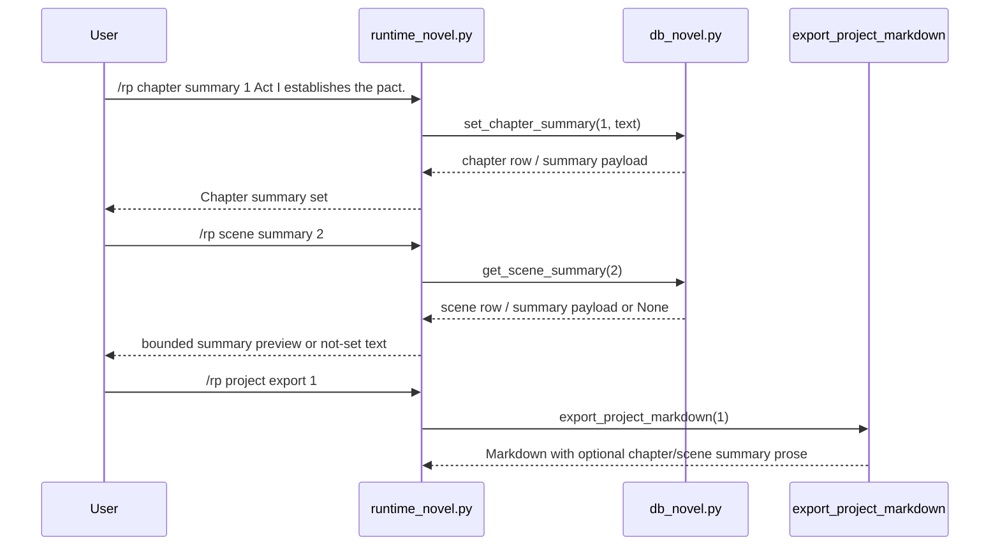

# Phase 129: Chapter And Scene Summary Metadata v1

## 0. Terms

| Term | Meaning | Conflict guard |
|---|---|---|
| Chapter Summary | User-authored local prose stored on an existing `novel_chapters.summary` field. | Not automatic model summarization and not memory extraction. |
| Scene Summary | User-authored local prose stored on an existing `novel_scenes.summary` field. | Not a rolling session summary and not prompt injection. |
| Summary Metadata | Informational chapter/scene text visible through commands and export. | Not provider, vector index, or generation behavior. |
| Summary Export | Optional prose emitted in project Markdown export near the owning chapter/scene heading. | Not project ZIP/archive import/export. |

Startup inspection found no active feature checklist: recent Phase 121-128 feature checklists are accepted/completed and no `planned`, `pending`, or `in_progress` feature checklist remains under `design/codestable/features`.

## 1. Decisions And Constraints

### Need

The root design lists long-form fiction support for projects, chapters, scenes,
outlines, canon, timeline, summaries, relationship state, and retrieval memory.
Phases 121-128 made the project/chapter/scene lane, scene goal/narration controls,
project style, project brief, project outline, and context-budget inspection current.
However the existing chapter and scene `summary` columns are still not directly
manageable from the command surface or visible in Markdown export.

### Success

- A user can inspect, set/update, and clear a chapter summary.
- A user can inspect, set/update, and clear a scene summary.
- Project Markdown export includes non-empty chapter summaries directly under
  chapter headings and non-empty scene summaries directly under scene headings
  before goal/narration/message content.
- `/rp help` and README command-surface docs expose the new summary commands.
- The feature stays local/offline and metadata-only: no prompt assembly,
  provider routing, content mode, vectorization, model summarization, or generation
  behavior changes.

### Explicit Non-Goals

- No automatic summarization, model/provider calls, scheduled summarization, memory
  extraction, vector index, retrieval, or context trimming.
- No prompt module injection for chapter or scene summary text.
- No project summary, rolling session summary, character state, relationship state,
  locations, organizations, plot threads, style samples, or default binding metadata.
- No project archive ZIP/import, Markdown import, provider/model routing, credentials,
  content-mode routing, minors/underage path, provider safety bypass, or protected
  core-file edits.
- No edits to `run_agent.py`, `cli.py`, or `gateway/run.py`.

### Complexity

Small local plugin slice. The database already has `novel_chapters.summary` and
`novel_scenes.summary`; this phase should add bounded helper/command/export behavior
and tests around those existing fields rather than introducing new schema or runtime
model work.

### Key Decisions

1. Reuse the existing `summary` columns instead of adding side tables.
2. Keep summaries user-authored and metadata-only in v1.
3. Use `summary` subcommands under the existing `chapter` and `scene` command families:
   `/rp chapter summary <chapter-id> [text]`, `/rp chapter summary clear <chapter-id>`,
   `/rp scene summary <scene-id> [text]`, and `/rp scene summary clear <scene-id>`.
4. Empty or whitespace-only summary text is not visible; explicit `clear` removes
   visible summary text.
5. Implement all runtime/source changes in one bounded S1 slice, then use S2 for
   acceptance and architecture/root-design writeback.

## 2. Names And Flow

### 2.1 Noun Layer

Current:

- `src/hermes_tavern/db_novel.py` creates `novel_chapters.summary` and
  `novel_scenes.summary` in the existing schema.
- `src/hermes_tavern/runtime_novel.py` owns `/rp chapter ...` and `/rp scene ...`
  command handling.
- `src/hermes_tavern/commands.py`, `README.md`, and command/docs tests guard
  public command visibility.
- `runtime_prompt_modules.py` and prompt/debug surfaces intentionally do not use
  project brief/outline metadata; chapter/scene summaries must preserve that boundary.

Change:

```python
def get_chapter_summary(self, chapter_id: int) -> dict[str, Any] | None
def set_chapter_summary(self, chapter_id: int, summary: str) -> dict[str, Any]
def clear_chapter_summary(self, chapter_id: int) -> bool
def get_scene_summary(self, scene_id: int) -> dict[str, Any] | None
def set_scene_summary(self, scene_id: int, summary: str) -> dict[str, Any]
def clear_scene_summary(self, scene_id: int) -> bool
```

Rules:

- Missing chapter or scene returns a bounded not-found path at runtime; DB helpers
  may raise `ValueError("Chapter not found")` / `ValueError("Scene not found")` or
  use an equivalent existing project-lane pattern, but runtime messages must not
  expose stack traces.
- Inspect returns a compact `(not set)` style response when no visible summary exists.
- Set rejects blank summary text with usage/bounded guidance; clearing is explicit.
- Export writes plain Markdown summary text without invoking providers or prompt logic.

Command behavior:

```text
/rp chapter summary <chapter-id>
/rp chapter summary <chapter-id> <text>
/rp chapter summary clear <chapter-id>
/rp scene summary <scene-id>
/rp scene summary <scene-id> <text>
/rp scene summary clear <scene-id>
```

### 2.2 Orchestration Layer



Flow constraints:

- Summary commands are local metadata commands only; they do not start generation,
  summarization, or memory extraction.
- Summary lookup is not called by prompt assembly, context-budget calculation,
  provider routing, model profiles, content mode, or generation.
- Export ordering is deterministic: chapter summary immediately after its chapter
  heading, scene summary immediately after its scene heading and before goal,
  narration controls, session messages, or no-session placeholders.

### 2.3 Mount Points

| Mount | Purpose |
|---|---|
| `src/hermes_tavern/db_novel.py` | S1: add helper methods around existing chapter/scene summary columns and export summary text. |
| `src/hermes_tavern/runtime_novel.py` | S1: route `/rp chapter summary ...` and `/rp scene summary ...` with bounded inspect/set/clear behavior. |
| `src/hermes_tavern/commands.py` | S1: add help lines for chapter/scene summary commands. |
| `README.md` | S1: keep Core commands command literals in sync if docs tests require it. |
| `tests/test_hermes_tavern_novel_db.py` | S1: helper/export ordering tests. |
| `tests/test_hermes_tavern_novel_runtime.py` | S1: runtime command behavior, missing-id, blank-text, and no prompt/context leak tests. |
| `tests/test_hermes_tavern_commands.py` and `tests/test_hermes_tavern_readme_docs.py` | S1: help/docs command visibility assertions. |
| `design/codestable/architecture/ARCHITECTURE.md` and `design/HERMES_TAVERN_DESIGN.md` | S2: writeback only after verification. |

Non-mounts:

- `runtime_prompt_modules.py`, `prompt.py`, `runtime_debug.py`, `model_router.py`,
  provider adapters, credentials, `run_agent.py`, `cli.py`, and `gateway/run.py`
  stay untouched. If implementation needs them, stop and redesign.

### 2.4 Slicing

1. S1: Chapter/Scene Summary Metadata implementation: DB helpers, runtime commands,
   help/README visibility, Markdown export, and focused offline tests.
2. S2: Acceptance/writeback after focused, plugin, full, YAML/frontmatter,
   whitespace, protected-core, and reverse-scope verification.

### 2.5 Structure Health

No pre-feature micro-refactor.

`db_novel.py` already owns chapter/scene persistence and project Markdown export.
`runtime_novel.py` already owns chapter/scene command parsing. Adding one metadata
subcommand per family and helper methods over existing fields is cohesive. If
implementation discovers that summaries require automatic model generation,
vector indexing, context trimming, retrieval, prompt injection, or new state families,
stop because that exceeds this phase.

## 3. Acceptance Criteria

1. Chapter summaries can be set, updated, inspected, and cleared, using existing
   chapter IDs and bounded messages for missing IDs and malformed arguments.
2. Scene summaries can be set, updated, inspected, and cleared, using existing
   scene IDs and bounded messages for missing IDs and malformed arguments.
3. Blank/whitespace set text is rejected; clear is explicit and idempotent enough
   for repeated user attempts.
4. Project Markdown export includes non-empty chapter summaries immediately after
   chapter headings and omits empty chapter summaries.
5. Project Markdown export includes non-empty scene summaries immediately after
   scene headings and before goal/narration/session content, and omits empty scene
   summaries.
6. `/rp help` and README Core commands include chapter/scene summary command literals.
7. `/rp debug prompt`, `/rp debug context`, prompt module selection, provider/model
   routing, content mode, credential handling, and generation behavior remain unchanged.
8. Reverse-scope scan confirms no protected core edits and no prohibited feature
   family implementation.

## 4. Architecture Writeback

Acceptance should update:

- `design/codestable/architecture/ARCHITECTURE.md`: add Phase 129 summary behavior
  to the Hermes Tavern capability list, command surface, DB schema semantics, and
  project/chapter/scene metadata description.
- `design/HERMES_TAVERN_DESIGN.md`: document chapter/scene summary commands and
  Markdown export behavior as current local metadata while keeping automatic
  summarization, project summary, character/relationship state, vectorization,
  context trimming, provider/generation behavior, minors/underage paths, and
  provider safety bypass deferred.
