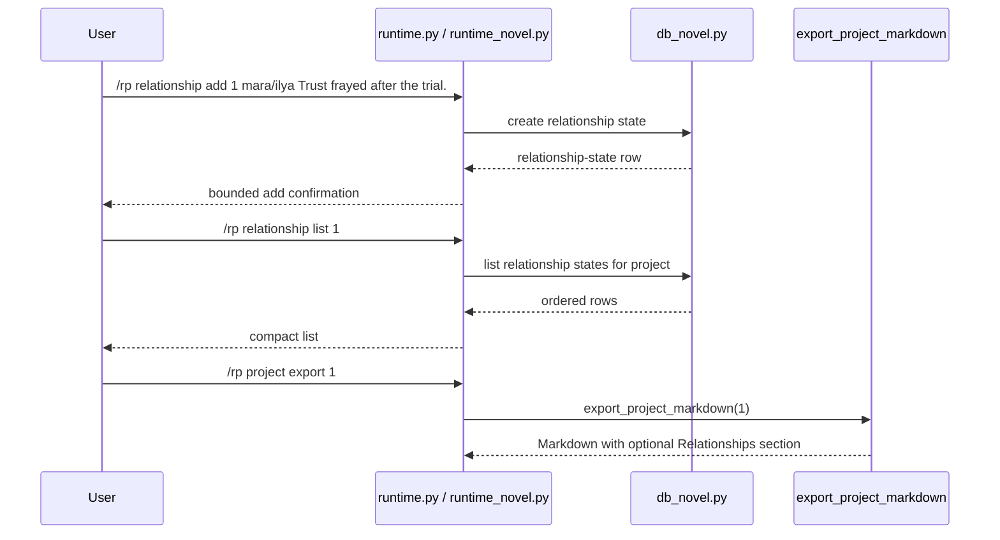

# Phase 130: Relationship State Metadata v1

## 0. Terms

| Term | Meaning | Conflict guard |
|---|---|---|
| Relationship State | User-authored local note describing the current relationship between characters/entities in a novel project. | Not automatic memory extraction and not provider-generated state. |
| Relationship Label | A compact one-token label supplied by the user, such as `mara/ilya` or `mara-ilya`. | Not parsed participant identity, not character-card binding, and not a taxonomy. |
| Relationship State Metadata | Project-scoped relationship rows visible through commands and Markdown export. | Not prompt injection, not debug context, not retrieval, and not generation behavior. |

This is an unattended cron design artifact. It remains `status: draft` until an implementation/acceptance pass verifies the scope.

## 1. Decisions And Constraints

### Need

The root design names relationship state as part of Hermes Tavern's long-form RP/novel goal and keeps it deferred after Phase 129. Current architecture and source through Phase 129 include project, chapter, scene, canon, timeline, project brief, outline, style guide, scene goals, narration controls, and chapter/scene summaries, but there is no relationship-state table, command family, or export surface.

### Success

- A user can add a relationship state under a project using a compact label and freeform state text.
- A user can list relationship states for an explicit or active project.
- A user can inspect, update, and delete a relationship state by relationship-state ID.
- Project Markdown export includes a `## Relationships` section when relationship states exist, and omits the section when none exist.
- `/rp help` and README Core commands expose the relationship command literals.
- Focused debug boundary tests prove distinctive relationship text does not appear in `/rp debug prompt` or `/rp debug context`.
- The feature remains local/offline metadata only.

### Explicit Non-Goals

- No automatic relationship extraction after assistant turns.
- No summarization worker, memory update cycle, vectorization, retrieval, context trimming, or model/provider call.
- No prompt module injection and no changes to `runtime_prompt_modules.py`, `prompt.py`, debug context composition, model routing, content mode, or generation.
- No character state, relationship graph visualization, locations, organizations, plot threads, style samples, canon check/conflict, archive ZIP/import/export, Markdown import, cloud/collaboration, backend accounts, credential storage, minors/underage paths, provider-safety bypass, or protected core-file edits.
- No parser change; relationship labels are one token in v1.

### Complexity

Small local plugin slice. It follows the current metadata pattern used by project brief, project outline, chapter/scene summary, and Markdown export behavior.

### Key Decisions

1. Add a project-scoped relationship-state row with `project_id`, `label`, `state_text`, created timestamp, and updated timestamp.
2. Keep labels freeform and one-token to avoid changing the `/rp` whitespace parser.
3. Use top-level `/rp relationship ...` commands, matching `canon` and `timeline` as project-linked novel families.
4. Require an explicit project ID for add; allow active-project fallback for list only.
5. Inspect/update/delete operate by relationship-state ID.
6. Export relationship states as project-level metadata after Style Guide and before Chapters.
7. Keep relationship state absent from prompt/debug/provider/generation paths.

## 2. Names And Flow

### 2.1 Noun Layer

Current:

- `src/hermes_tavern/db_novel.py` owns novel project persistence and Markdown export.
- `src/hermes_tavern/runtime_novel.py` owns project/chapter/scene/canon/timeline command behavior.
- `src/hermes_tavern/runtime.py` exposes pass-through methods from the command table into novel command handlers.
- `src/hermes_tavern/commands.py` owns `/rp help` command literals.
- README and focused command/docs tests guard the public command surface.
- No current relationship-state table or `/rp relationship` command exists.

Change:

- Add Relationship State Metadata as local project-scoped rows.
- Add command behavior:

```text
/rp relationship add <project-id> <label> <state...>
/rp relationship list [project-id]
/rp relationship inspect <relationship-id>
/rp relationship update <relationship-id> <state...>
/rp relationship delete <relationship-id>
```

Expected behavior:

- Blank labels or blank state text return bounded usage.
- Missing project returns `No novel project found: <id>`.
- Missing relationship-state ID returns `No relationship state found: <id>`.
- List output is deterministic and compact, with mobile previews for long state text.
- Update changes state text only; label rename is deferred.
- Delete removes the relationship-state row.

### 2.2 Orchestration Layer



Flow constraints:

- Relationship state commands do not start sessions, call providers, compile prompts, or mutate content mode.
- Relationship state is not selected by `_session_prompt_modules`, context-budget reporting, model routing, or provider adapters.
- Export reads relationship state only during local Markdown export.

### 2.3 Mount Points

| Mount | Purpose |
|---|---|
| `src/hermes_tavern/db_novel.py` | S1: schema, CRUD/list helpers, and Markdown export section. |
| `src/hermes_tavern/runtime_novel.py` | S1: `/rp relationship ...` command family. |
| `src/hermes_tavern/runtime.py` | S1: pass-through relationship command only. |
| `src/hermes_tavern/commands.py` | S1: command-table/help literals for `/rp relationship ...`. |
| `README.md` | S1: Core command literals. |
| `tests/test_hermes_tavern_novel_db.py` | S1: persistence/export tests. |
| `tests/test_hermes_tavern_novel_runtime.py` | S1: runtime command/no-leak tests. |
| `tests/test_hermes_tavern_commands.py` | S1: help command visibility tests. |
| `tests/test_hermes_tavern_readme_docs.py` | S1: README literal assertions. |
| `design/codestable/architecture/ARCHITECTURE.md` | S2: architecture writeback after verification. |
| `design/HERMES_TAVERN_DESIGN.md` | S2: root design writeback after verification. |

Non-mounts:

- `run_agent.py`, `cli.py`, `gateway/run.py`
- `src/hermes_tavern/runtime_prompt_modules.py`
- `src/hermes_tavern/prompt.py`
- `src/hermes_tavern/runtime_debug.py`
- `src/hermes_tavern/model_router.py`
- `src/hermes_tavern/provider_bridge.py`
- `src/hermes_tavern/adapters.py`
- `src/hermes_tavern/runtime_model.py`
- `src/hermes_tavern/runtime_generation.py`
- `build/lib/**`

### 2.4 Slicing

1. S1 implementation: add local relationship-state metadata persistence, commands, help/docs, export visibility, and focused tests.
2. S2 verify/accept/write architecture: run verification, create acceptance, and update architecture/root design to mark relationship-state metadata current.

### 2.5 Structure Health

No pre-feature micro-refactor.

`db_novel.py` and `runtime_novel.py` are broad, but they already own novel project persistence/export and novel command families. A new standalone module would add indirection for a small local slice. If future phases add character state, locations, organizations, plot threads, or larger relationship workflows, a later `cs-refactor` should revisit novel command/file organization.

## 3. Acceptance Criteria

1. Relationship-state migration creates exactly one new novel relationship-state table and its project index.
2. Add/list/inspect/update/delete helpers work against valid projects/IDs and return bounded missing-owner behavior.
3. `/rp relationship add <project-id> <label> <state...>` stores the full state text and returns a compact confirmation.
4. `/rp relationship list [project-id]` works with explicit project ID and active-project fallback.
5. `/rp relationship inspect/update/delete <relationship-id>` operate by relationship-state ID with bounded not-found and usage behavior.
6. Blank labels and blank state text are rejected.
7. Project Markdown export includes `## Relationships` only when relationship states exist, ordered after Style Guide and before Chapters.
8. `/rp help` and README Core commands include the relationship command literals.
9. `/rp debug prompt` and `/rp debug context` do not include distinctive relationship-state text.
10. Reverse-scope checks confirm no protected core, prompt, provider, model-router, content-mode, generation, credential, retrieval/vectorization, cloud/collab, minors/underage, or safety-bypass behavior changed.

## 4. Architecture Writeback

After S1 verification, S2 should update:

- `design/codestable/architecture/ARCHITECTURE.md`
  - Add Phase 130 to the capability summary.
  - Add `/rp relationship ...` to the command surface.
  - Add the relationship-state table to the DB schema snapshot.
  - State that relationship state is metadata/export-only and excluded from prompt/debug/provider/generation behavior.
- `design/HERMES_TAVERN_DESIGN.md`
  - Move relationship state from deferred future sub-objects into current local metadata scope.
  - Document command literals and Markdown export placement.
  - Keep character state, locations, organizations, plot threads, style samples, automation, retrieval, and provider/generation paths deferred.
