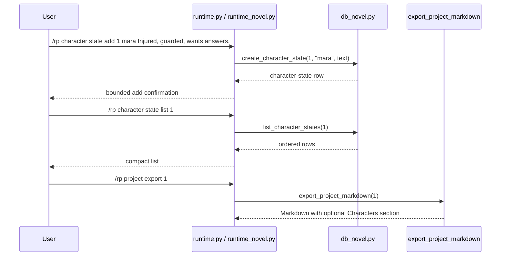

# Phase 131: Character State Metadata v1

## 0. Terms

| Term | Meaning | Conflict guard |
|---|---|---|
| Character State | User-authored local note describing a fictional character's current status in a project. | Not an ST character card, not a persona, not generated memory extraction. |
| Character Label | A compact one-token user label, such as `mara` or `captain-rye`. | Not parsed identity, not card binding, not an age/minor field. |
| Character State Metadata | Project-scoped rows visible through commands and Markdown export. | Not prompt injection, retrieval, model routing, or generation behavior. |
| Active Project | The per-gateway-scope project selected by `/rp project set <id>`. | Reuses Phase 121 active-project scope for list only. |

Startup inspection found no active planned/in-progress checklist. Phase 130 is accepted. Source search found no `novel_character_states`, no `/rp character state ...` command, and no character-state tests.

## 1. Decisions And Constraints

### Need

The root design still names character state as a deferred novel-engine dimension after relationship state became current in Phase 130. Long-form RP/fiction users need a local place to track current character condition, motivation, wounds, secrets, or scene-relevant status without relying on prompt mutation or automatic memory extraction.

### Success

- A user can add a character state under a project using a compact label and freeform state text.
- A user can list character states for an explicit or active project.
- A user can inspect, update, and delete a character-state row by ID.
- Project Markdown export includes `## Characters` only when character-state rows exist, and omits it when none exist.
- `/rp help` and README Core commands expose the new literals.
- Focused no-leak tests prove distinctive character-state text does not appear in `/rp debug prompt` or `/rp debug context`.
- The feature remains local/offline metadata only.

### Explicit Non-Goals

- No automatic character-state extraction after assistant turns.
- No summarization worker, vectorization, retrieval, context trimming, model/provider call, or scheduled update cycle.
- No prompt module injection and no changes to prompt compiler, debug context composition, model routing, content mode, credentials, or generation.
- No ST character-card importer/exporter changes and no card/persona binding in v1.
- No age, date-of-birth, minor/underage, school-grade, or sexual-safety classification fields, examples, tests, or commands.
- No relationship graph, relationship rename, locations, organizations, plot threads, style samples, canon check/conflict, archive ZIP/import/export, Markdown import, cloud/collaboration, backend accounts, credential storage, provider-safety bypass, or protected core-file edits.
- No edits to `run_agent.py`, `cli.py`, or `gateway/run.py`.

### Complexity

Small local plugin slice. It follows the current metadata/export pattern used by Project Brief, Project Outline, Chapter/Scene Summary, and Relationship State. No network calls, no provider calls, no credential persistence, and no Hermes core integration.

### Key Decisions

1. Add a project-scoped table:
   ```sql
   CREATE TABLE IF NOT EXISTS novel_character_states (
       id INTEGER PRIMARY KEY AUTOINCREMENT,
       project_id INTEGER NOT NULL REFERENCES novel_projects(id) ON DELETE CASCADE,
       label TEXT NOT NULL,
       state_text TEXT NOT NULL,
       created_at TEXT NOT NULL DEFAULT (datetime('now')),
       updated_at TEXT NOT NULL DEFAULT (datetime('now'))
   );

   CREATE INDEX IF NOT EXISTS idx_novel_character_states_project
       ON novel_character_states(project_id);
   ```
2. Keep labels one token to preserve the existing whitespace parser.
3. Use `/rp character state ...` commands to avoid conflating character state with ST card import/use.
4. Require an explicit project ID for `add`; allow active-project fallback for `list` only.
5. Inspect/update/delete operate by character-state ID.
6. Export character states as `## Characters` after Style Guide and before Relationships/Chapters.
7. Keep character state absent from prompt/debug/provider/generation paths.

## 2. Names And Flow

### 2.1 Noun Layer

Current:

- `src/hermes_tavern/db_novel.py` owns novel project persistence and Markdown export.
- `src/hermes_tavern/runtime_novel.py` owns project/chapter/scene/canon/timeline/relationship command behavior.
- `src/hermes_tavern/runtime.py` exposes pass-through methods from the command table into novel handlers.
- `src/hermes_tavern/commands.py` owns `/rp help` command literals.
- No current character-state table or `/rp character state ...` command exists.

Change:

Store contract:

```python
def create_character_state(self, project_id: int, label: str, state_text: str) -> dict[str, Any]
def list_character_states(self, project_id: int) -> list[dict[str, Any]]
def get_character_state(self, character_state_id: int) -> dict[str, Any] | None
def update_character_state(self, character_state_id: int, state_text: str) -> dict[str, Any]
def delete_character_state(self, character_state_id: int) -> bool
```

Command behavior:

```text
/rp character state add <project-id> <label> <state...>
/rp character state list [project-id]
/rp character state inspect <character-state-id>
/rp character state update <character-state-id> <state...>
/rp character state delete <character-state-id>
```

Rules:

- Missing project raises/returns bounded `Project not found` behavior.
- Missing character-state ID raises/returns bounded `Character state not found` behavior.
- Blank labels and blank state text are rejected.
- Update changes `state_text` only; label rename is deferred.
- Labels are user-authored identifiers and are not parsed into people, ages, cards, or personas.

### 2.2 Orchestration Layer



Flow constraints:

- Character state commands do not start sessions, call providers, compile prompts, or mutate content mode.
- Character state is not selected by `_session_prompt_modules`, context-budget reporting, model routing, or provider adapters.
- Export reads character state only during local Markdown export.

### 2.3 Mount Points

| Mount | Purpose |
|---|---|
| `src/hermes_tavern/db_novel.py` | Add schema, CRUD/list helpers, and optional `## Characters` Markdown export section. |
| `src/hermes_tavern/runtime_novel.py` | Add `/rp character state ...` command family with bounded messages. |
| `src/hermes_tavern/runtime.py` | Add `_character_command` pass-through only. |
| `src/hermes_tavern/commands.py` | Add command-table/help literals for `/rp character state ...`. |
| `README.md` | Add Core command literals. |
| `tests/test_hermes_tavern_novel_db.py` | Add migration, CRUD/list, missing-owner, blank-value, export inclusion/omission/order tests. |
| `tests/test_hermes_tavern_novel_runtime.py` | Add command contract, active list fallback, usage/not-found, blank-value, and no-leak tests. |
| `tests/test_hermes_tavern_commands.py` | Add help visibility assertions. |
| `tests/test_hermes_tavern_readme_docs.py` | Add README literal assertions. |
| `design/codestable/architecture/ARCHITECTURE.md` | S2 writeback after verification. |
| `design/HERMES_TAVERN_DESIGN.md` | S2 writeback after verification. |

Non-mounts:

- `run_agent.py`, `cli.py`, `gateway/run.py`
- `src/hermes_tavern/runtime_prompt_modules.py`
- `src/hermes_tavern/prompt.py`
- `src/hermes_tavern/runtime_debug.py`
- `src/hermes_tavern/model_router.py`
- `src/hermes_tavern/provider_bridge.py`
- `src/hermes_tavern/adapters.py`
- `src/hermes_tavern/runtime_model.py`
- `src/hermes_tavern/runtime_generation.py`
- `build/lib/**`

### 2.4 Slicing

1. S1 implementation: add local character-state metadata persistence, commands, help/README command literals, optional Markdown export visibility, and focused tests.
2. S2 verify/accept/write architecture: run focused/plugin/full checks, create acceptance, and update architecture/root design to mark character-state metadata current.

### 2.5 Structure Health

No pre-feature micro-refactor.

`db_novel.py` and `runtime_novel.py` are broad, but they already own novel project persistence/export and novel command families. A new standalone module would add indirection for a small local metadata slice. If later phases add locations, organizations, plot threads, relationship graph workflows, or many more state families, a separate refactor should revisit novel command/file organization.

## 3. Acceptance Criteria

1. Migration creates `novel_character_states` and `idx_novel_character_states_project`.
2. CRUD/list helpers work for valid projects/IDs and return bounded missing-owner behavior.
3. Blank labels and blank state text are rejected.
4. `/rp character state add <project-id> <label> <state...>` stores the full state text and returns a compact confirmation.
5. `/rp character state list [project-id]` works with explicit project ID and active-project fallback.
6. `/rp character state inspect/update/delete <character-state-id>` operate by character-state ID with bounded not-found and usage behavior.
7. Project Markdown export includes `## Characters` only when character states exist, ordered after Style Guide and before Relationships/Chapters.
8. `/rp help` and README Core commands include the character-state command literals.
9. `/rp debug prompt` and `/rp debug context` do not include distinctive character-state text.
10. Reverse-scope checks confirm no protected core, prompt, provider, model-router, content-mode, generation, credential, retrieval/vectorization, cloud/collab, minors/underage, ST asset importer/exporter, or safety-bypass behavior changed.

## 4. Architecture Writeback

S2 completed the architecture/root-design writeback and acceptance closure:

- `design/codestable/architecture/ARCHITECTURE.md`: Phase 131 is included in the capability summary, command surface, DB schema, metadata-only boundary notes, and known constraints.
- `design/HERMES_TAVERN_DESIGN.md`: character state moved from deferred future sub-objects into current local metadata scope; command literals and Markdown export placement are documented; locations/organizations/plot threads/relationship graph/rename/automatic extraction and automation/vectorization/retrieval/provider/generation paths remain deferred/out of scope.

Controller verification passed focused tests, Tavern plugin tests, full pytest, design/acceptance/checklist validators, reverse-scope guards, and whitespace checks before final acceptance.
