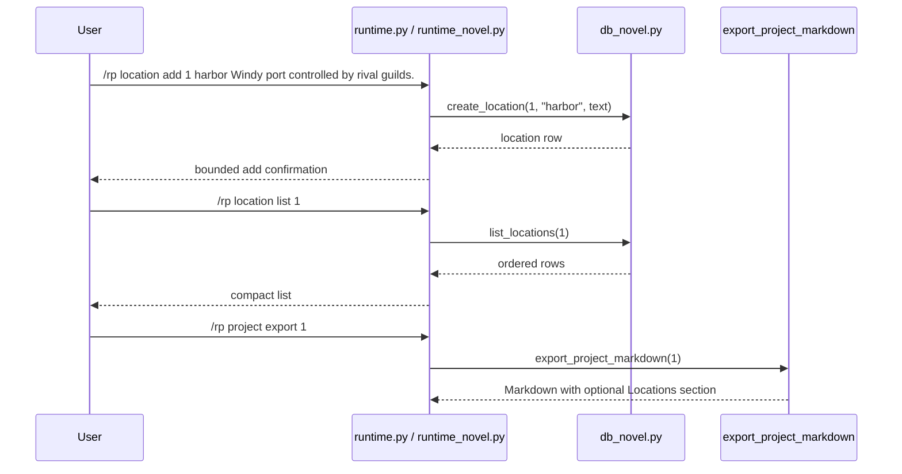

# Phase 132: Location Metadata v1

## 0. Terms

| Term | Meaning | Conflict guard |
|---|---|---|
| Location Metadata | User-authored local note describing a fictional project location. | Not map rendering, geocoding, retrieval memory, or prompt injection. |
| Location Label | A compact one-token user label, such as `harbor` or `obsidian-hall`. | Not an address parser, coordinates schema, or ST asset binding. |
| Active Project | The per-gateway-scope project selected by `/rp project set <id>`. | Reuses Phase 121 active-project scope for list only. |

Startup inspection found no active planned/in-progress/pending feature checklist.
Phase 131 is accepted. Source search found no `novel_locations`, no
`/rp location ...` command, and no location metadata tests.

## 1. Decisions And Constraints

### Need

The root design still lists locations as a deferred novel-engine sub-object after
relationship and character metadata became current in Phases 130 and 131.
Long-form RP/fiction users need a local place to track recurring places,
atmosphere, constraints, and scene-relevant details without mutating prompts or
starting automation.

### Success

- A user can add a location under a project using a compact label and freeform description.
- A user can list locations for an explicit or active project.
- A user can inspect, update, and delete a location row by ID.
- Project Markdown export includes `## Locations` only when location rows exist.
- `/rp help` and README Core commands expose the new literals.
- Focused no-leak tests prove distinctive location text does not appear in `/rp debug prompt` or `/rp debug context`.
- The feature remains local/offline metadata only.

### Explicit Non-Goals

- No automatic location extraction after assistant turns.
- No summarization worker, vectorization, retrieval, map/geocoding, context trimming, model/provider call, or scheduled update cycle.
- No prompt module injection and no changes to prompt compiler, debug context composition, context-budget composition, model routing, content mode, credentials, or generation.
- No ST character-card/preset/lorebook importer/exporter changes and no default asset binding behavior.
- No coordinates, maps, organization graph, plot threads, relationship graph/rename, canon conflict checks, archive ZIP/import/export, Markdown import, cloud/collaboration, backend accounts, credential storage, provider-safety bypass, or protected core-file edits.
- No age, date-of-birth, minor/underage, school-grade, or sexual-safety classification fields, examples, tests, or commands.
- No edits to `run_agent.py`, `cli.py`, or `gateway/run.py`.

### Complexity

Small local plugin slice. It follows the accepted metadata/export pattern used by
Project Brief, Project Outline, Relationship State, and Character State. No
network calls, no provider calls, no credential persistence, and no Hermes core
integration.

### Why This Gap

Location metadata is higher value and safer than the remaining alternatives for
this cron tick because it is explicitly deferred, common to long-form fiction and
worldbuilding, and can reuse the existing relationship/character metadata
pattern. It avoids unresolved choices around canon policy values, project-vs-
session content-mode precedence, and default card/preset/lorebook auto-apply
semantics. Retrieval/vectorization/summarization automation remains too broad.

### Key Decisions

1. Add a project-scoped table:
   ```sql
   CREATE TABLE IF NOT EXISTS novel_locations (
       id INTEGER PRIMARY KEY AUTOINCREMENT,
       project_id INTEGER NOT NULL REFERENCES novel_projects(id) ON DELETE CASCADE,
       label TEXT NOT NULL,
       description_text TEXT NOT NULL,
       created_at TEXT NOT NULL DEFAULT (datetime('now')),
       updated_at TEXT NOT NULL DEFAULT (datetime('now'))
   );

   CREATE INDEX IF NOT EXISTS idx_novel_locations_project
       ON novel_locations(project_id);
   ```
2. Keep labels one token to preserve the existing whitespace parser.
3. Use top-level `/rp location ...` commands, matching other project-linked novel families.
4. Require an explicit project ID for `add`; allow active-project fallback for `list` only.
5. Inspect/update/delete operate by location ID.
6. Export locations as `## Locations` after Style Guide and before Characters/Relationships/Chapters.
7. Keep location metadata absent from prompt/debug/context-budget/provider/generation paths.

## 2. Names And Flow

### 2.1 Noun Layer

Current:

- `src/hermes_tavern/db_novel.py` owns novel project persistence and Markdown export.
- `src/hermes_tavern/runtime_novel.py` owns project/chapter/scene/canon/timeline/relationship/character command behavior.
- `src/hermes_tavern/runtime.py` exposes pass-through methods from the command table into novel handlers.
- `src/hermes_tavern/commands.py` owns `/rp help` command literals.
- README and focused command/docs tests guard the public command surface.
- No current location table or `/rp location ...` command exists.

Change:

Store contract:

```python
def create_location(self, project_id: int, label: str, description_text: str) -> dict[str, Any]
def list_locations(self, project_id: int) -> list[dict[str, Any]]
def get_location(self, location_id: int) -> dict[str, Any] | None
def update_location(self, location_id: int, description_text: str) -> dict[str, Any]
def delete_location(self, location_id: int) -> bool
```

Command behavior:

```text
/rp location add <project-id> <label> <description...>
/rp location list [project-id]
/rp location inspect <location-id>
/rp location update <location-id> <description...>
/rp location delete <location-id>
```

Rules:

- Missing project returns bounded `No novel project found: <id>` behavior.
- Missing location ID returns bounded `No location found: <id>` behavior.
- Blank labels and blank descriptions are rejected.
- Update changes `description_text` only; label rename is deferred.
- Labels are user-authored identifiers and are not parsed into maps, addresses, coordinates, assets, or people.

### 2.2 Orchestration Layer



Flow constraints:

- Location commands do not start sessions, call providers, compile prompts, or mutate content mode.
- Location metadata is not selected by `_session_prompt_modules`, debug prompt, context-budget reporting, model routing, or provider adapters.
- Export reads locations only during local Markdown export.

### 2.3 Mount Points

| Mount | Purpose |
|---|---|
| `src/hermes_tavern/db_novel.py` | Add schema, CRUD/list helpers, and optional `## Locations` Markdown export section. |
| `src/hermes_tavern/runtime_novel.py` | Add `/rp location ...` command family with bounded messages. |
| `src/hermes_tavern/runtime.py` | Add `_location_command` pass-through only. |
| `src/hermes_tavern/commands.py` | Add command-table/help literals for `/rp location ...`. |
| `README.md` | Add Core command literals. |
| `tests/test_hermes_tavern_novel_db.py` | Add migration, CRUD/list, missing-owner, blank-value, export inclusion/omission/order tests. |
| `tests/test_hermes_tavern_novel_runtime.py` | Add command contract, active list fallback, usage/not-found, blank-value, and no-leak tests. |
| `tests/test_hermes_tavern_commands.py` | Add help visibility assertions. |
| `tests/test_hermes_tavern_readme_docs.py` | Add README literal assertions. |
| `design/codestable/architecture/ARCHITECTURE.md` | S2 writeback after verification. |
| `design/HERMES_TAVERN_DESIGN.md` | S2 writeback after verification. |

Non-mounts:

- `run_agent.py`, `cli.py`, `gateway/run.py`
- `src/hermes_tavern/runtime_prompt_modules.py`
- `src/hermes_tavern/prompt.py`
- `src/hermes_tavern/runtime_debug.py`
- `src/hermes_tavern/model_router.py`
- `src/hermes_tavern/provider_bridge.py`
- `src/hermes_tavern/adapters.py`
- `src/hermes_tavern/runtime_model.py`
- `src/hermes_tavern/runtime_generation.py`
- `src/hermes_tavern/runtime_content.py`
- `src/hermes_tavern/importers/**`
- `build/lib/**`

### 2.4 Slicing

1. S1 implementation: add local location metadata persistence, commands, help/README command literals, optional Markdown export visibility, and focused tests.
2. S2 verify/accept/write architecture: run focused/plugin/full checks, create acceptance, and update architecture/root design to mark location metadata current while preserving deferred automation/retrieval/provider/generation boundaries.

### 2.5 Structure Health

No pre-feature micro-refactor.

`db_novel.py` and `runtime_novel.py` are broad, but they already own novel
project persistence/export and novel command families. A new standalone module
would add indirection for a small local metadata slice. After Phase 132, a
separate refactor can revisit repeated project-scoped metadata CRUD/formatting
across relationship, character, and location families. That refactor is not a
precondition for this feature and should not be mixed into S1.

## 3. Acceptance Criteria

1. Migration creates `novel_locations` and `idx_novel_locations_project`.
2. CRUD/list helpers work for valid projects/IDs and return bounded missing-owner behavior.
3. Blank labels and blank descriptions are rejected.
4. `/rp location add <project-id> <label> <description...>` stores the full description and returns a compact confirmation.
5. `/rp location list [project-id]` works with explicit project ID and active-project fallback.
6. `/rp location inspect/update/delete <location-id>` operate by location ID with bounded not-found and usage behavior.
7. Project Markdown export includes `## Locations` only when rows exist, ordered after Style Guide and before Characters/Relationships/Chapters.
8. `/rp help` and README Core commands include the location command literals.
9. `/rp debug prompt` and `/rp debug context` do not include distinctive location text.
10. Reverse-scope checks confirm no protected core, prompt, provider, model-router, content-mode, generation, credential, retrieval/vectorization, cloud/collab, minors/underage, ST asset importer/exporter, build artifact, or safety-bypass behavior changed.

## 4. Architecture Writeback

S2 should update:

- `design/codestable/architecture/ARCHITECTURE.md`: Phase 132 capability summary, command surface, DB schema, metadata-only boundary notes, and known constraints.
- `design/HERMES_TAVERN_DESIGN.md`: move locations from deferred future sub-objects into current local metadata scope; document command literals and Markdown export placement; keep organizations, plot threads, relationship graph/rename/automatic extraction, style samples, project-default bindings, canon policy, content-mode metadata, automation, vectorization, retrieval, provider routing, and generation deferred/out of scope.
