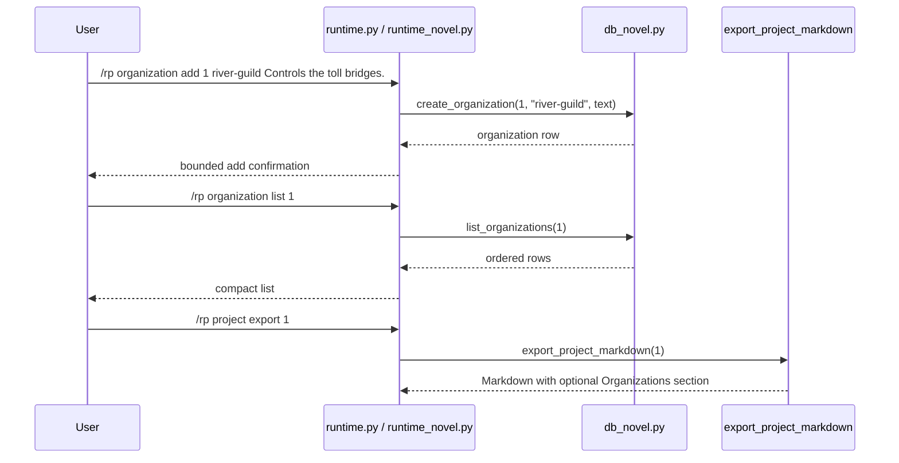

# Phase 133: Organization Metadata v1

## 0. Terms

| Term | Meaning | Conflict guard |
|---|---|---|
| Organization Metadata | User-authored local note describing a fictional project faction, guild, council, court, company, or institution. | Not an org graph, hierarchy engine, affiliation system, or automatic extractor. |
| Organization Label | A compact one-token user label, such as `river-guild` or `winter-court`. | Not parsed identity, membership roster, default asset binding, or relationship edge. |
| Active Project | The per-gateway-scope project selected by `/rp project set <id>`. | Reuses Phase 121 active-project scope for list only. |

Startup inspection found no active planned/in-progress/pending feature checklist.
Phases 130 relationship state, 131 character state, and 132 location metadata are
accepted. Source search found no `novel_organizations`, no `/rp organization ...`
command, and no organization metadata tests.

## 1. Decisions And Constraints

### Need

The root design still lists organizations as a deferred project/novel sub-object
after relationship, character, and location metadata became current local
metadata. Long-form RP/fiction users need a local place to track factions,
institutions, courts, companies, and other project organizations without
turning that note into prompt context, retrieval input, routing policy, or
automation.

### Success

- A user can add an organization under a project using a compact label and freeform description.
- A user can list organizations for an explicit or active project.
- A user can inspect, update, and delete an organization row by ID.
- Project Markdown export includes `## Organizations` only when organization rows exist.
- `/rp help` and README Core commands expose the new command literals.
- Focused no-leak tests prove distinctive organization text does not appear in `/rp debug prompt` or `/rp debug context`.
- The feature remains local/offline metadata only.

### Explicit Non-Goals

- No automatic organization extraction after assistant turns.
- No hierarchy model, membership roster, affiliation graph, organization-to-character binding, relationship graph/rename, or graph traversal.
- No summarization worker, vectorization, retrieval, context trimming, model/provider call, scheduled update cycle, or generated metadata.
- No prompt module injection and no changes to prompt compiler, debug context composition, context-budget composition, model routing, content mode, credentials, or generation.
- No ST card/preset/lorebook/persona importer/exporter changes and no default card/preset/lorebook binding behavior.
- No plot threads, style samples, canon check/conflict, project archive ZIP/import/export, Markdown import, cloud/collaboration, backend accounts, credential storage, provider-safety bypass, or protected core-file edits.
- No age, date-of-birth, minor/underage, school-grade, or sexual-safety classification fields, examples, tests, or commands.
- No edits to `run_agent.py`, `cli.py`, or `gateway/run.py`.

### Complexity

Small local plugin slice. It follows the accepted metadata/export pattern used by
Project Brief, Project Outline, Relationship State, Character State, and Location
Metadata. No network calls, no provider calls, no credential persistence, and no
Hermes core integration.

### Why This Gap

Organization metadata is higher value and safer than plot threads or style
samples for this cron tick. It is explicitly deferred, common to long-form
fiction/worldbuilding, and can reuse the established project-scoped CRUD/list/
inspect/update/delete/export pattern. Plot threads invite workflow semantics, and
style samples risk being confused with prompt style-guide injection.

### Key Decisions

1. Add a project-scoped table:
   ```sql
   CREATE TABLE IF NOT EXISTS novel_organizations (
       id INTEGER PRIMARY KEY AUTOINCREMENT,
       project_id INTEGER NOT NULL REFERENCES novel_projects(id) ON DELETE CASCADE,
       label TEXT NOT NULL,
       description_text TEXT NOT NULL,
       created_at TEXT NOT NULL DEFAULT (datetime('now')),
       updated_at TEXT NOT NULL DEFAULT (datetime('now'))
   );

   CREATE INDEX IF NOT EXISTS idx_novel_organizations_project
       ON novel_organizations(project_id);
   ```
2. Keep labels one token to preserve the existing whitespace parser.
3. Use top-level `/rp organization ...` commands, matching other project-linked novel families.
4. Require an explicit project ID for `add`; allow active-project fallback for `list` only.
5. Inspect/update/delete operate by organization ID.
6. Export organizations as `## Organizations` after Locations and before Characters/Relationships/Chapters. If no Locations section exists, Organizations still appears after Style Guide/Outline/Brief and before Characters/Relationships/Chapters.
7. Keep organization metadata absent from prompt/debug/context-budget/provider/generation paths.

## 2. Names And Flow

### 2.1 Noun Layer

Current:

- `src/hermes_tavern/db_novel.py` owns novel project persistence and Markdown export.
- `src/hermes_tavern/runtime_novel.py` owns project/chapter/scene/canon/timeline/relationship/character/location command behavior.
- `src/hermes_tavern/runtime.py` exposes pass-through methods from the command table into novel handlers.
- `src/hermes_tavern/commands.py` owns `/rp help` command literals.
- README and focused command/docs tests guard the public command surface.
- No current organization table or `/rp organization ...` command exists.

Change:

Store contract:

```python
def create_organization(self, project_id: int, label: str, description_text: str) -> dict[str, Any]
def list_organizations(self, project_id: int) -> list[dict[str, Any]]
def get_organization(self, organization_id: int) -> dict[str, Any] | None
def update_organization(self, organization_id: int, description_text: str) -> dict[str, Any]
def delete_organization(self, organization_id: int) -> bool
```

Command behavior:

```text
/rp organization add <project-id> <label> <description...>
/rp organization list [project-id]
/rp organization inspect <organization-id>
/rp organization update <organization-id> <description...>
/rp organization delete <organization-id>
```

Rules:

- Missing project returns bounded `No novel project found: <id>` behavior.
- Missing organization ID returns bounded `No organization found: <id>` behavior.
- Blank labels and blank descriptions are rejected.
- Update changes `description_text` only; label rename is deferred.
- Labels are user-authored identifiers and are not parsed into hierarchy, membership, affiliations, relationships, assets, people, ages, or provider policy.

### 2.2 Orchestration Layer



Flow constraints:

- Organization commands do not start sessions, call providers, compile prompts, mutate content mode, or touch credentials.
- Organization metadata is not selected by `_session_prompt_modules`, debug prompt/context, context-budget reporting, model routing, or provider adapters.
- Export reads organizations only during local Markdown export.

### 2.3 Mount Points

| Mount | Purpose |
|---|---|
| `src/hermes_tavern/db_novel.py` | Add schema, CRUD/list helpers, and optional `## Organizations` Markdown export section. |
| `src/hermes_tavern/runtime_novel.py` | Add `/rp organization ...` command family with bounded messages. |
| `src/hermes_tavern/runtime.py` | Add `_organization_command` pass-through only. |
| `src/hermes_tavern/commands.py` | Add command-table/help literals for `/rp organization ...`. |
| `README.md` | Add Core command literals. |
| `tests/test_hermes_tavern_novel_db.py` | Add migration, CRUD/list, missing-owner, blank-value, export inclusion/omission/order tests. |
| `tests/test_hermes_tavern_novel_runtime.py` | Add command contract, active list fallback, usage/not-found, blank-value, and no-leak tests. |
| `tests/test_hermes_tavern_commands.py` | Add help visibility assertions. |
| `tests/test_hermes_tavern_readme_docs.py` | Add README literal assertions. |
| `design/codestable/architecture/ARCHITECTURE.md` | S2 writeback after verification. |
| `design/HERMES_TAVERN_DESIGN.md` | S2 writeback after verification. |

Non-mounts:

- `run_agent.py`, `cli.py`, `gateway/run.py`
- `src/hermes_tavern/runtime_prompt_modules.py`
- `src/hermes_tavern/prompt.py`
- `src/hermes_tavern/runtime_debug.py`
- `src/hermes_tavern/model_router.py`
- `src/hermes_tavern/provider_bridge.py`
- `src/hermes_tavern/adapters.py`
- `src/hermes_tavern/runtime_model.py`
- `src/hermes_tavern/runtime_generation.py`
- `src/hermes_tavern/runtime_content.py`
- `src/hermes_tavern/importers/**`
- `build/lib/**`
- `design/codestable/**` during S1
- `design/HERMES_TAVERN_DESIGN.md` during S1

### 2.4 Slicing

1. S1 implementation: add local organization metadata persistence, commands, help/README command literals, optional Markdown export visibility, and focused tests.
2. S2 verify/accept/write architecture: run focused/plugin/full checks, create acceptance, and update architecture/root design to mark organization metadata current while preserving deferred automation/retrieval/provider/generation boundaries.

### 2.5 Structure Health

No pre-feature micro-refactor.

`db_novel.py` and `runtime_novel.py` are broad, but they already own novel
project persistence/export and novel command families. A new standalone module
would add indirection for a small local metadata slice. After Phase 133, a
separate refactor can revisit repeated project-scoped metadata CRUD/formatting
across relationship, character, location, and organization families. That
refactor is not a precondition for this feature and must not be mixed into S1.

## 3. Acceptance Criteria

1. Migration creates `novel_organizations` and `idx_novel_organizations_project`.
2. CRUD/list helpers work for valid projects/IDs and return bounded missing-owner behavior.
3. Blank labels and blank descriptions are rejected.
4. `/rp organization add <project-id> <label> <description...>` stores the full description and returns a compact confirmation.
5. `/rp organization list [project-id]` works with explicit project ID and active-project fallback.
6. `/rp organization inspect/update/delete <organization-id>` operate by organization ID with bounded not-found and usage behavior.
7. Project Markdown export includes `## Organizations` only when rows exist, ordered after Locations and before Characters/Relationships/Chapters; if Locations is absent, Organizations still appears before Characters/Relationships/Chapters.
8. `/rp help` and README Core commands include the organization command literals.
9. `/rp debug prompt` and `/rp debug context` do not include distinctive organization text.
10. Reverse-scope checks confirm no protected core, prompt, provider, model-router, content-mode, generation, credential, retrieval/vectorization, cloud/collab, minors/underage, ST asset importer/exporter, default-binding, archive import/export, or safety-bypass behavior changed.
11. S1 does not edit CodeStable checklist/status/acceptance files or architecture/root design writeback files.

## 4. Architecture Writeback

S2 should update:

- `design/codestable/architecture/ARCHITECTURE.md`: Phase 133 capability summary, command surface, DB schema, metadata-only boundary notes, and known constraints.
- `design/HERMES_TAVERN_DESIGN.md`: move organizations from deferred future sub-objects into current local metadata scope; document command literals and Markdown export placement; keep plot threads, relationship graph/rename/automatic extraction, style samples, project-default bindings, canon policy, content-mode metadata, automation, vectorization, retrieval, provider routing, and generation deferred/out of scope.
