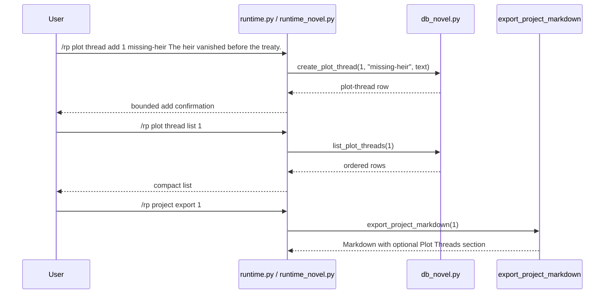

# Phase 134: Plot Thread Metadata v1

## 0. Terms

| Term | Meaning | Conflict guard |
|---|---|---|
| Plot Thread Metadata | User-authored local note describing an unresolved or ongoing fictional project thread. | Not a task workflow, graph, outline generator, extractor, scheduler, or prompt module. |
| Plot Thread Label | A compact one-token user label, such as `missing-heir` or `winter-pact`. | Not a gateway `thread_id`, relationship edge, chapter binding, or default asset binding. |
| Active Project | The per-gateway-scope project selected by `/rp project set <id>`. | Reuses Phase 121 active-project scope for list only. |

Startup inspection found no active planned/pending/in-progress/draft feature
checklist under `design/codestable/features`. Phase 133 is accepted. Source
search found no `novel_plot_threads`, no `/rp plot thread ...` command, and no
plot-thread metadata tests.

## 1. Decisions And Constraints

### Need

The root design still lists plot threads as a deferred novel sub-object after
relationship, character-state, location, and organization metadata became
current local metadata. Long-form RP/fiction users need a local place to track
open narrative threads without turning that note into prompt context, retrieval
input, generated planning, routing policy, or automation.

### Success

- A user can add a plot thread under a project using a compact label and freeform description.
- A user can list plot threads for an explicit or active project.
- A user can inspect, update, and delete a plot-thread row by ID.
- Project Markdown export includes `## Plot Threads` only when plot-thread rows exist.
- `/rp help` and README Core commands expose the new command literals.
- Focused no-leak tests prove distinctive plot-thread text does not appear in `/rp debug prompt` or `/rp debug context`.
- The feature remains local/offline metadata only.

### Explicit Non-Goals

- No automatic plot-thread extraction after assistant turns.
- No outline generation, rewrite, expand, compress, beat tracking, task workflow, status lifecycle, dependency graph, relationship graph, rename flow, or graph traversal.
- No summarization worker, vectorization, retrieval, context trimming, provider/model call, scheduled update cycle, or generated metadata.
- No prompt module injection and no changes to prompt compiler, debug context composition, context-budget composition, model routing, content mode, credentials, or generation.
- No ST card/preset/lorebook/persona importer/exporter changes and no default card/preset/lorebook binding behavior.
- No canon check/conflict, archive ZIP/import/export, Markdown import, cloud/collaboration, backend accounts, credential storage, provider-safety bypass, or protected core-file edits.
- No age, date-of-birth, minor/underage, school-grade, or sexual-safety classification fields, examples, tests, or commands.
- No edits to `run_agent.py`, `cli.py`, or `gateway/run.py`.

### Complexity

Small local plugin slice. It follows the accepted metadata/export pattern used by
Project Brief, Project Outline, Relationship State, Character State, Location,
and Organization Metadata. No network calls, no provider calls, no credential
persistence, and no Hermes core integration.

### Why This Gap

Plot-thread metadata is safer than the remaining alternatives because it can be
implemented as plain project-scoped CRUD/export metadata. Relationship graph or
rename work would introduce identity semantics; automatic extraction, retrieval,
vectorization, summarization, and archive import/export are broader workflows;
style samples risk prompt-style injection ambiguity; default binding and
content-mode/canon-policy metadata touch behavior and safety-sensitive routing.

### Key Decisions

1. Add a project-scoped table:
   ```sql
   CREATE TABLE IF NOT EXISTS novel_plot_threads (
       id INTEGER PRIMARY KEY AUTOINCREMENT,
       project_id INTEGER NOT NULL REFERENCES novel_projects(id) ON DELETE CASCADE,
       label TEXT NOT NULL,
       description_text TEXT NOT NULL,
       created_at TEXT NOT NULL DEFAULT (datetime('now')),
       updated_at TEXT NOT NULL DEFAULT (datetime('now'))
   );

   CREATE INDEX IF NOT EXISTS idx_novel_plot_threads_project
       ON novel_plot_threads(project_id);
   ```
2. Keep labels one token to preserve the existing whitespace parser.
3. Use nested `/rp plot thread ...` commands to avoid confusing plot-thread notes with gateway thread identity.
4. Require an explicit project ID for `add`; allow active-project fallback for `list` only.
5. Inspect/update/delete operate by plot-thread ID.
6. Export plot threads as `## Plot Threads` after Organizations and before Characters/Relationships/Chapters. If Organizations is absent, Plot Threads still appears before Characters/Relationships/Chapters.
7. Keep plot-thread metadata absent from prompt/debug/context-budget/provider/generation paths.

## 2. Names And Flow

### 2.1 Noun Layer

Current:

- `src/hermes_tavern/db_novel.py` owns novel project persistence and Markdown export.
- `src/hermes_tavern/runtime_novel.py` owns project/chapter/scene/canon/timeline/relationship/character-state/location/organization command behavior.
- `src/hermes_tavern/runtime.py` exposes pass-through methods from the command table into novel handlers.
- `src/hermes_tavern/commands.py` owns `/rp help` command literals.
- README and focused command/docs tests guard the public command surface.
- No current plot-thread table or `/rp plot thread ...` command exists.

Change:

```python
def create_plot_thread(self, project_id: int, label: str, description_text: str) -> dict[str, Any]
def list_plot_threads(self, project_id: int) -> list[dict[str, Any]]
def get_plot_thread(self, plot_thread_id: int) -> dict[str, Any] | None
def update_plot_thread(self, plot_thread_id: int, description_text: str) -> dict[str, Any]
def delete_plot_thread(self, plot_thread_id: int) -> bool
```

Command behavior:

```text
/rp plot thread add <project-id> <label> <description...>
/rp plot thread list [project-id]
/rp plot thread inspect <plot-thread-id>
/rp plot thread update <plot-thread-id> <description...>
/rp plot thread delete <plot-thread-id>
```

Rules:

- Missing project returns bounded `No novel project found: <id>` behavior.
- Missing plot-thread ID returns bounded `No plot thread found: <id>` behavior.
- Blank labels and blank descriptions are rejected.
- Update changes `description_text` only; label rename is deferred.
- Labels are user-authored identifiers and are not parsed into graph edges, relationships, chapter bindings, asset bindings, ages, provider policy, or workflow state.

### 2.2 Orchestration Layer



Flow constraints:

- Plot-thread commands do not start sessions, call providers, compile prompts, mutate content mode, or touch credentials.
- Plot-thread metadata is not selected by `_session_prompt_modules`, debug prompt/context, context-budget reporting, model routing, memory, retrieval, vectorization, provider adapters, image/TTS flows, or generation.
- Export reads plot threads only during local Markdown export.

### 2.3 Mount Points

| Mount | Purpose |
|---|---|
| `src/hermes_tavern/db_novel.py` | Add schema, CRUD/list helpers, and optional `## Plot Threads` Markdown export section. |
| `src/hermes_tavern/runtime_novel.py` | Add `/rp plot thread ...` command family with bounded messages. |
| `src/hermes_tavern/runtime.py` | Add `_plot_command` pass-through only. |
| `src/hermes_tavern/commands.py` | Add command-table/help literals for `/rp plot thread ...`. |
| `README.md` | Add Core command literals. |
| `tests/test_hermes_tavern_novel_db.py` | Add migration, CRUD/list, missing-owner, blank-value, export inclusion/omission/order tests. |
| `tests/test_hermes_tavern_novel_runtime.py` | Add command contract, active list fallback, usage/not-found, blank-value, and no-leak tests. |
| `tests/test_hermes_tavern_commands.py` | Add help visibility assertions. |
| `tests/test_hermes_tavern_readme_docs.py` | Add README literal assertions. |
| `design/codestable/architecture/ARCHITECTURE.md` | S2 writeback after verification. |
| `design/HERMES_TAVERN_DESIGN.md` | S2 writeback after verification. |

Non-mounts:

- `run_agent.py`, `cli.py`, `gateway/run.py`
- `src/hermes_tavern/runtime_prompt_modules.py`, `src/hermes_tavern/prompt.py`, `src/hermes_tavern/runtime_prompt_manager.py`, `src/hermes_tavern/runtime_debug.py`
- `src/hermes_tavern/model_router.py`, `src/hermes_tavern/provider_bridge.py`, `src/hermes_tavern/adapters.py`, `src/hermes_tavern/runtime_model.py`, `src/hermes_tavern/runtime_generation.py`
- `src/hermes_tavern/runtime_content.py`, `src/hermes_tavern/memory.py`, `src/hermes_tavern/runtime_memory.py`
- `src/hermes_tavern/images.py`, `src/hermes_tavern/runtime_images.py`
- `src/hermes_tavern/importers/**`
- `build/lib/**`
- `design/codestable/**` during S1
- `design/HERMES_TAVERN_DESIGN.md` during S1

### 2.4 Slicing

1. S1 implementation: add local plot-thread metadata persistence, commands, help/README command literals, optional Markdown export visibility, and focused tests.
2. S2 verify/accept/write architecture: run focused/plugin/full checks, create acceptance, and update architecture/root design to mark plot-thread metadata current while preserving deferred automation/retrieval/provider/generation boundaries.

### 2.5 Structure Health

No pre-feature micro-refactor.

`db_novel.py` and `runtime_novel.py` are broad, but they already own novel
project persistence/export and novel command families. A standalone module would
add indirection for a small local metadata slice. A later refactor can revisit
repeated project-scoped metadata CRUD/formatting across relationship,
character-state, location, organization, and plot-thread families. That refactor
is not a precondition and must not be mixed into S1.

## 3. Acceptance Criteria

1. Migration creates `novel_plot_threads` and `idx_novel_plot_threads_project`.
2. CRUD/list helpers work for valid projects/IDs and return bounded missing-owner behavior.
3. Blank labels and blank descriptions are rejected.
4. `/rp plot thread add <project-id> <label> <description...>` stores the full description and returns a compact confirmation.
5. `/rp plot thread list [project-id]` works with explicit project ID and active-project fallback.
6. `/rp plot thread inspect/update/delete <plot-thread-id>` operate by plot-thread ID with bounded not-found and usage behavior.
7. Project Markdown export includes `## Plot Threads` only when rows exist, ordered after Organizations and before Characters/Relationships/Chapters; if Organizations is absent, Plot Threads still appears before Characters/Relationships/Chapters.
8. `/rp help` and README Core commands include the plot-thread command literals.
9. `/rp debug prompt` and `/rp debug context` do not include distinctive plot-thread text.
10. Reverse-scope checks confirm no protected core, prompt, provider, model-router, content-mode, generation, credential, retrieval/vectorization, memory/summarization, media/TTS/image, cloud/collab, minors/underage, ST asset importer/exporter, default-binding, archive import/export, relationship graph/rename/extraction, or safety-bypass behavior changed.
11. S1 does not edit CodeStable checklist/status/acceptance files or architecture/root design writeback files.

## 4. Architecture Writeback

S2 should update:

- `design/codestable/architecture/ARCHITECTURE.md`: Phase 134 capability summary, command surface, DB schema, metadata-only boundary notes, and known constraints.
- `design/HERMES_TAVERN_DESIGN.md`: move plot threads from deferred future sub-objects into current local metadata scope; document command literals and Markdown export placement; keep relationship graph/rename/automatic extraction, style samples, default bindings, canon policy/content-mode metadata, archive import/export, automation, vectorization, retrieval, provider routing, generation, cloud/collab, minors/underage, and safety-bypass behavior deferred/out of scope.
