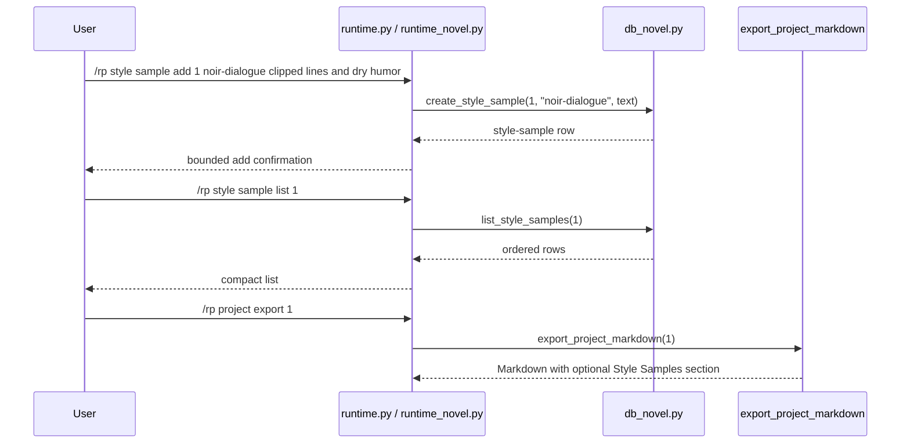

# Phase 135: Style Sample Metadata v1

## 0. Terms

| Term | Meaning | Conflict guard |
|---|---|---|
| Style Sample Metadata | User-authored local prose excerpt or style reference attached to a novel project. | Not a prompt module, preset, lorebook, image style, model style setting, provider parameter, or automatic style extractor. |
| Style Sample Label | A compact one-token user label, such as `noir-dialogue` or `battle-prose`. | Not a persona, character name, default binding, content-mode policy, or graph node. |
| Project Style Guide | Existing Phase 124 single project-level style guide that can be injected into linked session prompts. | Style samples do not change, replace, or feed this prompt-injected guide. |
| Active Project | The per-gateway-scope project selected by `/rp project set <id>`. | Reuses Phase 121 active-project scope for list only. |

Startup inspection found no active planned/pending/in-progress/draft feature
checklist under `design/codestable/features`. Phase 134 is accepted and the
architecture/root design are current through Phase 134. Source search found no
`novel_style_samples`, no `/rp style sample ...` command, and no style-sample
metadata tests.

## 1. Decisions And Constraints

### Need

The root design still lists style samples as a deferred novel sub-object after
project brief, outline, chapter/scene summary, relationship, character-state,
location, organization, and plot-thread metadata became current. Long-form
RP/fiction users need a local place to store example prose and voice references
without turning those examples into prompt context, generated instructions,
retrieval input, routing policy, or automation.

### Success

- A user can add a style sample under a project using a compact label and freeform sample text.
- A user can list style samples for an explicit or active project.
- A user can inspect, update, and delete a style-sample row by ID.
- Project Markdown export includes `## Style Samples` only when style-sample rows exist.
- `/rp help` and README Core commands expose the new command literals.
- Focused no-leak tests prove distinctive style-sample text does not appear in `/rp debug prompt` or `/rp debug context`.
- The feature remains local/offline metadata only and does not alter Phase 124 project-style prompt behavior.

### Explicit Non-Goals

- No prompt module injection and no changes to project-style-guide prompt injection.
- No automatic style extraction after assistant turns.
- No style scoring, imitation engine, rewrite/generation workflow, style selection, style blending, or style enforcement.
- No summarization worker, vectorization, retrieval, context trimming, provider/model call, scheduled update cycle, or generated metadata.
- No changes to prompt compiler, debug context composition, context-budget composition, model routing, content mode, credentials, or generation.
- No ST card/preset/lorebook/persona importer/exporter changes and no default card/preset/lorebook/style binding behavior.
- No relationship graph, relationship rename, automatic extraction, canon check/conflict, project archive ZIP/import/export, Markdown import, cloud/collaboration, backend accounts, credential storage, provider-safety bypass, or protected core-file edits.
- No age, date-of-birth, minor/underage, school-grade, or sexual-safety classification fields, examples, tests, or commands.
- No edits to `run_agent.py`, `cli.py`, or `gateway/run.py`.

### Complexity

Small local plugin slice. It follows the accepted metadata/export pattern used
by Relationship State, Character State, Location, Organization, and Plot Thread
Metadata. No network calls, no provider calls, no credential persistence, and no
Hermes core integration.

### Why This Gap

Style samples are now the highest-value bounded next phase because they are the
only remaining deferred local novel sub-object that is not already implemented
and not ruled out by the current cron constraints. Relationship graph, rename,
automatic extraction, default bindings, canon-policy/content-mode metadata,
provider routing, retrieval/vectorization, archive import/export, and generation
work are broader or explicitly prohibited. This phase keeps style samples safe by
making them metadata-only and export-visible, not prompt-active.

### Key Decisions

1. Add a project-scoped table:
   ```sql
   CREATE TABLE IF NOT EXISTS novel_style_samples (
       id INTEGER PRIMARY KEY AUTOINCREMENT,
       project_id INTEGER NOT NULL REFERENCES novel_projects(id) ON DELETE CASCADE,
       label TEXT NOT NULL,
       sample_text TEXT NOT NULL,
       created_at TEXT NOT NULL DEFAULT (datetime('now')),
       updated_at TEXT NOT NULL DEFAULT (datetime('now'))
   );

   CREATE INDEX IF NOT EXISTS idx_novel_style_samples_project
       ON novel_style_samples(project_id);
   ```
2. Keep labels one token to preserve the existing whitespace parser.
3. Use top-level `/rp style sample ...` commands to distinguish this multi-row metadata family from `/rp project style ...`, which remains the single project style guide.
4. Require an explicit project ID for `add`; allow active-project fallback for `list` only.
5. Inspect/update/delete operate by style-sample ID.
6. Update changes `sample_text` only; label rename is deferred.
7. Export style samples as `## Style Samples` after `## Style Guide` and before Locations, Organizations, Plot Threads, Characters, Relationships, and Chapters. If no Style Guide section exists, Style Samples still appear after Project Brief/Outline and before later metadata sections.
8. Keep style-sample metadata absent from prompt/debug/context-budget/provider/generation paths.

## 2. Names And Flow

### 2.1 Noun Layer

Current:

- `src/hermes_tavern/db_novel.py` owns novel project persistence and Markdown export.
- `src/hermes_tavern/runtime_novel.py` owns project/chapter/scene/canon/timeline/relationship/character-state/location/organization/plot-thread command behavior.
- `src/hermes_tavern/runtime.py` exposes pass-through methods from the command table into novel handlers.
- `src/hermes_tavern/commands.py` owns `/rp help` command literals.
- README and focused command/docs tests guard the public command surface.
- `novel_project_style_guides` and `/rp project style ...` already exist as Phase 124 project-style-guide behavior.
- No current style-sample table or `/rp style sample ...` command exists.

Change:

Store contract:

```python
def create_style_sample(self, project_id: int, label: str, sample_text: str) -> dict[str, Any]
def list_style_samples(self, project_id: int) -> list[dict[str, Any]]
def get_style_sample(self, style_sample_id: int) -> dict[str, Any] | None
def update_style_sample(self, style_sample_id: int, sample_text: str) -> dict[str, Any]
def delete_style_sample(self, style_sample_id: int) -> bool
```

Command behavior:

```text
/rp style sample add <project-id> <label> <sample...>
/rp style sample list [project-id]
/rp style sample inspect <style-sample-id>
/rp style sample update <style-sample-id> <sample...>
/rp style sample delete <style-sample-id>
```

Rules:

- Missing project returns bounded `No novel project found: <id>` behavior.
- Missing style-sample ID returns bounded `No style sample found: <id>` behavior.
- Blank labels and blank sample text are rejected.
- Labels are user-authored identifiers and are not parsed into project style guide instructions, persona bindings, card bindings, lore entries, image styles, provider policy, content mode, ages, or graph edges.

### 2.2 Orchestration Layer



Flow constraints:

- Style-sample commands do not start sessions, call providers, compile prompts, mutate content mode, or touch credentials.
- Style-sample metadata is not selected by `_session_prompt_modules`, debug prompt/context, context-budget reporting, model routing, memory, retrieval, vectorization, provider adapters, image/TTS flows, or generation.
- Export reads style samples only during local Markdown export.

### 2.3 Mount Points

| Mount | Purpose |
|---|---|
| `src/hermes_tavern/db_novel.py` | Add schema, CRUD/list helpers, and optional `## Style Samples` Markdown export section. |
| `src/hermes_tavern/runtime_novel.py` | Add `/rp style sample ...` command family with bounded messages. |
| `src/hermes_tavern/runtime.py` | Add `_style_command` pass-through only. |
| `src/hermes_tavern/commands.py` | Add command-table/help literals for `/rp style sample ...`. |
| `README.md` | Add Core command literals. |
| `tests/test_hermes_tavern_novel_db.py` | Add migration, CRUD/list, missing-owner, blank-value, export inclusion/omission/order tests. |
| `tests/test_hermes_tavern_novel_runtime.py` | Add command contract, active list fallback, usage/not-found, blank-value, and no-leak tests. |
| `tests/test_hermes_tavern_commands.py` | Add help visibility assertions. |
| `tests/test_hermes_tavern_readme_docs.py` | Add README literal assertions. |
| `design/codestable/architecture/ARCHITECTURE.md` | S2 writeback after verification. |
| `design/HERMES_TAVERN_DESIGN.md` | S2 writeback after verification. |

Non-mounts:

- `run_agent.py`, `cli.py`, `gateway/run.py`
- `src/hermes_tavern/runtime_prompt_modules.py`, `src/hermes_tavern/prompt.py`, `src/hermes_tavern/runtime_prompt_manager.py`, `src/hermes_tavern/runtime_debug.py`
- `src/hermes_tavern/model_router.py`, `src/hermes_tavern/provider_bridge.py`, `src/hermes_tavern/adapters.py`, `src/hermes_tavern/runtime_model.py`, `src/hermes_tavern/runtime_generation.py`
- `src/hermes_tavern/runtime_content.py`, `src/hermes_tavern/memory.py`, `src/hermes_tavern/runtime_memory.py`
- `src/hermes_tavern/images.py`, `src/hermes_tavern/runtime_images.py`
- `src/hermes_tavern/importers/**`
- `build/lib/**`
- `design/codestable/**` during S1
- `design/HERMES_TAVERN_DESIGN.md` during S1

### 2.4 Slicing

1. S1 implementation: add local style-sample metadata persistence, commands, help/README command literals, optional Markdown export visibility, and focused tests.
2. S2 verify/accept/write architecture: run focused/plugin/full checks, create acceptance, and update architecture/root design to mark style-sample metadata current while preserving deferred automation/retrieval/provider/generation/default-binding/policy/archive/graph boundaries.

### 2.5 Structure Health

No pre-feature micro-refactor.

`db_novel.py` and `runtime_novel.py` are broad, but they already own novel
project persistence/export and novel command families. A standalone module would
add indirection for a small local metadata slice. A later refactor can revisit
repeated project-scoped metadata CRUD/formatting across relationship,
character-state, location, organization, plot-thread, and style-sample families.
That refactor is not a precondition and must not be mixed into S1.

## 3. Acceptance Criteria

1. Migration creates `novel_style_samples` and `idx_novel_style_samples_project`.
2. CRUD/list helpers work for valid projects/IDs and return bounded missing-owner behavior.
3. Blank labels and blank sample text are rejected.
4. `/rp style sample add <project-id> <label> <sample...>` stores the full sample text and returns a compact confirmation.
5. `/rp style sample list [project-id]` works with explicit project ID and active-project fallback.
6. `/rp style sample inspect/update/delete <style-sample-id>` operate by style-sample ID with bounded not-found and usage behavior.
7. Project Markdown export includes `## Style Samples` only when rows exist, ordered after Style Guide and before Locations/Organizations/Plot Threads/Characters/Relationships/Chapters; if Style Guide is absent, Style Samples still appears before later metadata sections.
8. `/rp help` and README Core commands include the style-sample command literals.
9. `/rp debug prompt` and `/rp debug context` do not include distinctive style-sample text.
10. Existing `/rp project style ...` behavior and linked-session project-style prompt injection remain unchanged.
11. Reverse-scope checks confirm no protected core, prompt, provider, model-router, content-mode, generation, credential, retrieval/vectorization, memory/summarization, media/TTS/image, cloud/collab, minors/underage, ST asset importer/exporter, default-binding, archive import/export, relationship graph/rename/extraction, automatic extraction, or safety-bypass behavior changed.
12. S1 does not edit CodeStable checklist/status/acceptance files or architecture/root design writeback files.

## 4. Verification Commands

S1 focused verification:

```bash
PYTHONDONTWRITEBYTECODE=1 python -m py_compile src/hermes_tavern/db_novel.py src/hermes_tavern/runtime_novel.py src/hermes_tavern/runtime.py src/hermes_tavern/commands.py tests/test_hermes_tavern_novel_db.py tests/test_hermes_tavern_novel_runtime.py tests/test_hermes_tavern_commands.py tests/test_hermes_tavern_readme_docs.py
PYTHONDONTWRITEBYTECODE=1 python -m pytest tests/test_hermes_tavern_novel_db.py tests/test_hermes_tavern_novel_runtime.py tests/test_hermes_tavern_commands.py tests/test_hermes_tavern_readme_docs.py -q -o 'addopts=' -p no:cacheprovider
git diff --name-only -- run_agent.py cli.py gateway/run.py src/hermes_tavern/runtime_prompt_modules.py src/hermes_tavern/prompt.py src/hermes_tavern/runtime_prompt_manager.py src/hermes_tavern/runtime_debug.py src/hermes_tavern/model_router.py src/hermes_tavern/provider_bridge.py src/hermes_tavern/adapters.py src/hermes_tavern/runtime_model.py src/hermes_tavern/runtime_generation.py src/hermes_tavern/runtime_content.py src/hermes_tavern/memory.py src/hermes_tavern/runtime_memory.py src/hermes_tavern/images.py src/hermes_tavern/runtime_images.py src/hermes_tavern/importers build/lib design/HERMES_TAVERN_DESIGN.md design/codestable/architecture/ARCHITECTURE.md
git diff --check
```

S2 acceptance/writeback verification:

```bash
PYTHONDONTWRITEBYTECODE=1 python -m pytest tests/test_hermes_tavern_novel_db.py tests/test_hermes_tavern_novel_runtime.py tests/test_hermes_tavern_commands.py tests/test_hermes_tavern_readme_docs.py -q -o 'addopts=' -p no:cacheprovider
PYTHONDONTWRITEBYTECODE=1 python -m pytest tests/test_hermes_tavern_*.py -q -o 'addopts=' -p no:cacheprovider
PYTHONDONTWRITEBYTECODE=1 python -m pytest -q -o 'addopts=' -p no:cacheprovider
python design/codestable/tools/validate-yaml.py --file design/codestable/features/2026-06-05-hermes-tavern-phase135-style-sample-metadata/design.md --require doc_type --require status --require feature
python design/codestable/tools/validate-yaml.py --yaml-only --file design/codestable/features/2026-06-05-hermes-tavern-phase135-style-sample-metadata/checklist.yaml
git diff --name-only -- README.md src tests run_agent.py cli.py gateway/run.py build/lib
git diff --check
```

## 5. Architecture Writeback

S2 should update:

- `design/codestable/architecture/ARCHITECTURE.md`: Phase 135 capability summary, command surface, DB schema, metadata-only boundary notes, export ordering, and known constraints.
- `design/HERMES_TAVERN_DESIGN.md`: move style samples from deferred future sub-objects into current local metadata scope; document command literals, schema shape, and Markdown export placement; keep relationship graph/rename/automatic extraction, default bindings, canon policy/content-mode metadata, archive import/export, automation, vectorization, retrieval, provider routing, generation, cloud/collab, minors/underage, and safety-bypass behavior deferred/out of scope.

## 6. Guarded Boundaries

S1 allowed files are limited to:

- `src/hermes_tavern/db_novel.py`
- `src/hermes_tavern/runtime_novel.py`
- `src/hermes_tavern/runtime.py`
- `src/hermes_tavern/commands.py`
- `README.md`
- `tests/test_hermes_tavern_novel_db.py`
- `tests/test_hermes_tavern_novel_runtime.py`
- `tests/test_hermes_tavern_commands.py`
- `tests/test_hermes_tavern_readme_docs.py`

S1 prohibited boundaries:

- No edits to protected core: `run_agent.py`, `cli.py`, `gateway/run.py`.
- No prompt, provider, model-router, content-mode, generation, credential, retrieval/vectorization, memory/summarization, media/TTS/image, importer, build artifact, architecture writeback, root-design writeback, cloud/collab, archive, default-binding, relationship graph/rename/extraction, automatic extraction, or safety-bypass changes.
- No minors/underage fields, examples, tests, commands, or classification surfaces.
- No changes that make style samples feed the Phase 124 project style guide or any linked-session prompt module.