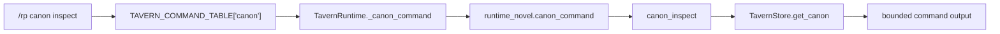

# Phase 143: Canon Inspect Surface

## 0. Terms

- Canon fact: an existing `novel_canon` row with `project_id`, `title`, `content`,
  `canon_group`, `importance`, and timestamps.
- Inspect surface: a read-only command that displays one canon row by id.
- Deferred canon tools: `/rp canon check`, `/rp canon conflict`, and
  `/rp canon pin <fact>` remain out of scope.

## 1. Decisions And Constraints

- Add only `/rp canon inspect <canon-id>` under the existing canon family.
- Do not add a top-level command family or edit `src/hermes_tavern/runtime.py`.
- Do not change schema, canon ordering, prompt module selection, prompt rendering,
  provider/model routing, generation, export, archive/import, or credentials.
- Canon remains prompt-active where it already is for linked sessions; this slice
  only makes one stored row easier to inspect.
- Use neutral fictional examples only; no minors/underage handling and no provider
  safety bypass behavior.

## 2. Names And Flow

### 2.1 Noun Layer

Current:
`novel_canon` already stores canon facts and supports create/list plus
`get_canon_for_prompt(project_id, limit)`. List output includes row ids.

Change:
Add a read-only `get_canon(canon_id)` helper returning one row or `None`. No table,
index, ownership, ordering, prompt, or export semantics change.

### 2.2 Orchestration Layer

Current:
`canon_command` handles `add`, `list`, and `group`.

Change:
`canon_command` gains an `inspect` branch. The branch parses one integer id, calls
the store helper, and returns compact output with id, project id, title, group, and
bounded content preview. Malformed usage returns the canon usage string; missing rows
return a bounded not-found message.

### 2.3 Mount Points

- `src/hermes_tavern/db_novel.py`: read-only canon getter.
- `src/hermes_tavern/runtime_novel.py`: nested canon inspect branch and output.
- `src/hermes_tavern/commands.py`: help literal for `/rp canon inspect <canon-id>`.
- `README.md`: Core commands visibility.
- Existing DB/runtime/command/README tests for offline verification.

### 2.4 Slicing

S1 implements the read-only command surface and focused tests only.
S2 is controller-owned verification and feature artifact closeout.

### 2.5 Structure Health

`runtime_novel.py` and `db_novel.py` are already large, but this is a single existing
family extension following nearby canon/timeline patterns. No preparatory
micro-refactor is justified. Do not create new modules for this slice.

## 3. Acceptance Criteria

- `/rp canon inspect <canon-id>` is visible in generated help and README Core commands.
- Inspecting an existing canon row returns its id, project id, title, group, and
  bounded content preview.
- Malformed ids and missing canon rows return bounded command output.
- `list_canon` ordering and `get_canon_for_prompt` behavior are unchanged.
- Deferred `/rp canon check`, `/rp canon conflict`, and `/rp canon pin <fact>` remain absent.
- No prompt/debug/context-budget, provider/model, generation, credential,
  retrieval/vectorization, archive/import, plugin shim, build artifact, or protected
  Hermes core behavior changes.

## 4. Architecture/Root Design Relationship

This slice fills a small command-surface gap in the current canon object model from
the root design. It does not make deferred canon analysis/correlation tools current.
If later promoted and implemented, architecture/root-design writeback should describe
only the new read-only inspect command and preserve the existing deferred boundaries.
