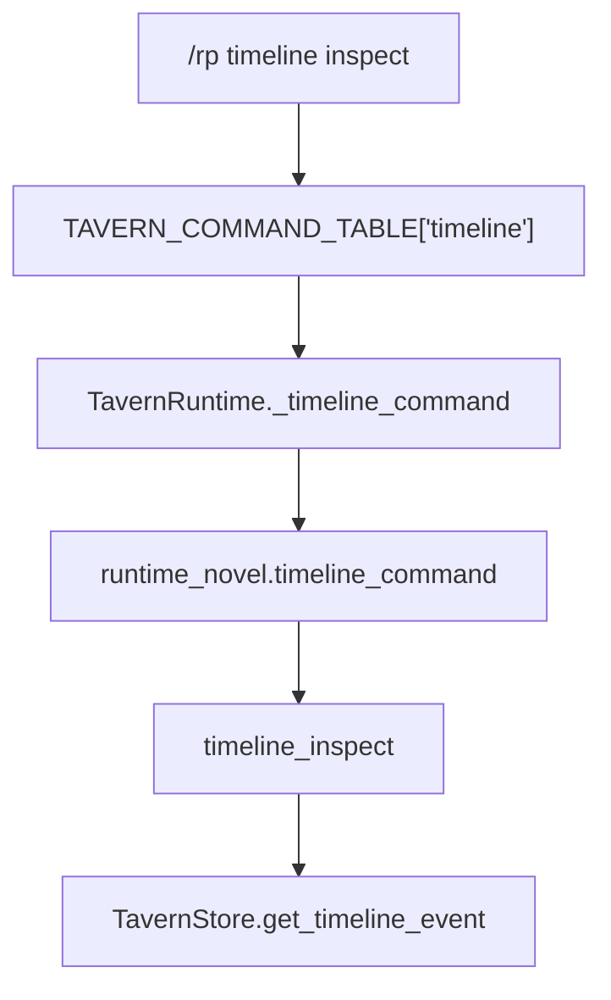

# Timeline Inspect Surface

## Background

Recent Hermes Tavern metadata and command-surface phases are accepted through Phase 143. Phase 143 added a bounded read-only `/rp canon inspect <canon-id>` surface for existing canon rows while preserving deferred canon analysis tools.

Timeline events are part of the current Phase 121 novel project layer, but the current command surface is still limited to `/rp timeline add/list`. The store has create/list helpers and Markdown export, but no read-only single-row timeline getter and no command-visible timeline inspection surface. This leaves timeline rows less inspectable than nearby canon and metadata families.

## Scope

Add one read-only timeline inspection surface:

- `TavernStore.get_timeline_event(timeline_event_id)` returns one existing `novel_timeline` row or `None`.
- `/rp timeline inspect <timeline-id>` routes under the existing timeline command family in `runtime_novel.py`.
- Generated `/rp help` and README Core commands include the new timeline inspect literal.
- Focused DB/runtime/help/README tests cover success, malformed ids, missing rows, and unchanged list/export behavior.

## Non-goals / Boundaries

This phase does not add timeline update, delete, pinning, graphing, map/geocode, visualization, import/export ZIP, archive import/export, generation, provider/model routing, retrieval/vectorization, prompt/debug/context-budget injection, credential handling, content-mode behavior, automatic extraction, collaboration, minors/underage handling, or provider safety bypass behavior.

Do not edit `run_agent.py`, `cli.py`, `gateway/run.py`, `src/hermes_tavern/runtime.py`, prompt/provider/generation/importer files, `plugins/**`, or `build/lib/**`.

## Proposed design

The noun layer already exists: `novel_timeline(id, project_id, event_date, title, description, chapter_id, sort_key, created_at)`. This slice adds only a read-only getter by primary key. It must not create tables, alter indexes, mutate rows, or change `list_timeline(project_id)` ordering.

The orchestration layer follows the existing canon inspect shape:

The command output should be compact and bounded. It should include the row id, project id, event date, title, optional sort key when present, and a mobile-bounded description preview. Malformed ids and extra arguments return the timeline usage string; missing rows return a bounded not-found message.

No micro-refactor is needed. `db_novel.py` and `runtime_novel.py` already own timeline persistence and commands, and this is a small family-local extension.

## Acceptance criteria

1. `/rp timeline inspect <timeline-id>` returns bounded details for one existing timeline row.
2. Malformed ids, missing ids, non-positive ids, and extra args return the timeline usage string.
3. A missing row returns a bounded not-found message without exceptions.
4. Generated help and README Core commands include `/rp timeline inspect <timeline-id>`.
5. `list_timeline` ordering and project Markdown export remain unchanged.
6. No prompt/debug/context-budget, provider/model, generation, credential, retrieval/vectorization, archive/import, graph/map/geocode, plugin shim, build artifact, or protected core file changes occur.

## Verification plan

Run focused offline checks:

- `PYTHONDONTWRITEBYTECODE=1 python -m py_compile src/hermes_tavern/db_novel.py src/hermes_tavern/runtime_novel.py src/hermes_tavern/commands.py tests/test_hermes_tavern_novel_db.py tests/test_hermes_tavern_novel_runtime.py tests/test_hermes_tavern_commands.py tests/test_hermes_tavern_readme_docs.py`
- `PYTHONDONTWRITEBYTECODE=1 python -m pytest tests/test_hermes_tavern_novel_db.py tests/test_hermes_tavern_novel_runtime.py tests/test_hermes_tavern_commands.py tests/test_hermes_tavern_readme_docs.py -q -o 'addopts=' -p no:cacheprovider`
- `PYTHONDONTWRITEBYTECODE=1 python -m pytest tests/test_hermes_tavern_*.py -q -o 'addopts=' -p no:cacheprovider`
- `PYTHONDONTWRITEBYTECODE=1 python -m pytest -q -o 'addopts=' -p no:cacheprovider`
- `git diff --check`

## Risks / rollback

Risk: users may infer this adds timeline editing or visualization. Mitigation: keep command text and docs strictly inspect-only and preserve deferred timeline graphics/import/archive boundaries.

Rollback is simple: remove the getter, command branch, help/README literal, and focused tests. No schema or data migration rollback is needed.
