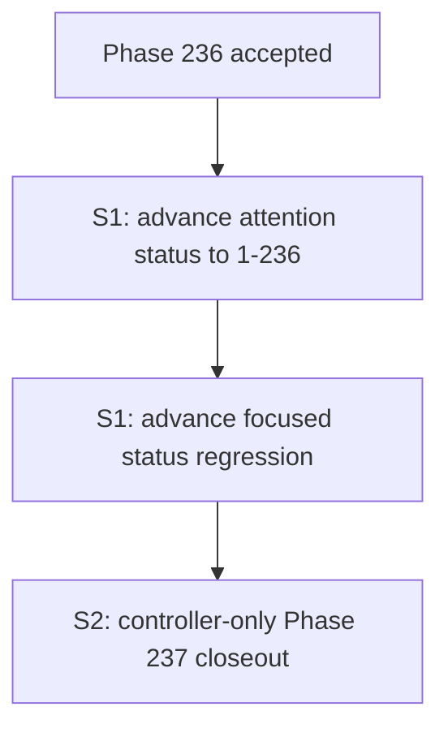

# Phase 237: CodeStable Attention Status Sync Through Phase 236

## Read-Only Precheck

Inspected read-only:

- `design/codestable/attention.md`
- `tests/test_hermes_tavern_codestable_status.py`
- `design/codestable/features/2026-06-14-hermes-tavern-phase236-attention-status-sync-through-phase235/design.md`
- `design/codestable/features/2026-06-14-hermes-tavern-phase236-attention-status-sync-through-phase235/checklist.yaml`
- `design/codestable/features/2026-06-14-hermes-tavern-phase236-attention-status-sync-through-phase235/phase236-acceptance.md`
- recent `design/codestable/features/` entries and Phase 237 marker search

Phase 236 is accepted: its acceptance artifact has `status: accepted`, and its checklist has `status: accepted` plus `workflow_status: completed`.

`design/codestable/attention.md` currently reports `Current status (2026-06-14): All phases 1-235 accepted`, ends through `Phase 235 attention status sync through Phase 234`, and does not include `Phase 236 attention status sync through Phase 235`.

`tests/test_hermes_tavern_codestable_status.py` currently guards terminal range 1-235, stale 1-234 markers, Phase 168 through Phase 235 labels, final suffix through Phase 235, and `range(168, 236)`.

No Phase 237 artifact or Phase 237 terminal marker was found. The next bounded slice is therefore Phase 237: attention status sync through accepted Phase 236.

## Gap

`design/codestable/attention.md` is the mandatory CodeStable startup read for this repository. Phase 236 is accepted, but the startup status and focused static regression still stop at Phase 235.

This is CodeStable startup-context metadata drift only. It is not a runtime, source, plugin, provider/model routing, prompt/generation, import/export, schema, root-design, architecture, reference, README, roadmap, requirement, compound, build, Hermes core, adult-fiction/RP compatibility, minors/underage, provider safety, safety-bypass, or SillyTavern compatibility feature gap.

## Scope

Create and close exactly one docs/test/status-only phase:

- Feature directory: `design/codestable/features/2026-06-14-hermes-tavern-phase237-attention-status-sync-through-phase236/`

S1 executor implementation may edit exactly:

- `design/codestable/attention.md`
- `tests/test_hermes_tavern_codestable_status.py`

S2 controller acceptance closeout may edit exactly:

- `design/codestable/features/2026-06-14-hermes-tavern-phase237-attention-status-sync-through-phase236/design.md`
- `design/codestable/features/2026-06-14-hermes-tavern-phase237-attention-status-sync-through-phase236/checklist.yaml`
- `design/codestable/features/2026-06-14-hermes-tavern-phase237-attention-status-sync-through-phase236/phase237-acceptance.md`

## Exact Marker Contract

S1 must update only the terminal current-status range from `All phases 1-235 accepted` to `All phases 1-236 accepted`, preserve all existing labels from Phase 168 through Phase 235 and the valid internal `Phase 121-167` range, and append exactly:

`Phase 236 attention status sync through Phase 235`

The focused static regression must advance together:

- `CURRENT_STATUS_PREFIX`: `Current status (2026-06-14): All phases 1-236 accepted`
- `STALE_STATUS_PREFIX`: `Current status (2026-06-14): All phases 1-235 accepted`
- stale standalone markers: `1-235` and `1–235`
- required labels: existing Phase 168 through Phase 235 labels plus `Phase 236 attention status sync through Phase 235`
- `FINAL_STATUS_SUFFIX`: `Phase 234 attention status sync through Phase 233, Phase 235 attention status sync through Phase 234, and Phase 236 attention status sync through Phase 235.`
- aggregate assertion: `range(168, 237)`
- no generated discovery via `glob`, `rglob`, `iterdir`, or `os.walk`

## Main Flow

## Noun Layer

Current:

- The attention status is a single `- Current status ...` bullet in `design/codestable/attention.md`.
- The focused regression is `tests/test_hermes_tavern_codestable_status.py`.
- Phase 236 artifacts are accepted and complete.

Change:

- The attention bullet becomes current through Phase 236.
- The focused regression explicitly guards Phase 168 through Phase 236, stale terminal 1-235 rejection, valid `Phase 121-167` preservation, final suffix through Phase 236, and `range(168, 237)`.
- Phase 237 artifacts are the only controller closeout artifacts.

## Orchestration Layer

S1 is the only executor implementation slice. It edits the two allowed S1 files and must not create acceptance output or mark final accepted statuses.

S2 is controller-only closeout. It records acceptance evidence in `phase237-acceptance.md` and may update only the new Phase 237 design/checklist/acceptance artifacts.

## Mount Points

- `design/codestable/attention.md`: the single startup status bullet.
- `tests/test_hermes_tavern_codestable_status.py`: static constants, required labels, stale-marker checks, final suffix, and aggregate range assertion.
- New Phase 237 feature directory: design/checklist/acceptance closeout metadata.

Removing these mount points removes the phase from startup context and its focused regression.

## Structure Health

No micro-refactor is needed.

`design/codestable/attention.md` already owns CodeStable startup context. `tests/test_hermes_tavern_codestable_status.py` already owns the focused static status guard. The new Phase 237 directory follows the established recurring status-sync artifact pattern.

## Non-Goals

Do not change runtime command handlers, source package files, plugin files, gateway or Hermes core files, provider/model routing files, prompt/generation behavior, import/export behavior or payloads, schema files, README text, root design, architecture docs, reference docs, roadmap or requirement docs, compound docs, build artifacts, file layout, database schemas, retrieval/vectorization, archive/ZIP/cloud sync behavior, graph tooling, automatic extraction, credentials, content mode, adult-fiction/RP compatibility, minors/underage handling, provider safety behavior, plugin assets, SillyTavern asset compatibility, Hermes-native plugin architecture, or safety-bypass behavior.

Adult-fiction/RP compatibility remains allowed and unchanged. This phase must not introduce minors/underage handling changes or provider safety bypass behavior.

Do not run service lifecycle commands.

Do not modify `run_agent.py`, `cli.py`, `gateway/run.py`, `gateway/**`, `src/**`, `plugins/**`, `build/**`, `build/lib/**`, `README.md`, `design/HERMES_TAVERN_DESIGN.md`, `design/codestable/architecture/**`, `design/codestable/reference/**`, `design/codestable/roadmap/**`, `design/codestable/requirements/**`, `design/codestable/compound/**`, `design/codestable/features/2026-06-14-hermes-tavern-phase236-attention-status-sync-through-phase235/**`, or any older accepted feature artifact during S1.

## Verification Commands

- `PYTHONDONTWRITEBYTECODE=1 python design/codestable/tools/validate-yaml.py --file design/codestable/features/2026-06-14-hermes-tavern-phase237-attention-status-sync-through-phase236/design.md --require doc_type --require status --require feature --require implementation_ready`
- `PYTHONDONTWRITEBYTECODE=1 python design/codestable/tools/validate-yaml.py --file design/codestable/features/2026-06-14-hermes-tavern-phase237-attention-status-sync-through-phase236/checklist.yaml --yaml-only --require doc_type --require status --require feature --require implementation_ready`
- `PYTHONDONTWRITEBYTECODE=1 python design/codestable/tools/validate-yaml.py --file design/codestable/features/2026-06-14-hermes-tavern-phase237-attention-status-sync-through-phase236/phase237-acceptance.md --require doc_type --require status --require feature`
- `PYTHONDONTWRITEBYTECODE=1 python -m py_compile tests/test_hermes_tavern_codestable_status.py`
- `PYTHONDONTWRITEBYTECODE=1 PYTEST_DISABLE_PLUGIN_AUTOLOAD=1 python -m pytest tests/test_hermes_tavern_codestable_status.py -q -o 'addopts=' -p no:cacheprovider -s`
- static marker guard for one current-status line, terminal `1-236`, explicit Phase 168 through Phase 236 labels, `range(168, 237)`, final punctuation through Phase 236, stale terminal `1-235` / `1–235` rejection, valid `Phase 121-167` preservation, and no generated phase-discovery calls
- allowed/prohibited overlap guard
- changed-path allowlist guard for the five allowed files
- protected-path guard for prohibited paths
- `git diff --check`
- `git diff --cached --check`

## Acceptance

Phase 237 is acceptable when the single current-status bullet reports all phases 1-236 accepted, preserves prior labels through Phase 235, appends exactly `Phase 236 attention status sync through Phase 235`, the final suffix is updated through Phase 236, stale terminal 1-235 markers are rejected while valid `Phase 121-167` remains allowed, the focused static regression passes and remains explicit/static, changed paths are limited to the five allowed files, allowed/prohibited overlap is empty, and S2 acceptance closeout is performed by the controller only.

## Risks

- The stale-negative checks and aggregate range must advance together.
- The current status line is long; keep it as one bullet.
- The final-list punctuation must move the `and` from Phase 235 to Phase 236 without rewriting older accepted labels.
